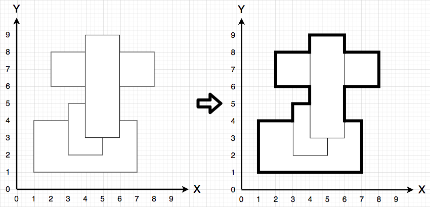
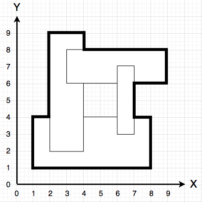
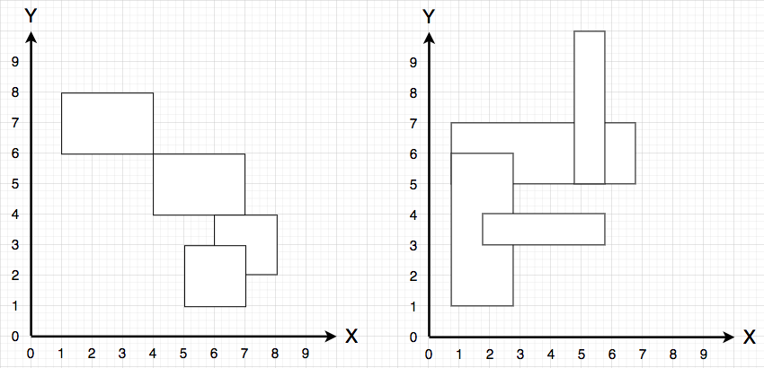
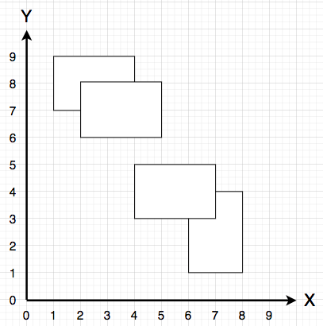
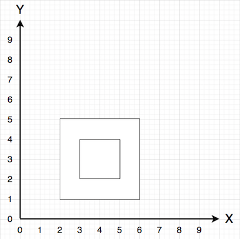

# [프로그래머스/Programmers] 아이템 줍기 (풀이 언어 - Python/파이썬)
## 문제 설명
[링크](https://school.programmers.co.kr/learn/courses/30/lessons/87694){:target="_blank"}

다음과 같은 다각형 모양 지형에서 캐릭터가 아이템을 줍기 위해 이동하려 합니다.



지형은 각 변이 x축, y축과 평행한 직사각형이 겹쳐진 형태로 표현하며, 캐릭터는 이 다각형의 둘레(굵은 선)를 따라서 이동합니다.

만약 직사각형을 겹친 후 다음과 같이 중앙에 빈 공간이 생기는 경우, 다각형의 가장 바깥쪽 테두리가 캐릭터의 이동 경로가 됩니다.



단, 서로 다른 두 직사각형의 x축 좌표 또는 y축 좌표가 같은 경우는 없습니다.



즉, 위 그림처럼 서로 다른 두 직사각형이 꼭짓점에서 만나거나, 변이 겹치는 경우 등은 없습니다.

다음 그림과 같이 지형이 2개 이상으로 분리된 경우도 없습니다.



한 직사각형이 다른 직사각형 안에 완전히 포함되는 경우 또한 없습니다.



지형을 나타내는 직사각형이 담긴 2차원 배열 rectangle, 초기 캐릭터의 위치 characterX, characterY, 아이템의 위치 itemX, itemY가 solution 함수의 매개변수로 주어질 때, 캐릭터가 아이템을 줍기 위해 이동해야 하는 가장 짧은 거리를 return 하도록 solution 함수를 완성해주세요.

## 제한사항
- rectangle의 세로(행) 길이는 1 이상 4 이하입니다.
- rectangle의 원소는 각 직사각형의 [좌측 하단 x, 좌측 하단 y, 우측 상단 x, 우측 상단 y] 좌표 형태입니다.
- 직사각형을 나타내는 모든 좌표값은 1 이상 50 이하인 자연수입니다.
- 서로 다른 두 직사각형의 x축 좌표, 혹은 y축 좌표가 같은 경우는 없습니다.
- 문제에 주어진 조건에 맞는 직사각형만 입력으로 주어집니다.
- charcterX, charcterY는 1 이상 50 이하인 자연수입니다.
- 지형을 나타내는 다각형 테두리 위의 한 점이 주어집니다.
- itemX, itemY는 1 이상 50 이하인 자연수입니다.
- 지형을 나타내는 다각형 테두리 위의 한 점이 주어집니다.
- 캐릭터와 아이템의 처음 위치가 같은 경우는 없습니다.

## 배점 참고 사항
- 전체 배점의 50%는 직사각형이 1개인 경우입니다.
- 전체 배점의 25%는 직사각형이 2개인 경우입니다.
- 전체 배점의 25%는 직사각형이 3개 또는 4개인 경우입니다.

## 풀이
- 먼저 지형을 덮는 최소 크기의 직사각형의 우측상단 꼭짓점 좌표를 염두에 두고 필요한 최대 크기의 board를 정의한다.
- rectangle 변수에 들어있는 사각형들이 덮는 지역을 fill_walls 함수로 표시한다. (True 값으로)
- BFS를 사용하여 경계를 따라 길을 찾는다.
- 이때, 경계선을 따라가는 조건을 구현하는 것이 다소 까다로울 수 있는데, 정사각형 4개로 이루어진 큰 정사각형 격자 중심에 현재 위치가 있다고 가정하자. 이 위치를 기준으로 상하좌우의 진행방향으로 양 옆에 놓인 두 칸의 각 정사각형의 지형이 비어있는지 아니면 덮여있는지를 살핀다. 만약 모두 덮여있거나 비어있다면 해당 방향으로 갈 수 없으며(진행할 수 없으며), 그렇지 않은 경우, 즉 한 칸의 정사각형은 비어있고 다른 한 칸은 덮여있는 경우에는 해당 방향으로 갈 수 있다는 데 착안한다.
- 따라서 두 정사각형이 board에서 모두 False 혹은 모두 True라면 갈 수 없고 둘의 구성이 False, True로 달라야 하므로 XOR gate 로직을 사용하여 알고리즘을 구성한다: 아래에서 `(board[rect1_x][rect1_y] ^ board[rect2_x][rect2_y])` 조건 부분.
- (2023. 06. 06. 수정 사항) Rust 스타일의 엄격한 타입 체크를 도입해보려고 기존 Python 코드를 수정해보았다. Rust는 강력한 타입 시스템을 가진 언어인데, 해당 언어의 장점을 취하면 코드의 안정성과 가독성을 향상시킬 수 있다고 한다. 이러한 원칙을 Python 코드에 적용하기 위해 데이터 클래스를 도입하여 좌표를 표현하였는데, 장점은 다음과 같은 것들이 있다고 한다.
  - 코드의 의도 명확화: 함수의 인자와 반환값에 대한 정보를 더욱 명확하게 제공
  - 코드의 유지 보수를 용이화
  - 잠재적인 오류 사전 방지

## 코드

```python
from collections import deque
from dataclasses import dataclass
from typing import List, Tuple


@dataclass
class Point:
    x: int
    y: int


def solution(rectangle: List[int],
             characterX: int,
             characterY: int,
             itemX: int,
             itemY: int) -> int:
    """지형의 경계를 따라 최단거리로 현재 위치에서 아이템 위치까지 이동하기.

    Args:
        rectangle: 지형을 나타내는 직사각형이 담긴 2차원 배열.
        characterX: 초기 캐릭터 위치의 x 좌표.
        characterY: 초기 캐릭터 위치의 y 좌표.
        itemX: 아이템 위치의 x 좌표.
        itemY: 아이템 위치의 y 좌표.

    Returns:
        캐릭터가 아이템을 줍기 위해 이동해야 하는 가장 짧은 거리.
    """
    rectangle_points = [(Point(rect[0], rect[1]), Point(rect[2], rect[3])) for rect in rectangle]
    character = Point(characterX, characterY)
    item = Point(itemX, itemY)

    max_point = get_max_point(rectangle_points)
    board = [[False for _ in range(max_point.x)] for _ in range(max_point.y)]
    fill_walls(board, rectangle_points)
    shortest = bfs(board, max_point, character, item)
    return shortest


def get_max_point(rectangle: List[Tuple[Point, Point]]) -> Point:
    """지형을 완전히 덮는 가장 작은 직사각형의 우측상단 꼭짓점 좌표 구하기."""
    max_x = max(rect[1].x for rect in rectangle)
    max_y = max(rect[1].y for rect in rectangle)
    return Point(max_x + 50, max_y + 50)


def fill_walls(board: List[List[bool]],
               rectangle: List[Tuple[Point, Point]]) -> None:
    """지형으로 덮인 곳 True로 채우기."""
    for rect in rectangle:
        for i in range(rect[0].x, rect[1].x):
            for j in range(rect[0].y, rect[1].y):
                board[i][j] = True


def bfs(board: List[List[bool]],
        max_point: Point,
        character: Point,
        item: Point) -> int:
    dx_zip = (0, 0, -1, 1)
    dy_zip = (1, -1, 0, 0)
    along_edge = (
        ((-1, 0), (0, 0)),  # 상
        ((-1, -1), (0, -1)),  # 하
        ((-1, 0), (-1, -1)),  # 좌
        ((0, 0), (0, -1)),  # 우
    )
    visited = [[False for _ in range(max_point.x)] for _ in range(max_point.y)]
    visited[character.x][character.y] = True
    q = deque([(character.x, character.y, 0)])
    while q:
        x, y, dist = q.popleft()

        if x == item.x and y == item.y:
            return dist

        for dx, dy, dw in zip(dx_zip, dy_zip, along_edge):
            nx, ny = x + dx, y + dy
            rect1, rect2 = dw
            dx1, dy1 = rect1
            dx2, dy2 = rect2
            rect1_x, rect1_y = x + dx1, y + dy1
            rect2_x, rect2_y = x + dx2, y + dy2
            conditions = (
                -1 < nx < max_point.x
                and -1 < ny < max_point.y
                and not visited[nx][ny]
                and (board[rect1_x][rect1_y]
                    ^ board[rect2_x][rect2_y])
            )
            if conditions:
                visited[nx][ny] = True
                q.append((nx, ny, dist + 1))
    return dist
```
