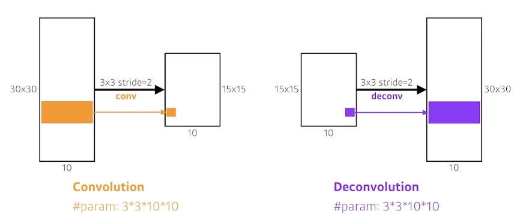

# [Deep Learning/딥 러닝] 컨볼루션 신경망

# Convolutional Neural Networks

## Convolution

### 정의

- Signal processing 분야에서 두 함수를 적절히 섞어주는 방법/operator
- Continuous convolution
    
    $$
    (f*g)(t)=\int f(\tau)g(t-\tau)d\tau=\int f(t-\tau)g(t)d\tau
    $$
    
- Discrete convolution
    
    $$
    (f*g)(t)=\sum_{i=-\infty}^\infty f(i)g(t-i)=\sum_{i=-\infty}^\infty f(t-i)g(i)
    $$
    
- 2D image convolution
    
    $$
    \begin{aligned}(I*K)(i,j)&=\sum_m\sum_nI(m,n)K(i-m,j-n)\\&=\sum_m\sum_nI(i-m,i-n)K(m,n)\end{aligned}
    $$
    

### 2D convolution의 의미?

- 해당 convolution filter의 모양을 이미지에 찍는 것

### RGB Image Convolution

- Input channel과 output convolution feature map의 channel을 알면 적용된 convolution feature의 크기를 알 수 있음

### Stack of Convolutions

## Convolutional Neural Networks

- CNN consists of convolution layer, pooling layer, and fully-connected layer.
    - Convolution and pooling layers: feature extraction
    - Fully-connected layer: decision making (e.g., classification)
    - 최근 FC layer가 최소화 내지는 없어지는 추세
        
        → 파라미터 수 때문
        
    - 학습하고자 하는 파라미터 수가 많을수록 학습이 어렵고, 일반화 성능(generalization performance) 성능이 떨어지는 것으로 알려져 있음
        - 일반화 성능이란?
            
            학습에서 얻어진 결과가 한 번도 본 적이 없는 실제 테스트 데이터에 얼마나 잘 작동하는지의 척도
            
    - CNN 발전 방향
        
        같은 모델을 만들고 최대한 모델을 깊게 쌓으면서 동시에 파라미터 수를 줄이는 데 집중
        
    - 각 layer마다의 파라미터 수와 모델 전체 파라미터 수에 대한 감을 가지는 것이 중요

## Convolution Arithmetic of GoogLeNet

### Stride & Padding

- Stride: filter를 몇 픽셀 단위로 이미지에 찍을 것인지
- Padding: boundary 정보를 어느 정도의 픽셀 두께로 보존할 것인지
    - no padding, zero padding

- 각 층에서의 파라미터 수의 order에 대한 감이 있는 것이 중요

### AlexNet 파라미터 수 계산

- 첫번째 층을 통과한 뒤 96 채널짜리 feature map을 구성해야 했으나, 당시 GPU 메모리의 한계를 이유로 48채널짜리 feature map 2개를 쓰도록 파트를 나누게 됨
- 첫번째 층 파라미터 수 계산 → 35k

- 두번째 층 파라미터 수 계산 → 307k

- 세번째 층 파라미터 수 계산 → 884k

- 네번째 층 파라미터 수 계산 → 663k

- 다섯번째 층 파라미터 수 계산 → 442k

- FC 층 (1) 파라미터 수 계산 → 177M

- FC 층 (2) 파라미터 수 계산 → 16M

- FC 층 (3) 파라미터 수 계산 → 4M
- Dense 층이 일반적으로 훨씬 더 많은 파라미터 수를 가지게 되는 이유?
    
    Convolution operator와 각각의 커널이 모든 위치에 대해 동일하게 적용되기 때문
    
- 결국 대부분의 파라미터가 FC 층에 집중되다 보니 네트워크의 발전 방향이 FC 부분을 최대한으로 줄이고 앞단의 convolution 층을 깊게 쌓는 것이 트렌드가 됨

## 1 x 1 Convolution

- Why?
    - Dimension reduction
    - To reduce the number of parameters while increasing the depth
    - e.g., bottleneck architecture

# Modern CNN

- 2018년 정도까지의 modern(?) 네트워크를 간략하게 살펴봄

## ILSVRC

- ImageNet Large-Scale Visual Recognition Challenge
    - Classification / Detection / Localization / Segmentation
    - 1,000 different categories
    - Over 1M images
    - Training set: 456,567 images

## AlexNet

- Alex Krizhevsky, Ilya Sutskever, and Geoffrey Hinton, “ImageNet Classification with Deep Convolutional Neural Networks,” NIPS, 2012

- 11x11 사이즈의 커널을 사용하는 것은 좋은 선택이 아닌 이유?
    
    → Receptive field(한 convolution kernel이 볼 수 있는 영역)은 커지나 상대적으로 더 많은 수의 파라미터가 필요하게 됨
    
- Key Ideas
    - ReLU (Rectified Linear Unit) activation
        - Preserves properties of linear models
        - Easy to optimize with gradient descent
        - Good generalization
        - Overcome the vanishing gradient problem (compared to sigmoid, tanh)
    - GPU implementation (2 GPUs)
    - Local response normalization, Overlapping pooling
    - Data augmentation
    - Dropout
- 2012년 당시에는 당연하지 않은 아이디어들! CNN이 잘 되게 하는 de facto standard를 잡아줌

## VGGNet

- Karen Simonyan, Andrew Zisserman, “Very Deep Convolutional Networks for Large-Scale Image Recognition,” ICLR, 2015

- Increasing depth with 3x3 convolution filters with stride 1
- 1x1 convolution for fully-connected layers
- Dropout (p=0.5)
- VGG-16, VGG-19

### Why 3 x 3 convolution?

- Receptive field
    
    하나의 convolutional feature map을 얻기 위해 고려할 수 있는 입력의 spatial dimension
    
- 3x3 kernel을 두 번 거치면 receptive field는 5x5가 됨
- 위의 그림에서, # of params를 계산해보면 전자는 $3\times3\times128\times128\times2=294,912$이고, 후자는 $5\times5\times128\times128=409,600$. 전자가 후자 대비 25% 정도 더 효율적.

## GoogLeNet

- Christian et al., “Going Deeper with Convolutions,” CVPR, 2015

- GoogLeNet won the ILSVRC in 2014
    - It combined network-in-network (NiN) with inception blocks
- Inception blocks
    
    
    
    - 3x3, 5x5 Conv 전에 1x1 Conv 층이 중요한 역할
    - What are the benefits of the inception block?
        - To reduce # of parameters
    - How?
        - Recall how # of parameters is computed
        - 1x1 convolution can be seen as channel-wise dimension reduction

### Inception Block

- Benefit of 1x1 convolution
    
    
    
    - 1x1 convolution enables about 30% reduction of # of params.
    - Q. 채널 방향으로 정보를 압축했다고 볼 수 있다면, 128이나 32와 같은 숫자가 최적일지에 대한 의문이 들고, 32채널로 중간에 축소가 가능하다면 굳이 128 채널로 펼쳐서 정보를 forwarding 하는 이유가 무엇일지?

### Comparison of # of params

- Which CNN architecture has the least number of parameters among below?
    - AlexNet (8 layers) → 60M
    - VGG-19 (19 layers) → 110M
    - **GoogLeNet (22 layers) → 4M ✔️**

## ResNet

- Kaiming He, Xiangyu Zhang, Shaoquing Ren, Jian Sun, “Deep Residual Learning for Image Recognition,” CVPR, 2015
- Deep neural networks are hard to train.
    - Overfitting is usually caused by an excessive number of parameters. But ResNet architecture overcame this problem somehow.
    
    
    
- Add an identity map (skip-connection)
    
    
    
    
    
- Add an identity map after nonlinear activations:
    
    
    
- Bottleneck architecture
    
    
    
- Performance increases while parameter size decreases.
    
    
    

## DenseNet

- DenseNet uses concatenation instead of addition.
    
    
    
    
    
- Dense Block
    - Each layer concatenates the feature maps of all preceding layers.
    - The number of channels increases geometrically.
- Transition Block
    - BatchNorm → 1x1 Conv → 2x2 AvgPooling
    - Dimension reduction

## Summary

- Key takeaways
    - VGG: repeated 3x3 blocks
    - GoogLeNet: 1x1 convolution
    - ResNet: skip-connection
    - DenseNet: concatenation

# Computer Vision Applications

## Semantic Segmentation

- 이미지 단위가 아닌 이미지의 픽셀 단위로 분류하는 문제
- Dense classification, per-pixel classification으로 불리기도 함

### Fully-convolutional network

- 장점? Dense layer가 사라진 것. 하지만 파라미터 수는 같음
    
    
    
- 파라미터 수나 네트워크 아키텍처 관점에서 차이가 미미함에도 이런 기법을 사용하는 이유?
    - Transforming fully-connected layers into convolution layers enables a classification net to output a heat map.
        
        
        
    - Input의 spatial dimension에 독립적 → 더 큰 이미지에 대해서도 reshape 때문에 기존 네트워크로는 불가능했던 task를 수행 가능. Output이 커지게 되면 뒷단의 네트워크 또한 커지게 됨.
    - Why? Convolution이 가지는 shared parameter의 성질 때문. → heatmap과 같은 효과
- While FCN can run with inputs of any size, the output dimensions are typically reduced by subsampling.
- So we need a way to connect the coarse output to the dense pixels.

### Deconvolution (conv transpose)

### 결과

## Detection

### R-CNN

- R-CNN (1) takes an input image, (2) extracts around 2000 region proposals (using Selective search), (3) compute features for each proposal (using AlexNet), and then (4) classifies with linear SVMs.
- The fact that # of crop/warp is usually over 2000 means that CNN must run more than 2000 times (59s/image on CPU).

### SPPNet

- CNN runs once.

### Fast R-CNN

- Takes an input and a set of bounding boxes.
- Generated convolutional feature map
- For each region, get a fixed length feature from ROI pooling
- Two outputs: class and bounding-box regressor.

### Faster R-CNN

- Region Proposal Network + Fast R-CNN

### Region Proposal Network (RPN)

- 이미지의 특정 영역/패치가 bounding box로서의 의미가 있을지 없을지, 물체가 있을지 없을지 등을 찾아주는 역할.

- 9: Three different region sizes (128, 256, 512) with three different ratios (1:1, 1:2, 2:1)
- 4: four bounding box regression parameters
- 2: box classification (whether to use it or not)

### YOLO

- YOLO (v1) is an extremely fast object detection algorithm.
    - baseline: 45 fps / smaller ver.: 155 fps
- It simultaneously predicts multiple bounding boxes and class probabilties.
    - No explicit bounding box sampling compared with Faster R-CNN.

- Given an image, YOLO divides it into SxS grid.
    - if the center of an object falls into the grid cell, that grid cell is responsible for detection.
- Each cell predicts B bounding boxes $$(B=5)$$.
    - Each bounding box predicts
        - box refinement $$(x / y / w / h)$$
        - confidence of objectness
- Each cell predicts C class probabilities.
- In total, it becomes a tensor with $$S\times S\times(B\times5+C)$$ size.
    - SxS: # of cells of the grid
    - B*5: B bounding boxes with offsets (x, y, w, h) and confidence
    - C: # of classes

## 참고
- [부스트코스 - 딥러닝 기초 다지기](https://www.boostcourse.org/ai111){:target="_blank"}