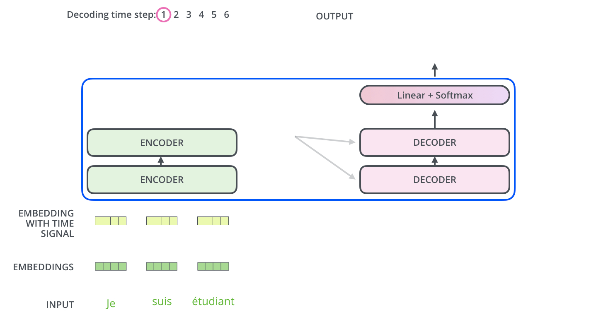

# [Deep Learning/딥 러닝] 시퀀스 모델

## Recurrent Neural Networks (RNNs)

### Sequence Models

- Naive sequence model
- 시퀀스 데이터는 길이가 어떻게 될지 모른다는 특징이 있음 → 일반 CNN 모델을 바로 사용하기 힘듦

#### Autoregressive model

- 과거의 time span을 고정

#### Markov model (first-order autoregressive model)

- 현재는 바로 전 과거에만 dependent하다는 가정
    
    $$
    p(x_i|x_{i-1},\cdots,x_1)\overset{\tiny\text{assume}}{=}p(x_i|x_{i-1})
    $$
    
    - 정보량 손실이 큼
- Generative model에서 많이 활용되는 autoregressive model !

#### Latent autoregressive model

- 과거 정보의 summary가 담긴 hidden (latent) state $$h$$

### Recurrent Neural Network (RNN)

- 문제점
    - Short-term dependencies: fixed rule로 과거의 정보를 취합하다보니 미래의 sequence에 과거 정보가 잘 전달되지 않는 현상
        
        → 해결을 위해 Long Short Term Memory (LSTM) 등장
        
- 학습이 어려운 이유?
    
    
    
    - 네트워크를 풀게 되면 width가 매우 커지게 됨

### Long Short Term Memory (LSTM)

- Vanilla RNN
    
    
    
- LSTM
    
    
    
    - 왜 long-term dependency를 잡는 데 도움이 되는지 이해하는 것 필요

1. Forget gate
    
    
    
    - Decide which information to throw away
    
    $$
    f_t=\sigma(W_f\cdot[h_{t-1},x_t]+b_f)
    $$
    
2. Input gate
    
    
    
    - Decide which information to store in the cell state
    
    $$
    \begin{aligned}
    i_t&=\sigma(W_i\cdot[h_{t-1},x_t]+b_i)\\\tilde C_t&=\tanh(W_C\cdot[h_{t-1},x_t]+b_C)
    \end{aligned}
    $$
    
3. Update gate
    
    
    
    - Update the cell state
    
    $$
    C_t=f_t*C_{t-1}+i_t*\tilde C_t
    
    $$
    
4. Output gate
    
    
    
    - Make output using the updated cell state
    
    $$
    \begin{aligned}
    o_t&=\sigma(W_o\cdot[h_{t-1},x_t]+b_o)\\h_t&=o_t*\tanh(C_t)
    \end{aligned}
    $$
    

### Gated Recurrent Unit (GRU)

- Simpler architecture with two gates (reset gate & update gate)
- No cell state, just hidden state
- 네트워크 파라미터 수가 LSTM에 비해 적은데, 적은 파라미터로도 비슷한 성능을 낸다면, generalization performance가 올라간다는 관점에서 GRU도 많이 사용했음
- Transformer 이후 RNN 기반 아키텍처는 많이 쓰지는 않게 됨

## Transformer

<aside>
💡 Why is sequence modeling hard?

</aside>

- Attention is All You Need, NeurIPS 2017.
- Transformer is the first sequence transduction model based entirely on attention.

- From a bird’s eye-view, this is what the Transformer does for machine translation tasks.
- NMT 뿐만 아니라 다른 sequence model tasks에도 적용 가능한 아키텍처. 이미지 분류, 탐지 등에도 활용됨

### Transformer

#### 구조 설명

- If we glide down a little bit, this is what the Transformer does.

- 입력 시퀀스의 단어 수와 출력 시퀀스의 단어 수는 다를 수 있음
- 입출력 시퀀스 각각의 도메인은 다를 수 있음
- 재귀적인 아키텍처가 아니라 한 번에 시퀀스를 처리할 수 있는 구조. 다만, 생성 모델의 경우 autoregressive 특성을 가지며 돌아감
- 목표
    - 단어 $$n$$개가 어떻게 encoder에서 처리되는지 이해
    - Encoder-decoder 간의 상호작용을 통해 어떤 정보가 오가는지 이해
    - Decoder가 어떻게 generation을 할 수 있는지 이해

- The Self-Attention in both encoder and decoder architectures is the cornerstone of Transformer.

- First, we represent each word with some embedding vectors.

- Then Transformer encodes each word to feature vectors with Self-Attention.
- 단어 $$n$$개가 주어지면 각각의 $$n$$개의 단어의 임베딩 벡터들을 찾아주는 역할
- 이때 단일 단어 정보뿐만 아니라 문맥 단어 정보까지 같이 고려함
    
    → Dependency 존재
    

- Suppose we encode two words: Thinking and Machines.
- Self-Attention at a high level
    - The animal didn’t cross the street because it was too tired.

- 3가지 벡터(3개의 신경망)를 만들어 냄

- Score vector: encoding 하고자하는 단어의 query 벡터와 나머지 $$n$$개 단어의 key 벡터를 내적하여 얼마나 align 되어있는지, 관계가 어떤지 살핌
- 예를 들어, Thinking을 encoding할 때 나머지 단어들 중 어떤 단어와 interaction이 많이 일어나야 하는지 정보를 attention score를 계산하여 담음

- Then we compute the attention weights by sacling followed by softmax.

1. 임베딩 벡터가 주어졌을 때
2. 그 임베딩 벡터에 대해 각각의 신경망을 거쳐 $$q,k,v$$ (query, key, value) 벡터를  만든 뒤
3. query 벡터와 key 벡터의 내적으로 attention 점수를 계산하고
4. activation function의 특성을 고려해 scaling을 진행한 값을 softmax를 취하여
5. 각 임베딩들의 value 벡터들의 weight로 삼아 weighted sum을 사용
- query, key 벡터는 차원이 같아야 하나, value 벡터는 차원이 달라도 됨

- Calculate Q, K, and V from X in a matrix form.

#### 왜 잘 되는가?

- 이미지 데이터가 MLP나 CNN 아키텍처를 통과하는 경우 fixed input에 대해 output도 고정됨
- Transformer의 경우 문맥 시퀀스에 따라 단어의 임베딩 벡터가 달라지게 됨 → more flexible architecture; ample expressions of each element
- 때문에 더 많은 연산량이 요구된다고 해석할 수도 있음
- 입력 시퀀스 길이 $$n$$이 주어지면 기본적으로 $$n\times n$$의 attention map을 만들어야 함 → time complexity가 $$O(n^2)$$이므로 $$n$$을 키우는 데 한계가 있는 것이 Transformer의 한계 ($$n$$개의 요소들을 한 번에 처리해야 하므로)
- RNN의 경우, 예컨대 시퀀스 길이가 $$n=1000$$이면 1000번 RNN을 돌리면 됨.

#### Multi-headed attention

- Multi-headed attention (MHA) allows Transformer to focus on different positions.

- If eight heads are used, we end up getting eight different sets of encoded vectors (attention heads).

- We simply pass thme through additional (learnable) linear map.

#### Positional encoding

- 순서 정보를 넣어주기 위한 목적
- Why? self-attention은 order-independent

- 4-dimensional encoding case

- 512-dimensional encoding

- Update on positional encoding (July 2020)

#### Decoder side

- Transformer transfers key (K) and value (V) of the topmost encoder to the decoder.

- The output sequence is generated in an autoregressive manner.
- In the decoder, the self-attention layer is only allowed to attend to earlier attention, except it creates its Queries matrix from the layer below it, and takes the Keys and Values from the encoder stack.

- The final layer converts the stack of decoder outputs to the distribution over words.

#### Vision Transformer

#### DALL-E

- An armchair in the shape of an avocado

## 참고
- [부스트코스 - 딥러닝 기초 다지기](https://www.boostcourse.org/ai111){:target="_blank"}
- [The Illustrated Transformer by Jay Alammar](https://jalammar.github.io/illustrated-transformer/){:target="_blank"}