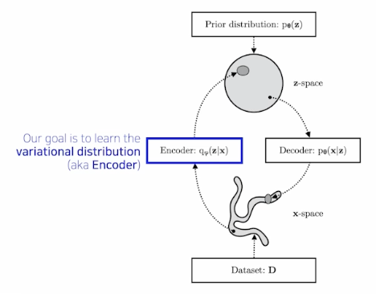

# [Deep Learning/딥 러닝] 생성 모델

# Generative Models Part 1

## Introduction

💡 [Deep Generative Models](https://deepgenerativemodels.github.io/){:target="_blank"}

- What does it mean by learning a generative model?

### Learning a Generative Model

- Suppose that we are given images of dogs.
- We want to learn a probability distribution $$p(x)$$ such that
    - Generation: If we sample $$\tilde x\sim p(x)$$, $$\tilde x$$ should look like a dog.
    - Density estimation: $$p(x)$$ should be high if $$x$$ looks like a dog, and low otherwise.
        - This is also known as an explicit models.
- Then how can we represent $$p(x)$$?

### Basic Discrete Distributions

- Bernoulli distribution: (biased) coin flip
    - Sample space $$D=\{\text{Heads}, \text{Tails}\}$$.
    - Specify $$P(X=\text{Heads})=p$$. Then $$P(X=\text{Tails})=1-p$$.
    - Say $$X\sim\text{Ber}(p)$$.
- Categorical distribution: (biased) $$m$$-sided dice
    - Sample space $$D=\{1,\cdots,m\}$$.
    - Specify $$P(Y=i)=p_i$$ such that $$\sum_{i=1}^mp_i=1$$.
    - Say $$Y\sim\text{Cat}(p_1,\cdots,p_m)$$.

### Example

- Modeling a single pixel of an RGB image.
    - Color tuple $$(r,g,b)\sim p(R,G,B)$$
    - Number of cases = $$256\times256\times256$$
    - How many parameters do we need to specify?
        
        $$
        256\times256\times256-1
        $$
        

## Independence

### Example

- Suppose we have $$X_1,\cdots,X_n$$ of binary pixels (a binary image).
    - Number of cases = $$2^n$$
    - How many parameters do we need to specify?
        
        $$
        2^n-1
        $$
        
    
    → Almost impossible to model a distribution
    

### Structure through Independence

- Suppose independencies among $$X_i’s$$ for $$i=1,\cdots,m$$
    - Number of cases = $$2^n$$
    - However parameters we need to specify = $$n$$.
    
    → Bad modeling that can represent a meaningful distribution
    

### Conditional Independence

- 위 두 assumptions의 중간 어딘가의 타협점을 찾기 위해..
- Three important rules
    - Chain rule
        
        $$
        p(x_1,\cdots,x_n)=p(x_1)p(x_2|x_1)p(x_3|x_1,x_2)\cdots p(x_n|x_1,\cdots,x_{n-1})
        $$
        
    - Bayes’ rule
        
        $$
        p(x|y)=\frac{p(x,y)}{p(y)}=\frac{p(y|x)p(x)}{p(y)}
        $$
        
    - Conditional independence
        
        If $$x\perp y|z$$, then
        
        $$
        p(x|y,z)=p(x,z)
        $$
        
- Using chain rule we obtain
    
    $$
    P(X_1,\cdots,X_n)=P(X_1)P(X_2|X_1)\cdots P(X_n|X_1,\cdots,X_{n-1})
    $$
    
- How many parameters?
    - For each term, $$P(X_i|X_{i-1},\cdots)$$: $$2^{i-1}$$ parameters needed
    - The total sum becomes $$1+2+\cdots+2^{n-1}=2^n-1$$.
- Now we suppose Markov assumption: $$X_{i+1}\perp X_1,\cdots,X_{i-1}\perp X_i$$, then the above equation becomes
    
    $$
    p(x_1,\cdots,x_n)=p(x_1)p(x_2|x_1)p(x_3|x_2)\cdots p(x_n|x_{n-1})
    $$
    
- How many parameters?
    
    $$
    2n-1
    $$
    
    - Hence by leveraging the Markov assumption, we get exponential reduction on the number of parameters.
    - Autoregressive models leverages this conditional independency.

## Autoregressive Models

- Suppose we have $$28\times28$$ binary pixels.
- Our goal is to learn $$P(X)=P(X_1,\cdots,X_{784})$$ over $$X\in\{0,1\}^{784}$$.
- Then how can we parametrize $$P(X)$$?
    - Let’s use the chian rule to factor the joint distribution.
    - An autoregressive model:
        
        $$
        P(X_{1:784})=P(X_1)P(X_2|X_1)P(X_3|X_2)\cdots
        $$
        
    - Note that we need an ordering (e.g., raster scan order) of all random variables.

### NADE: Neural Autoregressive Density Estimator

- The probability distribution of $$i$$-th pixel is
    
    $$
    p(x_i|x_{1:i-1})=\sigma(\alpha_i\bold h_i+b_i)\;\;\text{where}\;\;\bold h_i=\sigma(W_{<i}x_{1:i-1}+\bold c)
    $$
    
- **NADE** is an explicit model that can compute the density of the given inputs.
- How can we compute the density of the given image?
    - Suppose that we have a binary image with 784 binary pixels i.e., $$\{x_1,x_2,\cdots,x_{784}\}$$.
    - Then the joint probability is computed by
        
        $$
        p(x_1,\cdots,x_{784})=p(x_1)\cdots p(x_{784}|x_{1:783})
        $$
        
        where each conditional probability $$p(x_i|x_{1:i-1})$$ is computed independently.
        
- In case of modeling continuous random variables, a mixture of Gaussian (MoG) can be used.

### Summary of Autoregressive Models

- Easy to sample from
    - Sample $$\tilde x_0\sim p(x_0)$$
    - Sample $$\tilde x_1\sim p(x_1|x_0=\tilde x_0)$$
    - and so forth (in a sequential manner, hence slow).
- Easy to compute probability $$p(x=\tilde x)$$
    - Compute $$p(x_0=\tilde x_0)$$
    - Compute $$p(x_1=\tilde x_1|x_0=\tilde x_0)$$
    - Multiply together (sum their logarithms)
    - and so on.
    - Ideally we can compute all these terms in parallel.
- Easy to be extended to continuous variables. E.g., we can choose mixture of Gaussians.

# Generative Models Part 2

## Maximum Likelihood Learning

- Given a training set of examples, we can cast the generative model learning process as finding the best-approximating density model from the model family.
- Then how can we evaluate the goodness of the approximation?
- KL-divergence ~ symmetric property를 만족하지 않으나 “근사적으로” 두 분포사이의 거리를 의미하는 것으로 해석
    
    $$
    \begin{aligned}\mathcal D(P_\text{data}\Vert P_\theta)&=\mathbb E_{\bold x\sim P_\text{data}}\left[\log\left(\frac{P_\text{data}(\bold x)}{P_\theta(\bold x)}\right)\right]\\&=\int P_\text{data}(\bold x)\log\frac{P_\text{data}(\bold x)}{P_\theta(\bold x)}\;\text{d}\bold x\end{aligned}
    $$
    
- We can simplify the above as follows:
    
    $$
    \begin{aligned}\mathcal D(P_\text{data}\Vert P_\theta)&=\mathbb E_{\bold x\sim P_\text{data}}\left[\log\left(\frac{P_\text{data}(\bold x)}{P_\theta(\bold x)}\right)\right]\\&=\mathbb E_{\bold x\sim P_\text{data}}[\log P_\text{data}(\bold x)]-\mathbb E_{\bold x\sim P_\text{data}}[\log P_\theta(\bold x)]\end{aligned}
    $$
    
- As the first term does not depend on $$P_\theta$$, minimizing the KL-divergence is equivalent to maximizing the expected log-likelihood.
    
    $$
    \begin{aligned}\argmin_{P_\theta}\mathcal D(P_\text{data}\Vert P_\theta)&=\argmin_{P_\theta}-\mathbb E_{\bold x\sim P_\text{data}}[\log P_\theta(\bold x)]\\&=\argmax_{P_\theta}\mathbb E_{\bold x\sim P_\text{data}}[\log P_\theta(\bold x)]\end{aligned}
    $$
    
- Approxmiate the expected log-likelihood
    
    $$
    \mathbb E_{\bold x\sim P_\text{data}}\left[\log P_\theta(\bold x)\right]
    $$
    
    with the empirical log-likelihood
    
    $$
    \mathbb E_\mathcal D[\log P_\theta(\bold x)]=\frac{1}{|\mathcal D|}\int_{\bold x\in\mathcal D}\log P_\theta(\bold x)\;\text{d}\bold x
    $$
    
    - 분포 $$P_\text{data}$$을 직접적으로 알 수 없는 상황에서 관측한 데이터셋 $$\mathcal D$$가 분포 $$P_\text{data}$$를 가진다고 가정하고 parametrized distribution을 학습하겠다는 것
- Maximum likelihood learning is then
    
    $$
    \max_{P_\theta}\frac{1}{|\mathcal D|}\int_{\bold x\in\mathcal D}\log P_\theta(\bold x)\;\text{d}\bold x
    $$
    
- Variance of Monte Carlo estimate is high:
    
    $$
    V_P[\hat g]=V_P\left[\frac{1}{T}\sum_{t=1}^Tg(x^t)\right]=\frac{V_P[g(x)]}{T}
    $$
    
    - 데이터 수가 충분하지 않을 경우, 예측이 정확하지 않을 수 있음

### Empirical Risk Minimization

- For maximum likelihood learning, empirical risk minimization (ERM) if often used.
- However, ERM often suffers from its overfitting.
    - Extreme case: The model remembers all training data
        
        $$
        p(x)=\frac{1}{|\mathcal D|}\sum_{i=1}^{|\mathcal D|}\delta(x,x_i)
        $$
        
- To achieve better generalization, we typically restrict the hypothesis space of distributions that we search over.
- However, it could deteriorate the performance of the generative model.

### Maximum Likelihood Learning

- Usually MLL is prone to underfitting as we often use simple parametric distributions such as spherical Gaussians.
- 모든 사용 가능한 확률 분포를 사용할 수 없기 때문
- 최적화를 위해 gradient descent 기법을 사용하며 미분 가능한 log likelihood를 사용해야 하는데 이때 무난하게 가정하는 것이 Gaussian. 사실 유의미한 분포를 모델링하는 것이 2014년 Ian Goodfellow이 제안한 GAN 이전까지 불가능했음.
- What about other ways of measuring the similarity?
    - KL-divergence leads to maximum likelihood learning or Variational Autoencoder (VAE).
    - Jensen-Shannon divergence leads to Generative Adversarial Network (GAN).
    - Wasserstein distance leads to Wasserstein Autoencoder (WAE) or Adversarial Autoencoder (AAE).

## Latent Variable Models

<aside>
💡 D.Kingma, “Variational Inference and Deep Learning: A New Synthesis,” Ph.D Thesis

</aside>

### Is an autoencoder a generative model?

→ No. Just a model.

### Variational Autoencoder

- Objective
    
    $$
    \max p_\theta(x)
    $$
    
- Variational Inference (VI)
    - The goal of VI is to optimize the variational distribution the best matches the posterior distribution.
        - Posterior distribution: $$p_\theta(z|x)$$
        - Variational distribution: $$q_\phi(z|x)$$
    - In particular, we want to find the variational distribution that minimizes the KL-divergence between the true posterior.

- MLE
    
    $$
    \begin{aligned}
    \overbrace{\log p_\theta(x)}^\text{maximum likelihood learning}
    &=\int_z\underbrace{q_\phi(z|x)}_{\text{For\;any}\;q_\phi}\log p_\theta(x)\mathrm{d}x
    \\&=\mathbb E_{z\sim q_\phi(z|x)}\left[\log\frac{p_\theta(x)p_\theta(z|x)}{p_\theta(z|x)}\right]
    \\&=\mathbb E_{z\sim q_\phi(z|x)}\left[\log\frac{p_\theta(x,z)}{p_\theta(z|x)}\right]
    \\&=\mathbb E_{z\sim q_\phi(z|x)}\left[\log\frac{p_\theta(x,z)q_\phi(z|x)}{p_\theta(z|x)q_\phi(z|x)}\right]
    \\&=\mathbb E_{z\sim q_\phi(z|x)}\left[\log\frac{p_\theta(x,z)}{q_\phi(z|x)}\right]+\mathbb E_{z\sim q_\phi(z|x)}\left[\log\frac{q_\phi(z|x)}{p_\theta(z|x)}\right]
    \\&=\underbrace{\mathbb E_{z\sim q_\phi(z|x)}\left[\log\frac{p_\theta(x,z)}{q_\phi(z|x)}\right]}_{\text{ELBO}\;\uparrow}+\underbrace{D_{KL}(q_\phi(z|x)\Vert p_\theta(z|x))}_{\text{Variational Gap}\;\downarrow}
    \end{aligned}
    $$
    
    - ELBO: Evidence Lower Bound
    - True posterior $$q_\phi(z|x)$$는 존재성은 알고 있으나 수식으로 풀어내어 계산하는 것은 불가능한 항
    - 목적은 $$p_\theta$$를 $$q_\phi$$에 근사하고자 하는 것
    - 이때 ELBO는 tractable quantity이므로 이를 최대화하여 variational gap을 상대적으로 줄이고자 하는 것

### Evidence Lower Bound

$$
\begin{aligned}
\underbrace{\mathbb E_{z\sim q_\phi(z|x)}\left[\log\frac{p_\theta(x,z)}{q_\phi(z|x)}\right]}_{\text{ELBO}\;\uparrow}
&=\int\log\frac{p_\theta(x|z)p(z)}{q_\phi(z|x)}q_\phi(z|x)\mathrm dz
\\&=\underbrace{\mathbb E_{q_\phi(z|x)}[p_\theta(x|z)]}_\text{reconstruction\;term}-\underbrace{D_{KL}(q_\phi(z|x)\Vert p(z))}_\text{prior\;fitting\;term}
\end{aligned}
$$

- Reconstruction term: encoder $$q_\phi$$와 decoder $$p_\theta$$를 모두 통과한 것으로 해석할 수 있음
- Prior fitting term — enforces the latent distribution to be similar to the prior distribution $$p(z)$$.

### Key Limitations

- Intractable model (hard to evaluate likelihood)
- The prior fitting term should be differentiable ($$\because$$ gradient descent method), hence it is hard to use diverse latent prior distributions.
- In most cases, we use an isotropic Gaussian where we have a closed-form for the prior fitting term.
    
    $$
    D_{KL}(q_\phi(z|x)\Vert \mathcal N(0,I))=\frac{1}{2}\sum_{i=1}^{|\mathcal D|}(\sigma_{z_i}^2+\mu_{z_i}^2-\log(\sigma_{z_i}^2)-1)
    $$
    
- Prior fitting term을 gradient descent로 최적화하기 위해서는 isotropic Gaussian을 가정할 수밖에 없기 때문에 Gaussian을 사용
- 생성된 이미지의 퀄리티로 볼 때, 추천되지 않는 방법

## Generative Adversarial Networks

$$
\min_G\max_DV(D,G)=\mathbb E_{\bold x\sim p_\text{data}(\bold x)}[\log D(\bold x)]+\mathbb E_{\bold z\sim p_{\bold z}(\bold z)}[\log(1-D(G(\bold z)))]
$$

### GAN objective

- GAN is a two player minimax game between generator and discriminator.
    - Discriminator objective:
        
        $$
        \max_DV(G,D)=\mathbb E_{\bold x\sim p_\text{data}(\bold x)}[\log D(\bold x)]+\mathbb E_{\bold x\sim p_G(\bold z)}[\log(1-D(\bold x))]
        $$
        
    - The optimal discriminator is
        
        $$
        D_G^*(\bold x)=\frac{p_\text{data}(\bold x)}{p_\text{data}(\bold x)+p_G(\bold x)}
        $$
        
    - Generator objective:
        
        $$
        \min_GV(G,D)=\mathbb E_{\bold x\sim p_\text{data}}[\log D(\bold x)]+\mathbb E_{\bold x\sim p_G}[\log(1-D(\bold x))]
        $$
        
    - Plugging the optimal discriminator into the above generator objective equation we obtain
        
        $$
        \begin{aligned}
        V(G,D_G^*(\bold x))
        &=\mathbb E_{\bold x\sim p_\text{data}}\left[\log \frac{p_\text{data}(\bold x)}{p_\text{data}(\bold x)+p_G(\bold x)}\right]+\mathbb E_{\bold x\sim p_G}\left[\log\frac{p_G(\bold x)}{p_\text{data}(\bold x)+p_G(\bold x)}\right]
        \\&=\mathbb E_{\bold x\sim p_\text{data}}\left[\log \frac{p_\text{data}(\bold x)}{\frac{p_\text{data}(\bold x)+p_G(\bold x)}{2}}\right]+\mathbb E_{\bold x\sim p_G}\left[\log\frac{p_G(\bold x)}{\frac{p_\text{data}(\bold x)+p_G(\bold x)}{2}}\right]-\log4
        \\&=\underbrace{D_{KL}\left[p_\text{data},{\frac{p_\text{data}+p_G}{2}}\right]+D_{KL}\left[p_G,{\frac{p_\text{data}+p_G}{2}}\right]}_{2\times\text{Jenson-Shannon\;Divergence\;(JSD)}}-\log4
        \\&=2D_{JSD}[p_\text{data},p_G]-\log4
        \end{aligned}
        $$
        

### Deep Convolutional GAN

## Diffusion Models

<aside>
💡 Ho et al., “Denoising Diffusion Probabilistic Models,” 2020

</aside>

- Diffusion models progressively generate images from noise.
- 논문 이해를 위한 lecture note 링크: [https://github.com/sjchoi86/2022-1-deep-learning-applications/blob/main/lecture note/08. Generative model (DDPM).pdf](https://github.com/sjchoi86/2022-1-deep-learning-applications/blob/main/lecturenote/08.Generativemodel(DDPM).pdf)
- DDPM paper는 1000번의 step을 밟음. 한 이미지 생성에 몇 분씩 소요.
- 장점? 성능이 좋음. 비효율적으로 보이고 구현하기는 더더욱 어려우나, 월등히 좋은 성능.
- Autoregressive model 성능도 좋다는 것이 알려지면서 2022년 기준 엎치락뒤치락하는 상황.

### Diffusion Models

- Forward (diffusion) process progressively injects noise to an image.
    
    $$
    p_\theta(\bold x_{t-1}|\bold x_t):=\mathcal N(\bold x_{t-1};\mu_\theta(\bold x_t,t),\Sigma_\theta(\bold x_t,t))
    $$
    
- The reverse process is learned in such a way to denoise the perturbed image back to a clean image.
- DDPM 간단 요약: 굉장히 오랜 스텝을 거쳐 noise vector를 original image로 개선해나가는 과정

### DALL-E 2

- 이미지의 특정 부분을 editing 할 수 있다는 점이 인상적

## 참고
- [부스트코스 - 딥러닝 기초 다지기](https://www.boostcourse.org/ai111){:target="_blank"}
