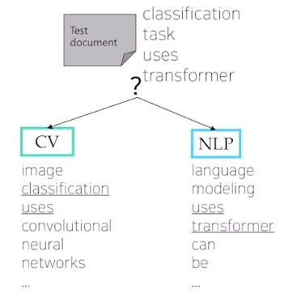
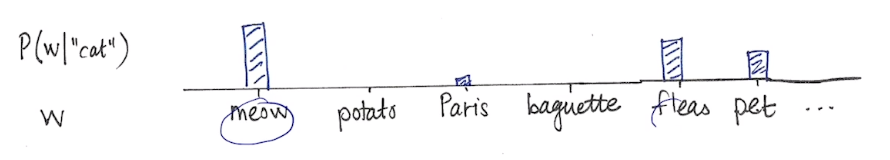

# [NLP/자연어 처리] 단어 임베딩 등

## Part 1 — Bag of Words & Word Embedding

### NLP 들어가기

- **Bag-of-Words**: 단어의 표현 시 one-hot-encoding을 이용하며, 단어의 등장 순서를 고려하지 않는 아주 간단한 방법 중 하나. 간단한 모델이지만 많은 자연어 처리 task에서 효과적으로 동작하는 알고리즘 중 하나.
- **Naive Bayes Classifier**: Bag-of-Words를 이용해 문서를 분류.

#### NLP tasks

- NLU: 문장, 문단 등을 컴퓨터가 이해할 수 있는가
- NLG: 자연어를 상황에 따라 적절히 생성할 수 있는가

#### NLP 응용

- Language modeling (언어 모델)
    
    현재까지 주어진 문장이나 문단 일부를 보고 다음 단어를 예측
    
- Machine translation (기계 번역)
- Question answering (질의응답)
- Document classification (문서 분류)
- Dialog systems (대화 시스템)

#### 자연어 처리(NLP)

- Major conferences: ACL, EMNLP, NAACL
- SOTA(state-of-the-art) 딥러닝 기반 모델 & 태스크
- Low-level parsing
    - Tokenization (토큰화)
        - E.g., “I study math”의 각 단어를 정보 단위로 생각. 이러한 단어를 보통 토큰이라고 부르고, 단어 단위로 쪼개나가는 과정이 tokenization
    - Stemming (어간추출)
        - E.g., study가 studied, studies 등으로 변하는 것. 단어의 다양한 의미 변화를 없애고 주요 의미만을 추출하는 것이 stemming
- Word and phrase level
    - Named entity recognition (NER, 고유 명사 인식)
        - E.g., New York Times를 하나의 고유 명사로서 인식해야
    - Part-of-speech (POS) tagging (품사 태깅)
        - E.g., 단어들이 문장 내에서 어떤 품사를 가지는가
    - Noun-phrase chunking (명사구 청킹)
    - Dependency parsing (종속성 구문 분석)
    - Coreference resolution
- Sentence level
    - Sentiment analysis (감정 분석)
        - E.g., This moive was not that bad는 bad라는 단어가 들어갔음에도 부정이 아닌 긍정으로 분류할 수 있어야
    - Machine translation (기계 번역)
- Multi-sentence and paragraph level
    - Entailment prediction (수반 예측)
        - 두 문장 간의 내포, 모순 관계 등을 예측
        - E.g., 어제 John이 결혼했다. 어제 최소한 한 명이 결혼했다. → 첫 문장이 참인 경우, 다음 문장은 참.
    - Question answering (질의응답)
        - E.g., Where did Napoleon die?를 Google에 검색하는 경우, 이전에는 질문에 포함된 단어가 많이 포함된 관련 문서의 링크를 리스트업 해주었지만, 현재는 질문에 바로 답할 수 있도록 바뀜
    - Dialog systems (대화 시스템)
    - Summarization (요약)

#### 텍스트 마이닝(Text mining)

- Major conferences: KDD, The WebConf (formerly, WWW), WSDM, CIKM, ICWSM
- 텍스트나 문서로부터 유용한 정보나 인사이트를 추출하는 것
    - E.g., analyzing the trends of AI-related keywords from massive news data
- 문서 클러스터링 (예컨대, 토픽 모델링)
    - E.g., clustering news data and grouping into different subjects
- 계산 사회과학과 밀접한 연관
    - E.g., analyzing the evolution of people’s political tendency based on social media data
    - 신조어 분석 → 사회과학적 인사이트 도출

#### 정보 검색(Information retrieval)

- Major conferences: SIGIR, WSDM, CIKM, RecSys
- 구글, 네이버 등 포털의 검색 기술 연구
- 어느 정도 성숙한 분야. 발전 속도가 느려진 분야.
- 현재는 활발히 연구가 진행되지 않으나, 추천시스템 분야로 진화하여 연구가 되고 있기도 함!

#### NLP 트렌드

- 텍스트 데이터는 단어의 시퀀스로 볼 수 있는데, 각각의 단어는 Word2Vec 혹은 GloVe 방법 등에 의해 벡터로 표현될 수 있음.
- RNN 패밀리 모델인 LSTMs, GRUs 등이 NLP 태스크의 메인 아키텍처!
- RNN 모델들을 self-attention이 대체함으로써 NLP 태스크의 전반적인 성능은 attention(어텐션) 모듈 및 트랜스포머 모델 이후로 향상되어 왔음.
    - Attention Is All You Need — 기계 번역을 위해 제안된 트랜스포머
    - 현재 자연어처리 모델들은 트랜스포머를 기본 구조로 함.
    - 기계 번역의 경우 딥 러닝이 등장하기 이전 지난 십수 년간 성능 향상을 위해 rule-base 방식이 쓰였음. 하지만 예외가 워낙 많아 한계가 있었음.
    - RNN 기반 기술을 썼더니 성능이 월등히 올라가게 됨.
- 트랜스포머 모델과 마찬가지로, 대부분의 진보한 NLP 모델들의 원목적은 기계번역 태스크 성능 향상을 위한 것이었음.
    - 트랜스포머는 여기에서 또 한 번의 성능 점프를 가능케했고, 영상 처리, 시계열 예측, 신약 개발, 신물질 개발 등 다른 여러 분야에도 광범위하게 응용됨.
- 최근, 다른 NLP 태스크들 해결을 위한 커스터마이징된 모델들이 따로 떨어져 나가 발전해옴.
- 트랜스포머가 제안된 이후로 트랜스포머의 기초 모듈인 self-attention을 단순히 쌓는 방식의 거대 모델들 방식들이 제안되었으며, 이들은 자가지도학습 환경에서 언어 모델링 태스크를 통해 방대한 크기의 데이터셋에 의해 학습됨.
    - Self-attention 모듈을 단순히 쌓아나가는 식으로 모델 크기를 키우고 대규모 텍스트 데이터를 통해, 소위 자가 지도 학습이라는 특정 태스크를 위해 별도의 레이블이 필요하지 않은 범용 태스크를 활용하여 모델을 학습하고, 사전 학습된 모델을 전이 학습 형태로 적용 → 기존의 태스크별로 특화된 모델들보다 월등히 뛰어난 성능을 보임
    - AGI, 범용 인공지능 기술로서 현대의 인공지능이 발전했다고도 해석할 수 있음
    - 대규모의 데이터, 엄청난 규모의 GPU가 필요 → 구글, 메타, OpenAI 등 막강한 자본력이 뒷받침되는 일부 소수의 기관에 의해 독점
    - E.g., BERT, GPT-3, …
- 이후에 위에 언급된 모델들은 전이학습으로 응용되었으며 기존의 커스터마이징된 모델들을 압도하는 성능을 보임.
- 현재 수많은 NLP 태스크들의 핵심. 제한된 GPU 자원으로 NLP 연구가 힘들어진 상황.

### Bag-of-Words

#### Bag-of-Words Representation

- Step 1. Construct the vocabulary containing unique words
    - 예시 문장
        - “John really really loves this movie”, “Jane really likes this song”
    - → 중복 단어를 제거하여 사전 구축!
    - 단어
        - {”John”, “really”, “loves”, “this”, “movie”, “Jane”, “likes”, “song”}
- Step 2. Encode unique words to one-hot vectors
    - Vocabulary
        - {”John”, “really”, “loves”, “this”, “movie”, “Jane”, “likes”, “song”}
        - Each word maps to one-hot vector
        - E.g., John: [1 0 0 0 0 0 0 0], really: [0 1 0 0 0 0 0 0]
    - For any pair of words, the Euclidean distance is $$\sqrt2$$
    - For any pair of words, the cosine similarity is $$0$$
    - Word embedding과는 다른 특징. 즉 단어의 의미와는 무관하게 단어 간 상관관계가 모두 동일한 것으로 가정.
- A sentence/document can be represented as the sum of one-hot vectors
    - Sentence 1
        - “John really really loves this movie”
        - John + really + really + loves + this + movie: [1 2 1 1 1 0 0 0]
    - Sentence 2
        - “Jane really likes this song”
        - Jane + really + likes + this + song: [0 1 0 1 0 1 1 1]
- Bag-of-Words for Document Classification
    
    
    

#### Bayes’ Rule applied to Document and Classes

- For a document $$d$$ consisting of a sequence of words $$w$$, and a class $$c$$,
    
    $$
    \begin{aligned}
    c_\text{MAP}&=\arg\max_{c\in C}P(c\vert d)
    \\&=\arg\max_{c\in C}\frac{P(d\vert c)P(c)}{P(d)}\text{(Bayes rule)}
    \\&=\arg\max_{c\in C}P(d\vert c)P(c)
    \end{aligned}
    $$
    
- The probability of a document can be represented by multiplying the probability of each word appearing
- With conditional independence assumption,
    
    $$
    \begin{aligned}P(d\vert c)P(c)&=P(w_1,w_2,\cdots,w_n\vert c)P(c)\\&=P(c)\prod_{w_i\in W}P(w_i\vert c)\end{aligned}
    $$
    

### 단어 임베딩(Word embedding)

- 단어를 벡터에 1—1 매핑하는 것
- Similar words (E.g., ‘cat’ and ‘kitty’)
    
    → similar vector representations
    
    → short Euclidean distance
    
- Dissimilar words → far each other

#### Word2Vec

- 문맥을 고려해 단어 표현을 학습
- 가정
    - 유사 문맥 내 단어들을 유사 의미를 가질 것이다!
- 한 단어는 주변의 단어를 통해 의미를 알 수 있다는 가정에 착안
- E.g., cat 주변 단어를 지우고(masking) cat이 주어졌을 때 주변 단어의 분포를 살핌
    
    
    

#### Word2Vec 특성 — Intrusion Detection

- 거리가 가장 먼 단어 골라내기
- **staple** hammer saw drill
- math **shopping** reading science

#### Word2Vec 응용

- 단어 유사성(word similarity)
- 기계 번역(machine translation)
- 품사 태깅(part-of-speech tagging)
- 개체명 인식(named entity recognition)
- 감정 분석(sentiment analysis)
- 클러스터링(clustering)
- 의미론적 어휘 구축(semantic lexicon building)

#### GloVe: Global Vectors for Word Representation

- 손실 함수
    
    $$
    J(\theta)=\frac{1}{2}\sum_{i,j=1}^Wf(P_{ij})(u_i^Tv_j-\log P_{ij})^2
    $$
    
- Word2Vec과의 차이점?
    - Word2Vec의 경우, 학습이 빈번하게 될수록 단어 간 유사도 값도 커지게끔 손실 함수가 세팅됨.
    - GloVe의 경우, 단어 간 유사도($$u_i^Tv_j$$)가 두 단어가 한 윈도우 내에 등장한 빈도 수($$P_{ij}$$)의 로그값에 가까워지도록 손실함수를 세팅한 것. 이때 $$P_{ij}$$는 한 윈도우 내 단어쌍이 동시 등장한 빈도 수로서 미리 계산함.
- 해석
    - 선형대수의 관점에서, 추천시스템에 많이 활용되는 알고리즘인 co-occurence matrix의 low rank matrix factorizaiton의 태스크로도 이해할 수 있음.
- 실제 다양한 태스크에 적용할 경우 Word2Vec, GloVe 모두 성능이 비등한 수준으로 나타남

## 참고
- [부스트코스 - 자연어 처리의 모든 것](https://www.boostcourse.org/ai330){:target="_blank"}
