# [NLP/자연어 처리] 순환 신경망(RNN) 아키텍처

## Part 2 — RNN, LSTM, and GRU

### RNNs 기초

#### Model architecture and how it works

- 기본 구조
    
    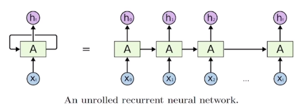
    
    - 시각 $$t$$에서의 시퀀스 입력 벡터 $$x_{t}$$와 은닉 상태 벡터(hidden state vector; 드러나지 않은 정보를 담은 상태 벡터) $$h_{t-1}$$를 입력으로 받아 출력으로 $$h_t$$를 내어주는 형태
        
        $$
        h_t=f_W(h_{t-1},x_t)
        $$
        
    - 여기에 더해 $$y_t$$는 각 시퀀스 요소마다 계산될 수도, 시퀀스 단위별로 한 개의 레이블씩 계산될 수도 있음. 예컨대, 문장 내 단어의 품사 예측을 해야한다면 단어마다 $$y_t$$가 계산될 것이고, 문장의 긍부정 여부를 판단하는 모델이라면 문장 단위로 $$y_t$$가 계산됨.
    - RNNs 모델에서 $$h_t$$를 계산하는 방법
        
        $$
        \begin{aligned}h_t&=f_W(h_{t-1},x_t)\\&=\tanh(W_{hh}h_{t-1}+W_{xh}x_t)\\y_t&=W_{hy}h_t\end{aligned}
        $$
        
    - 해석
        
        $$
        \begin{aligned}W_{xh}&:x_t\rightarrow h_t\\W_{hh}&:h_{t-1}\rightarrow h_t\\W_{hy}&:h_t\rightarrow y_t\end{aligned}
        $$
        

### RNNs 종류

- One-to-one
    
    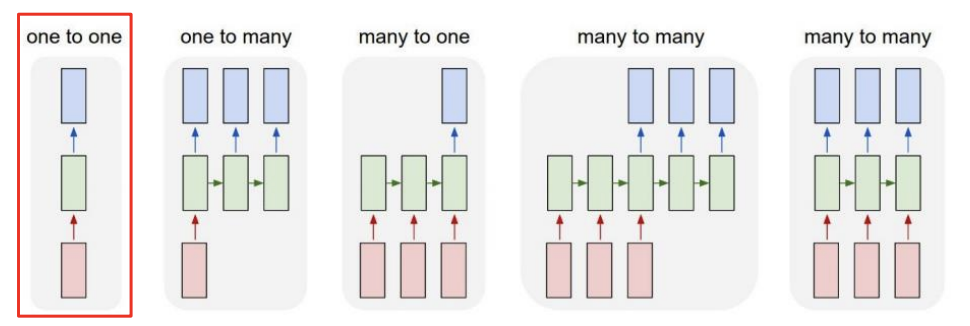
    
    - E.g., 키, 몸무게, 나이 → $$h_t$$ → 혈압의 고혈압/저혈압/정상혈압 여부
- One-to-many
    
    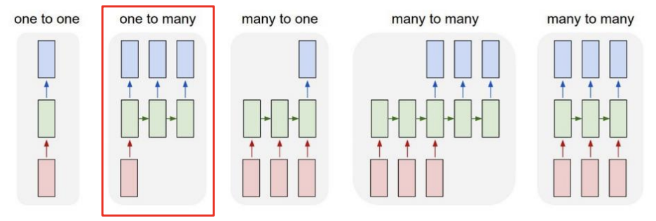
    
    - E.g., 이미지 캡셔닝(image captioning)
- Many-to-one
    
    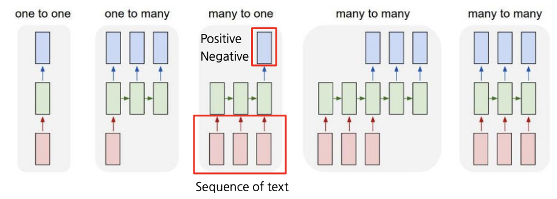
    
    - E.g., 감정 분석(sentiment analysis) … 영화 리뷰의 긍부정 레이블링
- Many-to-many
    
    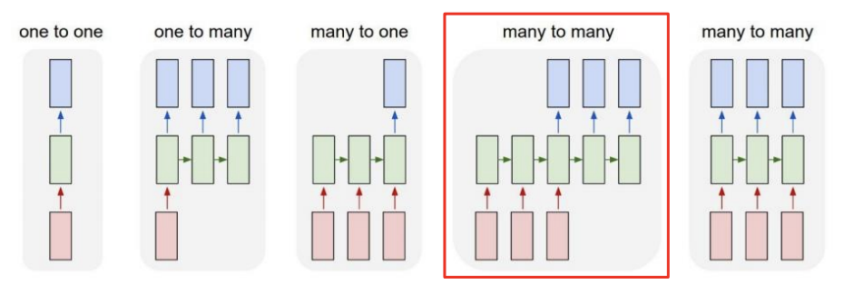
    
    - E.g., 기계 번역(machine translation)
- Many-to-many
    
    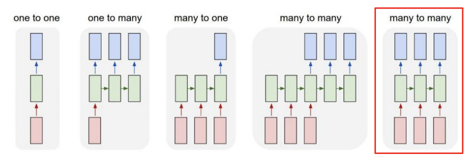
    
    - E.g., delay가 허락되지 않는 문제들, 예컨대 품사 태깅(POS tagging)이나 프레임 레벨에서의 비디오 분류(video classification on frame level) 문제 등

### Character-level Language Model

- 언어 모델: 주어진 문자열이나 단어 시퀀스를 바탕으로 그 다음 문자나 단어를 예측하는 태스크
- MyQ
    - 비선형함수를 쓰는 이유는 원칙에 대한 예외를 학습시키기 위해서인가?
- RNN 모델을 활용하여 주식 가격 예측 시스템 설계해볼 수도!

#### 예제 (Vanilla RNN 아닌 LSTM, GRU를 이용한 학습!)

- Shakespeare 작품 학습
    
    
    
- LaTeX으로 작성된 논문 학습
    
    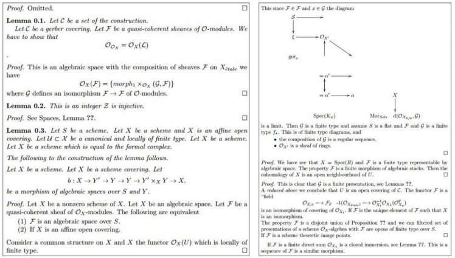
    
- C 코드 학습
    
    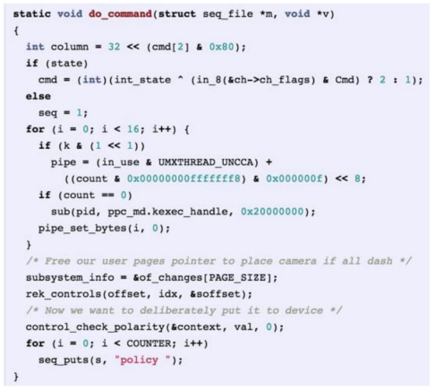
    

#### Backpropagation through time (BPTT)

- 시퀀스 길이가 길면 컴퓨팅 자원 한계 등으로 학습에 한계가 있을 수 있음
    
    → 한 번에 학습할 수 있는 시퀀스 길이를 제한
    

#### RNN의 한계

- 기울기 소실 혹은 폭증(vanishing gradient or exploding)에 의한 학습 저하 문제
- 파라미터 값들이 절댓값이 0에 가까운 값을 가진다는 것의 의미
    
    → 뒤쪽의 time-step까지 유의미한 신호를 전달할 수 없게 됨을 의미
    

### Long Short-Term Memory (LSTM) & Gated Recurrent Unit (GRU)

#### 개선점

- Gradient vanishing or explosion 문제
- Long-term dependency 문제

#### LSTM (Long Short-Term Memory)

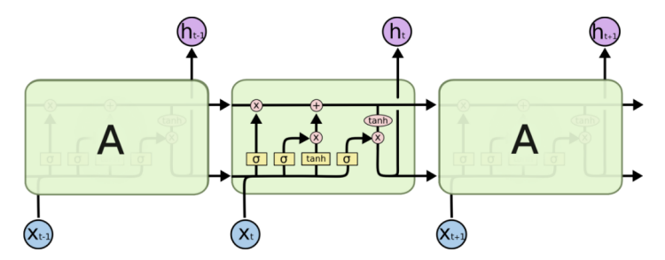

- 단기 기억 소자
- 모델링
    
    $$
    \begin{aligned}h_t&=f_W(x_t,h_{t-1})\\\rightarrow\{C_t,h_t\}&=\text{LSTM}(x_t,C_{t-1},h_{t-1})\end{aligned}
    $$
    
- 셀 상태(cell state) 정보 $$c$$와 은닉 상태(hidden state) 정보 $$h$$
    
    $$
    c_t=f_t\odot c_{t-1}+i_t\odot g_t
    $$
    
    - 해석
        - 다음 단위 시각 $$t$$의 셀 정보 $$c_t$$는 이전 단위 시각 $$t-1$$의 셀 정보 $$c_{t-1}$$에서 일정 정도를 망각하여 $$f_t$$ 만큼을 기억하고, 이전까지의 은닉 정보 $$h_{t-1}$$과 현재 토큰 $$x_t$$에 관한 정보를 종합한 $$g_t$$를 일정 정도 $$i_t$$만큼 기억하여 전파됨
        - 셀 상태 $$c_t$$
            - 조금 더 핵심 정보에 가까움
            - 조금 더 완성된, 여러 정보를 담고 있는 벡터
        - 히든 상태 $$h_t$$
            - 셀 상태 벡터를 한 번 더 가공하여 노출시킬 만한 정보만을 남긴 필터링 처리된 벡터
- 주의
    - 가운데 곱하기로 표시된 연산은 행렬 곱(matrix multiplication)이 아닌 아다마르 곱(Hadamard product; element-wise multiplication)이다.
- 한계?
    - 어차피 은닉 상태 정보가 셀 상태 정보의 일부를 취한 형태이고, 각각을 망각 혹은 기억하는 정도를 나타내는 가중치에 의한 선형 결합을 계산한다면, 게이트 $$f$$와 게이트 $$i$$의 역할을 하나가 하게끔 하는 방법을 쓸 수 있음 → GRU
    - 계산 비용
    - 메모리 사용량
        - 입력 데이터 길이에 따른 동적 메모리 할당

#### GRU (Gated Recurrent Unit)

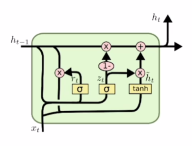

- GRU의 은닉 상태 정보 $$h$$가 LSTM의 셀 상태 정보 $$c$$와 비슷한 역할을 한다고 볼 수 있음
- 즉 보다 완성되고 여러 정보를 담고 있는 핵심 벡터 역할
- 은닉 상태 정보 $$h$$
    
    $$
    h_t=(1-z_t)h_{t-1}+z_t\tilde h_t
    $$
    
    - 업데이트 게이트(update gate) $$z_t$$가 LSTM에서의 $$i,f$$ 둘의 역할을 함

#### Backpropagation through time (BPTT)

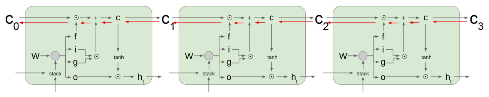

- LSTM이나 GRU는 Vanilla RNN과 달리 역전파(backpropagation) 과정에서 덧셈 연산이 추가되어 있어 gradient vanishing 등의 문제를 덜 겪음
- 덧셈 연산은 역전파를 복사해주는 역할을 함(두 방향으로 전파)

### RNN, LSTM, GRU 요약

- RNNs — 아키텍처 설계에 있어 유연성 제공
- Vanilla RNNs는 단순하나 잘 쓰이지 않고, LSTM이나 GRU 모델이 쓰임
- 이유는 RNNs 아키텍처가 겪는 기울기 폭증/소실(gradient explosion/vanishing) 문제 때문
- LSTM과 GRU 아키텍처 내 덧셈 연산이 기울기 흐름(gradient flow)을 개선함

## 참고
- [부스트코스 - 자연어 처리의 모든 것](https://www.boostcourse.org/ai330){:target="_blank"}
