# [NLP/자연어 처리] 어텐션 기반 Seq2seq 모델, 빔 서치, BLEU 점수

## Part 3 — Seq2seq with Attention, Beam Search and BLEU Score

### Seq2Seq with attention

#### Seq2Seq Model (Encoder-decoder architecture)

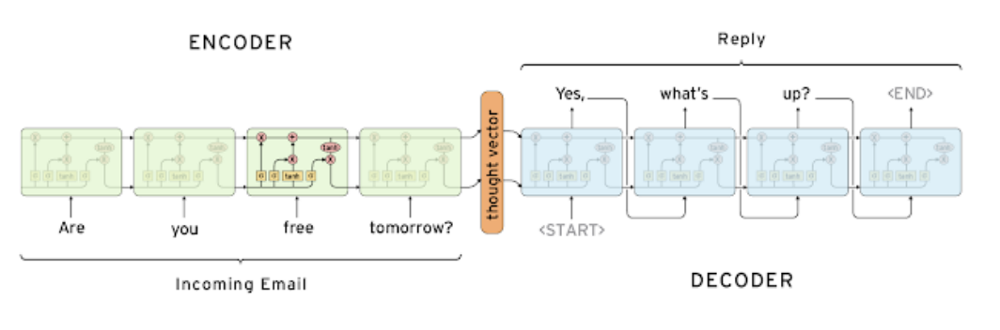

- Many-to-many RNN 계열에 해당
- 태스크 예시
    - 입력 문장 “Are you free tomorrow?”에 대해 출력 문장 “Yes, what’s up?”을 예측하는 태스크
- 인코더와 디코더는 서로 파라미터를 공유하지 않음
- 특수 토큰
    - <SoS>: Start of Sentence (문장 시작을 나타내는 토큰)
    - <EoS>: End of Sentence (문장 끝을 나타내는 토큰)
- 한계
    - Hidden state vector의 차원이 고정되어 있어 입력 문장 길이에 상관없이 정보를 인코더 끝단에 욱여넣어야 하는 문제
    - LSTM에서 long-term dependency를 Vanilla RNN에 비해 크게 개선했으나, 뒷단과 먼 앞쪽의 정보는 변경, 유실되는 등 변동이 있을 수 있음
        - 예컨대, I go home 정보를 순차로 압축한 다음 hidden state vector가 decoder에서 I를 번역할 때 정보가 유실되었을 수 있음
        - 이에 대한 해결책으로서 home go I와 같은 방식으로 문장을 뒤집어서 데이터를 feeding하는 방식이 제안되기도

#### Seq2Seq Model with Attention

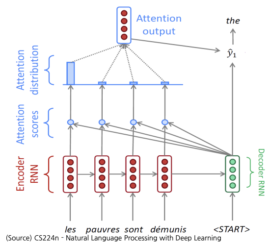

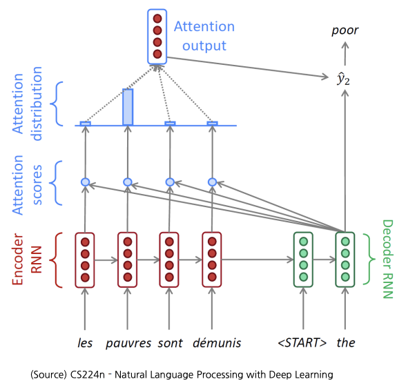

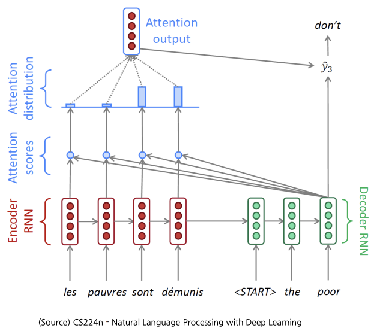

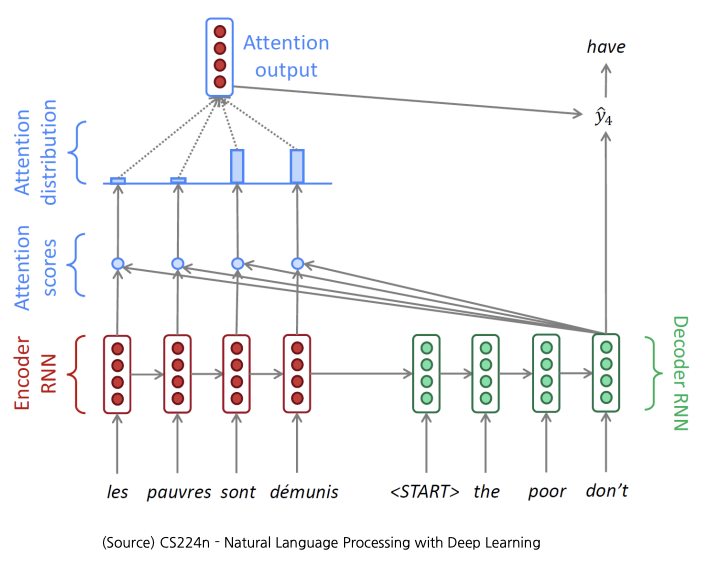

- Attention 모듈 아이디어: hidden state vector 뿐만 아니라 인코더의 hidden state vectors를 선별적으로 가져가 예측에 도움을 주는 형태로 활용
- Teacher forcing
    - 디코더 단에 매 time-step의 입력 토큰들을 모두 ground truth로 넣어주는 방식
- 처음에는 teacher forcing 방식을 사용하다가 학습 후반부에는 decoder의 각 time step의 예측 토큰을 다음 time step의 decoder 입력으로 집어넣는 방식도 존재

#### Attention Mechanism

$$
\begin{aligned}\text{score}(h_t,h_s)=\begin{cases}h_t^\top \bar h_s&\text{dot}\\h_t^\top \mathbf{W}_a\bar h_s&\text{general}\\v_a^\top \tanh(\mathbf{W}_a[h_t;\bar h_s])&\text{concat}\end{cases}\end{aligned}
$$

- Bahdanau attention (Additive attention)
    - Dzmitry Bahdanau, Kyunghyun Cho, Yoshua Bengio에 의해 2014년 제안
    - 기계 번역 개선을 위해 seq2seq 모델에 적용
    - 단 하나의 concat-score 정렬(alignment) 존재
    - Attention 계산 방법
        - 현재 디코더의 은닉 상태와 모든 인코더 은닉 상태 간의 어텐션 스코어(attention score) 계산
- Luong attention
    - Minh-Thang Luong, Hieu Pham, Christopher D. Manning에 의해 2015년 제안
    - 여러 종류의 정렬(alignments) 존재

#### Attention Mechanism’s Contributions

- NMT 성능 상당 개선
    - 디코더가 소스 데이터의 특정 부분에 주목하게끔 함
- Information bottleneck 문제 — encoder의 마지막 time step의 hidden step vector만을 사용하여 번역을 수행했어야 하는 문제 — 해결
    - Attention 메커니즘은 bottleneck 부분을 우회하여 상대적인 지름길로 역전파가 진행하게 하여 학습을 가능케 함
- 기울기 소실(gradient vanishing) 문제 해결
- Attention은 해석력(interpretability)을 제공함

### Beam Search

- Seq2seq with attention 중 자연어 생성 모델에서 테스트 시점에 보다 좋은 품질의 생성 결과를 낼 수 있는 기법

#### Greedy Decoding

- 매 단위 시각(time step)마다 가장 그럴 듯한 토큰을 예측하는 것
- 단점
    - 결정을 되돌릴 방법이 없음

#### Exhaustive Search

$$
P(y\vert x)=P(y_1\vert x)P(y_2\vert y_1,x)\cdots P(y_T\vert y_{T-1},\cdots,y_1,x)
$$

- 단점
    - 시퀀스 $$y$$의 가능한 조합을 모두 탐색할 경우, 어휘 크기 $$\vert V\vert$$에 대해 매 단위 시각 $$t$$마다 $$\vert V\vert^t$$가지의 부분 시퀀스를 탐색. 즉 $$O(\vert V\vert^t)$$의 시간복잡도 → 너무 큰 비용 소요

#### Beam Search

$$
\begin{aligned}\text{score}(y_1,\cdots,y_t)&=\log P_{LM}(y_1,\cdots,y_t\vert x)\\&=\sum_{i=1}^t\log P_{LM}(y_i\vert y_1,\cdots,y_{t-1},x)\end{aligned}
$$

- 매 단위 시각(time step)마다 디코더에서 beam size $$k$$가지의 가장 가능성 있는 부분 시퀀스만 탐색
- 장점
    - Greedy decoding, exhaustive search 방법의 중간 합의점
- 예시 ($$k=2$$)
    
    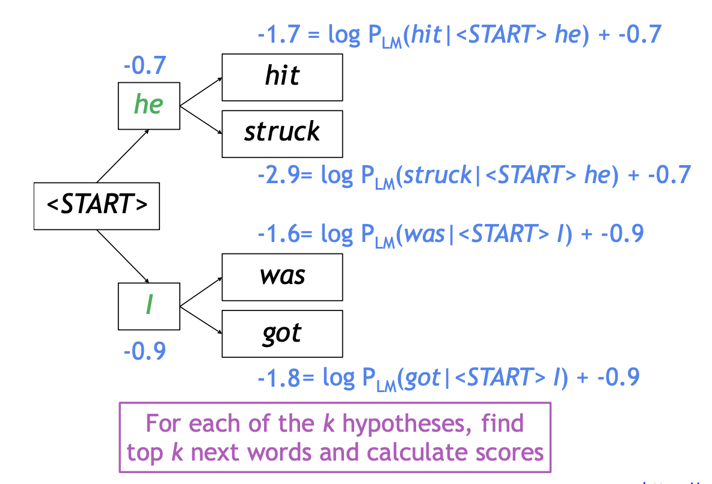
    
    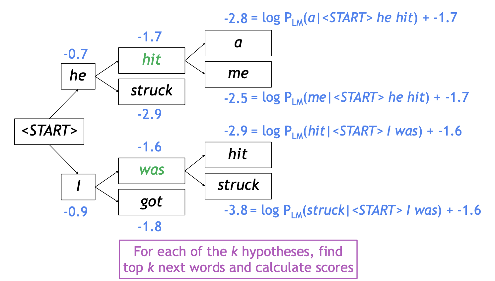
    
    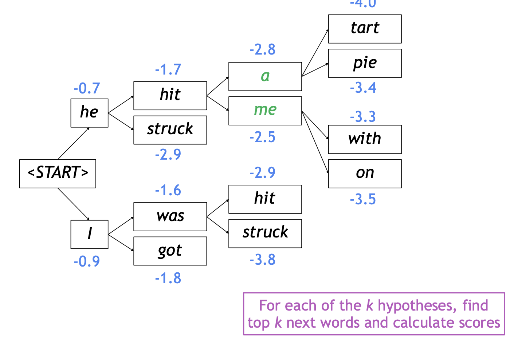
    
    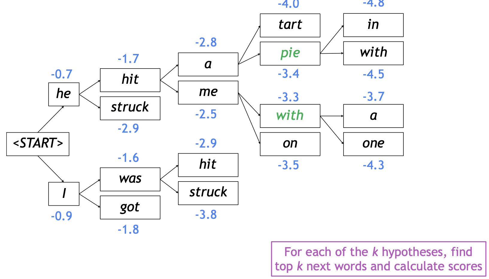
    
- 보완점
    - 토큰이 많이 생성될수록 결합 확률(joint probability)값이 더 작아지게 되는 문제 존재
- 개선된 score
    
    $$
    \text{score}(y_1,\cdots,y_t)=\frac{1}{t}\sum_{i=1}^t\log P_{LM}(y_i\vert y_1,\cdots,y_{t-1},x)
    $$
    

### BLEU score

#### Precision and Recall

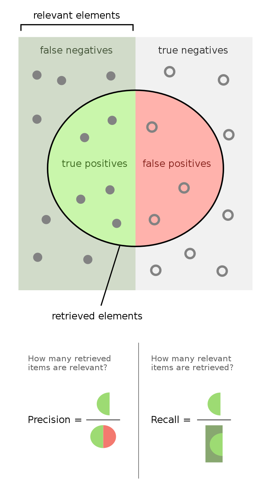

(그림 출처:[https://en.wikipedia.org/wiki/F-score](https://en.wikipedia.org/wiki/F-score))

- 정밀도(precision): 예측한 것 중에 얼마나 맞혔나?
    
    $$
    \text{Precision}=\frac{TP}{TP+FP}
    $$
    
- 재현율(recall): 양성들 중 얼마만큼을 예측해 맞혔나?
    
    $$
    \text{Recall}=\frac{TP}{TP+FN}
    $$
    
- 정밀도와 재현율 암기/구분
    - 전체 집합을 사각형으로 나타내고, 가운데 원을 그려 예측한 것을 나타냄.
    - 찍은 것 중 맞은 것 = 정밀도(precision)
        
        양성으로 맞혀야 할 것들 중 실제 맞힌 것 = 재현율(recall)
        
    - 개인적으로는 위 그림으로 기억하는 것이 편해서 머릿속에 그림을 그려서 외우려고 했다.

#### F1-score

- 정밀도와 재현율의 조화평균
    
    $$
    \begin{aligned}F_1&=\text{Precision}\Vert\text{Recall}\\&=\frac{\text{Precision}+\text{Recall}}{\text{Precision}\cdot\text{Recall}}\end{aligned}
    $$
    
- 양수들이 주어졌을 때, 이들의 산술평균 $$AM$$, 기하평균 $$GM$$, 조화평균 $$HM$$에 대하여
    
    $$
    AM\geq GM\geq HM
    $$
    
    이 성립하는데, 산술평균 $$AM$$이 중간값을 가진다는 점을 상기해보면, 기하평균 $$GM$$은 이보다 크지 않은 값으로 평균을 추정하며, 조화평균 $$HM$$은 또 이보다 크지 않은 값으로 평균을 추정함
    
- 세 가지 평균들 중 조화평균 $$HM$$이 가장 작은 값들에 민감하여 가장 작은 값에 평균값이 치우쳐져 측정될 수 있다는 특징이 있으며, BLEU 스코어에서는 이러한 성질 때문에 기하평균 $$GM$$을 채택함

#### BLEU Score

$$
\text{BLEU}=\min\left(1,\frac{\text{length of prediction}}{\text{length of reference}}\right)\left(\prod_{i=1}^4\text{precision}_i\right)^{\frac{1}{4}}
$$

- 예제
    
    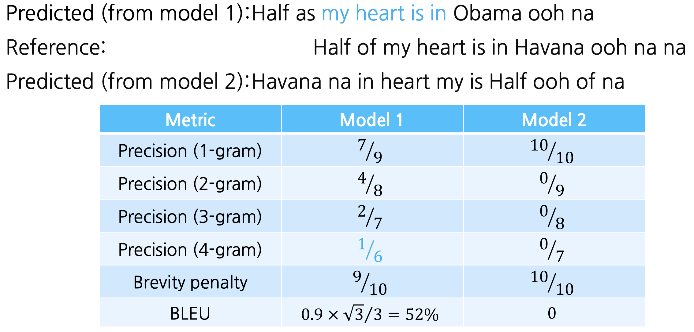
    

## 참고
- [부스트코스 - 자연어 처리의 모든 것](https://www.boostcourse.org/ai330){:target="_blank"}
