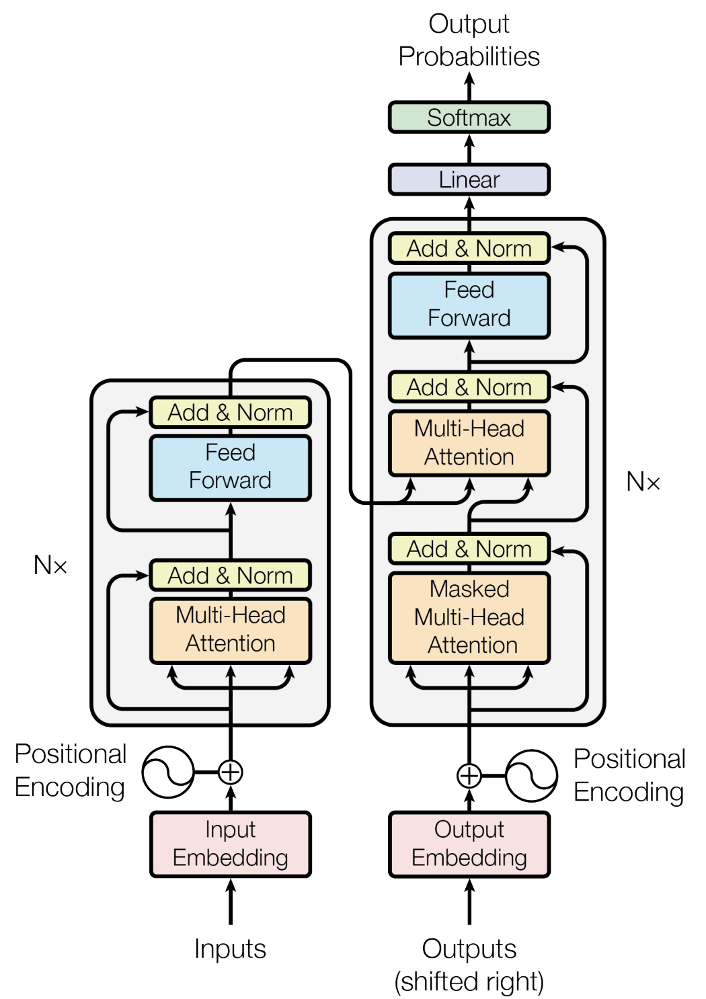
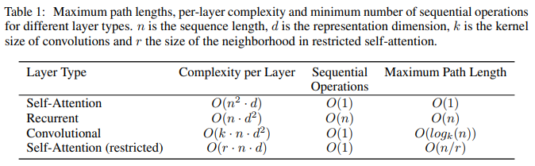
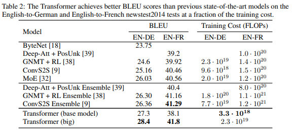
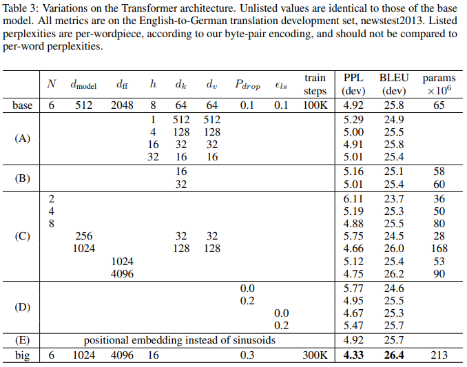
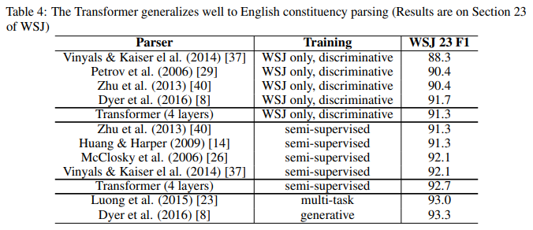

# [논문 리뷰] Attention Is All You Need (NIPS 2017, Transformer)

## 논문의 기여

- 순환 구조(recurrence)나 컨볼루션(convolution) 연산 없이 어텐션(attention) 메커니즘만으로 인코더-디코더(encoder-decoder) 아키텍처를 구현.
- 병렬 처리가 가능하여 GPU 코어 수가 충분하다는 전제하에 $$O(1)$$의 시간복잡도의 어텐션 계산 성능을 얻음. 다만, 이 과정에서 메모리 사용량이 trade-off 관계에 있음.
- 영어-프랑스어, 영어-독일어 번역 태스크에서 2 BLEU 포인트만큼 앞선 SOTA를 달성.
- 일반화 성능이 좋아 영어 구문 구조 분석(English constituency parsing) 태스크에도 잘 작동.

## 개요(Intro)

- RNN, LSTM, GRU 등 시퀀스 모델링 방법이 언어 모델링, 기계 번역 등의 태스크에서 굳어져 있던 방법론이었으나, 이들은 본질적으로 ‘순차적 특성’(sequential nature)를 가지고 있어 학습(training) 과정에서 병렬 처리 하는 데 있어 근본적 한계가 존재.
    
    → 긴 시퀀스 길이에 대해서는 메모리 한계 등의 이유로 치명적.
    
- Factorization tricks, conditional computation 등의 방법으로 계산 복잡도의 효율화를 달성해오고 있었지만, 여전히 순차적 계산(sequential computation)의 한계가 존재했음
- 한편, 어텐션 메커니즘이라는 강력한 방법론이 시퀀스 모델링 등에 활용되어 옴.
- 본 논문에서 제안하는 Transformer 아키텍처는 어텐션 메커니즘만을 사용하여 입출력 간 ‘전역적 의존성’(global dependencies)을 이끌어냄. 이때 순환 구조(recurrence)나 컨볼루션(convolution) 연산은 배제함.
- 8개의 P100 GPUs로 12시간 정도 학습.

## 배경(Background)

- 멀티-헤드 어텐션(Multi-Head Attention)
- 셀프-어텐션(Self-Attention)
    - 인트라-어텐션(intra-attention)이라고도 불림
    - 단일 시퀀스의 서로 다른 위치 관계 정보를 통해 시퀀스 표상을 계산

## 모델 아키텍처(Model Architecture)

- Stacked self-attention & point-wise, fully-connected layers

### 인코더 및 디코더 스택(Encoder & Decoder Stacks)

#### 인코더

- 위 그림에서 왼쪽 회색 영역 박스에 해당하는 부분. $$N=6$$개 만큼 반복.
- 순서 정보가 담긴 단어 표상(word representations with positional encoding)
    
    → 멀티-헤드 어텐션(Multi-Head Attention)
    

#### 디코더

- 위 그림에서 오른쪽 회색 영역 박스에 해당하는 부분. $$N=6$$개 만큼 반복.
- 출력 임베딩은 시퀀스 위치 한 칸만큼 offset이 있음.

### 어텐션(Attention)

#### 스케일드 닷-프로덕트 어텐션(Scaled Dot-Product Attention, Self-Attention)

$$
\text{Attention}(Q,K,V)=\text{softmax}\left(\frac{QK^\top}{\sqrt{d_k}}\right)V
$$

- cf. Alignment model 비교 ([source](https://ai.stackexchange.com/questions/11866/why-is-dot-product-attention-faster-than-additive-attention))
    - Additive attention ([Bahdanau et al. 2014](https://arxiv.org/abs/1409.0473))
        
        $$
        \begin{aligned}e_{ij}&=V_a^\top\tanh(W_as_{i-1}+U_ah_j)\\&=V_a^\top\tanh(Q+K)\end{aligned}
        $$
        
    - Scaled Dot-Product Attention
        
        $$
        \begin{aligned}e_{ij}&=W^Qs_{i-1}(W^Kh_j)^\top\\&=QK^\top\end{aligned}
        $$
        
    - Dot-product attention은 행렬 곱연산 코드의 최적화 덕분에 현실에서 additive attention보다 훨씬 빠르며 공간 효율적.
- 한편, $$QK^\top$$가 평균 0, 분산 $$d_k$$인 특성을 고려하여, 정규화를 위해 $$\sqrt{d_k}$$만큼 스케일링하여 분산을 1로 만듦.

#### 예제를 곁들인 설명

$$
A(q,K,V):\text{attention-based vector representation of a word}
$$

→ 각 토큰(단어)마다 계산

- 예시
    
    $$
    \begin{aligned}
    x^{<1>}&:\text{Jane}
    \\x^{<2>}&:\text{visite}
    \\x^{<3>}&:\text{l'Afrique}
    \\x^{<4>}&:\text{en}
    \\x^{<5>}&:\text{septembre}
    \end{aligned}
    $$
    
    - `l’Afrique`를 나타내는 한 가지 방법
        - `l’Afrique`의 워드 임베딩을 찾아보는 것
    - ❓ `l’Afrique`나 `Africa`를 어떻게 생각하나요?
        - 휴양지?
        - 세계에서 두번째로 큰 대륙?
        - ✅ 해당 단어에 대해 어떻게 생각하냐에 따라 $$A^{<3>}$$를 다르게 표시하도록 선택할 수 있음.
        - 🥅 목적?
            
            → 이 문장 내에서 Africa에 대해 어떻게 이야기하고 있는지 알아내고자 함.
            
            → 가장 적절한 표현 찾기.
            
- 토큰 $$i=1,2,\cdots,n$$번째에 대한 셀프 어텐션(Self-Attention):
    
    $$
    \begin{aligned}
    q^{<i>}&=W^{Q}x^{<i>}\\
    k^{<i>}&=W^{K}x^{<i>}\\
    v^{<i>}&=W^{V}x^{<i>}
    \end{aligned}
    $$
    
- 해석
    - 쿼리 $$q^{<3>}$$: `l’Afrique`에 대해 물어볼 수 있는 질의
    - 닷-프로덕트 어텐션 $$q^{<3>}\cdot k^{<1>}$$: `Jane`이 얼마나 위 질의에 대해 적절한 답변인지를 나타내는 척도
    - 🥅 닷-프로덕트 어텐션 $$q\cdot k$$를 계산하는 목적
        
        → 가장 유용한 표현 $$A^{<3>}$$ 계산을 도울 가장 중요한 정보를 위에 제공하는 것
        
- 유의
    - `l’Afrique` 단어는 고정된 단어 임베딩이 아님. (동적 임베딩)
    - `l’Afrique`가 `visite`의 목적지임을 나타내줌으로써 더 유용한 표현을 계산.
- 요약
    - 쿼리(Query): `Africa`에서 무슨 일이 일어나는지와 같은 질의
    - 키(Key): 다른 모든 단어들을 살펴보고 쿼리와 유사하게 어느 단어가 가장 그 질문에 답변이 되는지 알아내도록 도움 (`visite`이 `Africa`에서 일어나는 일)
    - 값(Value): 표상 `visite`가 어떻게 attentions 내에서 표현되어야 하는지를 나타내는 역할

#### 멀티-헤드 어텐션(Multi-Head Attention)

$$
\text{MultiHead}(Q,K,V)=\text{Concat}(\text{head}_1,\cdots,\text{head}_h)W^O.
$$

이때,

$$
\text{head}_i=\text{Attention}(QW_i^Q,KW_i^K,VW_i^V)
$$

그리고

$$
\begin{aligned}
W_i^Q&\in\mathbb R^{d_\text{model}\times d_k}
\\W_i^K&\in\mathbb R^{d_\text{model}\times d_k}
\\W_i^V&\in\mathbb R^{d_\text{model}\times d_v}
\\W_i^O&\in\mathbb R^{hd_v\times d_\text{model}}
.\end{aligned}
$$

- 차원이 $$d_\text{model}$$인 키(key), 값(value), 쿼리(query)를 사용하여 단일 어텐션 계산을 수행하는 대신, 쿼리, 키, 값들을 $$d_k,d_k,d_v$$ 차원으로 선형 프로젝션(linear projection)하여 $$h$$번의 학습된 결과물을 사용하는 것이 나음을 발견. → 병렬 처리 가능.
- 서로 다른 표상의 부분공간(different representaion subspaces) 정보를 서로 다른 위치에서 공동 참조가 가능.
- 논문에서는 $$h=8$$개의 병렬 어텐션 헤드를 사용. $$d_k=d_v=d_\text{model}/h=64$$ 사용.

#### 쿼리(Query), 키(Key), 값(Value) 해석

- 쿼리 $$Q$$
    - 시퀀스(문장) 내 토큰(단어)에 대한 흥미로운 질의
- 키 $$K$$
    - 쿼리가 주어졌을 때, 토큰(단어)의 질적 가치
- 값 $$V$$
    - 쿼리가 주어졌을 때, 토큰(단어)의 구체적인 표상

#### 예시

- 질의 $$h$$개
- 무슨 일이 일어나는지? — $$W_1^Q,W_1^K,W_1^V$$
- 언제 일어나는지? — $$W_2^Q,W_2^K,W_2^V$$
- 누가 연관되어 있는지? — $$W_3^Q,W_3^K,W_3^V$$
- …

#### 어텐션(Attention) 응용례

- ‘인코더-디코더 어텐션’ 층(모델 아키텍처 그림에서 우측의 Multi-Head Attention 부분)에서 입력 쿼리 $$Q$$는 디코더 층으로부터, 입력 키 $$K$$ 및 값 $$V$$는 인코더 출력으로부터 나옴
    
    → 디코더의 모든 위치가 입력 시퀀스의 모든 위치 정보를 참조할 수 있도록 함.
    
- 인코더는 셀프-어텐션 층을 포함. 셀프-어텐션의 각 입력은 같은 키, 값, 쿼리를 가지며, 출력은 다음 인코더 층의 입력이 됨.
- 디코더 또한 비슷한데, 인코더 파트로의 정보 유실을 막기 위해(디코더의 auto-regressive 특성 보존을 위해) 스케일드 닷-프로덕트 어텐션 내부에 masking out하여 값을 $$-\infty$$로 설정하는 기법을 사용하여 허용되지 않는 연결을 나타냄.

### 위치별 피드-포워드 네트워크(Position-wise Feed-Forward Networks)

- 두 개의 linear 층과 ReLU 활성화 함수로 구성.

### 임베딩 & 소프트맥스

- 차원 $$d_\text{model}$$인 토큰 임베딩 사용

### 위치 인코딩

위치 $$\text{pos}$$와 차원 $$i$$에 대해

$$
\begin{aligned}PE_{(\text{pos},2i)}&=\sin\left(\frac{\text{pos}}{10000^{2i/d_\text{model}}}\right)\\PE_{(\text{pos},2i+1)}&=\cos\left(\frac{\text{pos}}{10000^{2i/d_\text{model}}}\right)\end{aligned}
$$

- 순환 구조 및 컨볼루션을 사용하지 않아(no recurrence & no convolution) 시퀀스의 순서 정보를 담아낼 장치 필요.

## 왜 셀프-어텐션인가

- 세 가지 이유
    - 층당 계산복잡도
    - 병렬처리 가능한 연산량 → 최소한의 순차적 연산(sequential operations) 요구
    - 네트워크에서 장거리 종속성(long-range dependencies) 사이의 경로 길이(path length)

### 복잡도

- 충분히 많은 GPU 코어를 가정했을 경우, 트랜스포머 아키텍처가 RNN 아키텍처에 비해 시간복잡도 면에서 이점이 있음.
- 다만 메모리 사용량이 크다는 한계(단점) 존재
- 이웃거리 크기 $$r$$을 제한하여 셀프 어텐션을 계산하는 방법을 사용하면 $$r$$ 값 조절에 따라 $$n^2$$ 대신 $$n\log n$$에 비례할 수도 있는 층당 계산 복잡도를 이룰 수 있어보임. 다만, 이 경우 장거리 종속성 문제와 trade-off 관계.

## 학습

### 학습 데이터 & 일괄 처리(Training Data and Batching)

- 표준 WMT 2014 영어-독일어 데이터셋
    - 약 450만 개의 문장 쌍
    - 바이트-페어 인코딩(byte-pair encoding)으로 문장 인코딩
    - 공유 소스-타겟 어휘 약 37,000개의 토큰
- 표준 WMT 2014 영어-프랑스어 데이터셋
    - 약 3600만 개의 문장 쌍
    - 32,000개의 워드피스(word-piece) 어휘
- 각 학습 배치
    - 약 25,000개의 소스 토큰과 25,000개의 타겟 토큰이 포함된 문장 쌍 집합

### 하드웨어 & 스케줄

- 8개의 NVIDIA P100 GPUs
- 모델
    - 베이스(base)
        - 스텝 시간 0.4초
        - 10만 스텝
        - 12시간 학습
    - 빅(big)
        - 스텝 시간 1.0초
        - 30만 스텝
        - 3.5일 학습

### 옵티마이저

$$
lr=d_\text{model}^{-0.5}\cdot\min\left(\text{step-num}^{-0.5},\;\text{step-num}\cdot\text{warmup-steps}^{-1.5}\right)
$$

- Warmup steps = 4000
- Adam
    - 하이퍼파라미터: $$\beta_1=0.9,\beta_2=0.98,\epsilon=10^{-9}$$

### 정규화

#### 잔차 드롭아웃(Residual dropout)

- 드롭아웃률 $$P_\text{drop}=0.1$$

#### 레이블 스무딩(Label smoothing)

- 레이블 스무딩 값 $$\epsilon_{ls}=0.1$$
- Perplexity는 나빠지나, 정확도와 BLEU 점수는 향상

## 결과

### 기계번역(Machine Translation)

#### WMT 2014 영어-독일어 번역

- 바닐라 트랜스포머 (big) 기준 BLEU 점수 28.4 기록 (2.0 BLEU 이상 향상 SoTA 달성)
- 8개의 P100 GPUs로 3.5일 학습

#### WMT 2014 영어-프랑스어 번역

- BLEU 점수 41.0 기록 (SoTA)
- 학습 비용은 SoTA의 25% 수준(75% 절감)
- 드롭아웃율을 0.1 대신 0.3을 사용
- 빔 서치 (beam size=4, length penalty $$\alpha$$=0.6)를 수행

### 모델 변형(Model Variations)

### 영어 구문 분석(English Constituency Parsing)

## 결론

- 어텐션 기반 시퀀스 변환 모델 Transformer(트랜스포머) 제안: 인코더-디코더 아키텍처에서 일반적으로 사용되는 순환층을 멀티-헤드 셀프-어텐션으로 대체.
- 2017년 기준 영-프, 영-독 기계 번역 성능 SOTA 달성.
- 텍스트 이외의 입출력 모드가 포함된 문제에 트랜스포머 확장(멀티-모달).
- 대규모 입출력의 효율적 처리를 위한 로컬, 제한된 어텐션 메커니즘 연구 계획.
- 모델 아키텍처 내의 순차성을 더 덜어내는 것 또한 미래 과제.

## 참고
- [Attention Is All You Need](https://arxiv.org/abs/1706.03762){:target="_blank"}
- [Sequence Models of DLS course by Andrew Ng](https://www.coursera.org/learn/nlp-sequence-models){:target="_blank"}