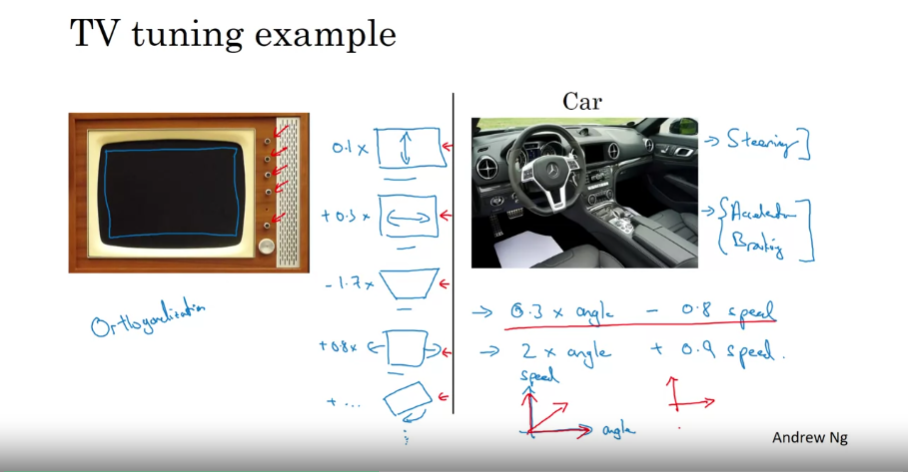

# [Machine Learning/머신 러닝] 머신 러닝 프로젝트의 구조화

STS (Semantic Textual Similarity) 태스크를 수행해보면서 머신 러닝 프로젝트를 설계하고, 에러 해석을 어떻게 진행하면 좋을지 등에 관해 이전에 수강한 적 있던 Andrew Ng 교수의 Coursera `Deep Learning Specialization` 코스 중 `Structuring Machine Learning Projects` 강의를 참고하기 위해 내용 중 일부를 요약하여 정리해보고자 했다.

## 머신 러닝 전략ML strategy의 개요

### Why ML strategy

- 고양이 분류 문제 가정
    - 90% 정확도의 ML 시스템을 구축
    - 비즈니스에 사용하기 위해 성능 향상 필요
- 어떻게 성능을 개선할 것인가?
    - 데이터 더 모으기
    - 다양한 데이터 모으기: 다양한 포즈의 고양이 사진, 고양이가 아닌(negative) 사진 등
    - 학습 시간 늘리기
    - 경사하강법(GD; gradient descent) 알고리즘 대신 Adam 사용하기
    - 더 큰 규모의 아키텍처 시도하기
    - 더 작은 규모의 아키텍처 시도하기
    - 드롭아웃(Dropout) 적용하기
    - L2 정규화 추가하기
    - 아키텍처 수정
        - 활성화 함수
        - 은닉 파라미터 수
        - …

### Orthogonalization

- 가장 효율적인 ML 엔지니어들은 **어떠한 효과**를 내기 위해 **무엇을 튜닝할지**를 제대로 이해하고 있음. 이 과정은 orthogonalization이라고 불림.

#### 하드웨어 장치의 튜닝 비유

- TV 디자이너가 튜닝을 통해 화면 송출을 효율적으로 하기 위해선 각각의 튜너들의 역할을 제대로 파악하고 있어야!
- 자동차 제어의 경우, 핸들(steering), 가속장치(accelerator), 브레이크(braking) 등이 각각 독립된 역할을 수행함으로써 자동차의 운행을 가능케 함.

#### 머신러닝 프로젝트의 경우

1. 트레이닝training 세트에 대해 좋은 성능이 나와야 한다.
    
    → 인간 수준의 성능human-level performance
    
    - 트레이닝 세트에 대해 낮은 성능이 나올 경우?
        
        → 큰 규모의 아키텍처, Adam, RAdam 등의 더 나은 최적화 알고리즘 선택, …
        
2. 데브dev 세트에 대해 좋은 성능이 나와야 한다.
    - 트레이닝 세트는 괜찮으나, 데브 세트에서 낮은 성능이 나올 경우?
        
        → 정규화, 더 큰 트레이닝 세트, …
        
3. 테스트test 세트에 대해 좋은 성능이 나와야 한다.
    - 트레이닝, 데브 세트는 괜찮으나, 테스트 세트에서 낮은 성능이 나올 경우?
        
        → 더 큰 데브 세트
        
4. 실제 세계에서 시스템이 잘 작동하여야 한다.
    - 트레이닝, 데브, 테스트 세트까지는 괜찮으나, 실제 세계에서 낮은 성능이 나올 경우?
        
        → 데브 세트나 비용 함수 바꾸기
        
- 팁
    - 네 가지 문제 중 어떤 문제를 해결하고자 하는지 명확해야 함.
    - Early stopping을 사용하지 않는 이유?
        - 트레이닝 세트에 얼마나 적합(fit) 시킬 수 있느냐에 영향을 줌.
        - 한편, 데브 세트 성능을 개선함.
        - 두 가지 데이터셋 성능에 영향을 주므로 orthogonalization 정도가 떨어진다고 표현.

## 참고
- [Structuring Machine Learning Projects](https://www.coursera.org/learn/machine-learning-projects/home/week/1){:target="_blank"}