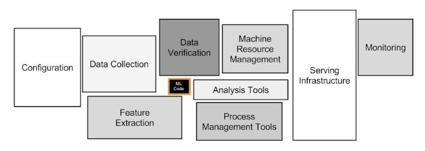

# [AI 서빙 기초] 소프트웨어 엔지니어링

## Software Engineering

### 소프트웨어 엔지니어링이란?

- 소프트웨어를 개발하는 과정에서 체계적이고 효율적인 방법을 사용하여 소프트웨어의 품질과 유지 보수성을 보장하는 학문 분야.
- 컴퓨터 프로그램 + 관련 문서 + 데이터
- A set of computer programs and associated documentation and data. This is in contrast to hardware, from which the system is built and which actually performs the work (Wikipedia)

### 소프트웨어 개발 라이프사이클(Software development Lifecycle)

1. 계획(Planning)
2. 요구 조건 분석(Analysis)
3. 설계(Design)
4. 구현(Implementation)
5. 테스트(Testing & Integration)
6. 유지 보수(Maintenance)

### 좋은 소프트웨어 설계

1. 모듈성
    - 모듈: 고유한 목적, 기능을 가지는 단위
2. 높은 응집도(Cohesion)
    - 응집도: 시스템의 모듈 구성 요소가 목적 달성을 위해 관련되어 있는 정도
3. 느슨한 결합도(Coupling)
    - 모듈들의 상호 의존성

### 테스팅

- 배포 전 확인 절차

### 문서화

- README, API 문서, 아키텍처 문서

### 소프트웨어 엔지니어링을 배워야 하는 이유

- 머신 러닝 모델을 만드는 것도 소프트웨어 엔지니어링 중 하나.
- 실제 유저에게 사용하게 한다면, 소프트웨어 엔지니어링을 하게 될 것.

## 참고
- 부스트캠프 - AI 서비스 개발 기초 by 변성윤