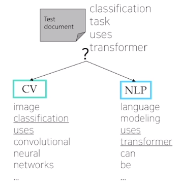
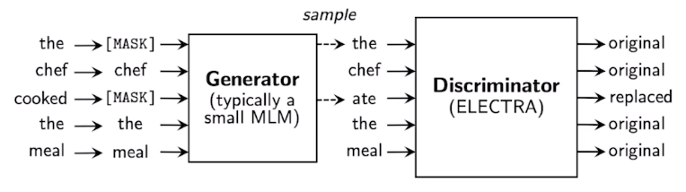

# [NLP/자연어 처리] 자기 지도 사전 학습 모델

## Part 5. 자기 지도 사전 학습 모델 (Self-supervised Pre-training Models)

### Self-supervised Pre-training

- 2020년대 초 트렌드
    - 셀프-어텐션(Self-attention) 블록 기반 트랜스포머 모델이 좋은 일반화 성능을 보임.
    - 바닐라 트랜스포머(Vanilla transformer; 트랜스포머 모델 시초)가 셀프-어텐션 모듈이 6개 스택으로 이루어지는 데 반해, 모델 아키텍처의 틀은 유지한 채로 모듈을 단순히 깊게 쌓는 방식으로 발전해 옴. 예컨대 모듈 12개, 24개, 48개 등
        - 예시: BERT, GPT-3, XLNet, ALBERT, RoBERTa, Reformer, T5, ELECTRA, …
- 응용 사례의 확장
    - 추천 시스템, 신약 개발, 컴퓨터 비전 등.
- 한계
    - 자연어 생성에 있어, 셀프-어텐션 기반 모델들은 여전히 그리디 디코딩(greedy decoding; 왼쪽에서부터 단어를 하나씩 생성) 방식에서 벗어나지 못 하고 있음.

#### GPT-1 (Generative Pre-trained Transformer-1)

- OpenAI 회사에서 만듦.
- 특징
- 스페셜 토큰 제안. \<S\> / \<E\> / $ 등이 그 예시.
    
    → 효과: 단순한 태스크 뿐만 아니라 자연어 처리 분야의 다양한 태스크들을 포괄할 수 있는 통합된 모델을 제안.
    
- 태스크에 특정된 아키텍처를 부가할 필요 없음.

#### GPT-1 모델 구조

- 아키텍처
    - 입력에서 텍스트 임베딩 + 위치 임베딩(positional embedding).
    - 셀프-어텐션 블록 12개
    - Text prediction(텍스트 예측): 첫 단어부터 다음 단어를 순차적으로 예측하는 언어 모델링(language modeling) 태스크.
- Extract 토큰의 역할?
    - EOS(end of sentence) 토큰 대신 특별한 역할을 하는 Extract 토큰이 들어감.
    - 예컨대, 분류(classification) 문제에서 Start + Text + Extract가 12개의 셀프-어텐션 모듈을 거쳐 최종적으로 나온 Extract 토큰에 해당하는 인코딩 벡터를 최종 출력층에 입력 벡터로 줌.
        
        → 문장의 긍부정 여부 판단.
        
    - Extract 토큰은 문장의 말미에 추가해준 토큰일 뿐이었지만, 문장 혹은 문장 간 관계에 대한 이해 정도에 대한 정보가 셀프-어텐션 모듈 12개를 거쳐 인코딩 되는 동안 쿼리(query)로서의 역할을 함으로써 태스크마다 필요한 적절한 정보를 추출할 수 있게 됨.
- 다른 태스크에의 전이 학습(transfer learning)?
    - 12번째 셀프-어텐션 모듈의 출력으로 나오는 토큰별 인코딩 벡터 → 무작위 초기화(random initialization)된 선형 계층(linear layer) → 메인 태스크!
    - 전체 네트워크를 재학습 하는 과정에서 기학습된 12개의 셀프-어텐션 모듈에는 상대적으로 작은 학습률(learning rate)을 적용해야.

#### GPT-1 성능

- 많은 태스크에서 task-specific(구체적 태스크에 맞추어진) 여러 아키텍처를 제치고 SOTA(state-of-the-art)를 달성함으로써 파인튜닝된 트랜스포머 기반 언어 모델의 우수성을 검증.

#### BERT (Bidirectional Encoder Representations from Transformers)

- 언어 모델링을 위한 아키텍처로서 문장 내 일부 단어를 맞히기 위해 사전 학습된 모델이며, 가장 널리 쓰임.
- GLUE 벤치마크 결과
    
    
    
    - BERT-large 모델의 경우, 8개 태스크에서 모두 SOTA (state-of-the-art) 달성.

#### BERT의 사전 학습 태스크 — 마스크된 언어 모델(Masked Language Model)

- 배경
    - Standard LM의 한계, 예컨대 ‘<SOS> I study math’에서 <SOS>로부터 I를, <SOS> I로부터 study를, <SOS> I study로부터 math를 예측하는 태스크로 사전 학습함으로써 이전 문맥은 파악하나 전후 문맥을 고려하지 못 하는 한계 존재.
- 방법
    - 일정 확률(15%)로 각 토큰을 [MASK] 토큰으로 치환.
- 문제
    - 파인 튜닝 과정에서 [MASK] 토큰은 전혀 보이지 않았음.
- 해결
    - 80% → [MASK] 토큰으로
    - 10%는 임의의 다른 단어로
    - 10%는 기존 단어를 그대로
    
    → 변형 문제를 풀게 함.
    

#### BERT의 사전 학습 태스크 — 다음 문장 예측(Next Sentence Prediction)

- 문장 레벨에서의 예측을 위한 사전 학습도 제안.
    
    → 기법 이름: Next Sentence Prediction
    
- [CLS] 토큰
    - 문장 혹은 다수의 문장 수준에서 예측 태스크를 수행하는 역할 담당.
    - GPT에서의 Extract 토큰(다수 문장의 마지막에 등장)과 비슷한 역할.

#### BERT 요약

1. 모델 아키텍처
    - BERT-base: $L=12,H=768,A=12$.
        - 셀프 어텐션 블록 12개, 셀프 어텐션 블록에서의 인코딩 벡터의 차원 수 768, 멀티-헤드 어텐션 블록의 헤드 숫자 12개.
    - BERT-large: $L=24,H=1024,A=16$.
2. 입력 표상
    - WordPiece 임베딩 (30,000 WordPiece)
    - 학습 가능한 위치 임베딩(Learnable positional embedding)
        - 위치 임베딩 벡터 또한 학습에 의해 결정(바닐라 트랜스포머와 구별)
    - [CLS] — 분류 임베딩(Classification embedding)
    - 문장 끝에 등장하는 packed sentence embedding [SEP]
    - 분할 임베딩(Segment embedding)
        
        
        
        - 위치 임베딩(Positional embedding)이 단어의 순서 정보를 담았다면, 분할 임베딩은 단어가 BERT 입력으로 들어가는 이어붙은 두 문장 중 어느 문장에 속하는지에 관한 정보를 담음.
        - 각 단어는 토큰 임베딩 + 위치 임베딩 + 분할 임베딩에 매핑(mapping)됨.
3. 사전학습 태스크
    - 마스킹 언어모델(Masked LM)
    - 다음 문장 예측(Next Sentence Prediction)

#### GPT-1 vs. BERT 차이점

|  | GPT-1 | BERT |
| --- | --- | --- |
| 접근 가능 정보 | 주어진 문장 내 이전 토큰 정보에 접근 불가 → 마스킹 된 셀프 어텐션 블록(masekd multiple self-attention blocks) 사용 | [MASK]로 치환된 토큰들 주로 예측. 이들 토큰을 포함한 문장 내 전체 정보에 접근 허용 가능 |
| 학습 데이터 크기 | BookCorpus (800M 단어) | BookCorpus & Wikipedia (2,500M 단어) |
| 배치 크기 | 32,000 단어 | 128,000 단어 |
| 학습률 | 모든 파인튜닝 실험에 5e-5의 동일한 학습률 적용 | 태스크 특화된 파인 튜닝 학습률 적용 |

#### BERT 태스크

- MRC (Machine Reading Comprehension)
- QA (Question Answering)

#### BERT 소거 연구(Ablation study)

- 모델을 더 깊게 쌓고 모델 파라미터 수를 늘리는 방식으로 학습을 진행하면 여러 다운스트림 태스크에 대한 성능이 지속적으로 향상되는 현상 발견.

### Other Self-supervised Pre-training Models

#### GPT-2

- 모델 아키텍처상 GPT-1와 차별점은 없음. 모델 사이즈를 키운 트랜스포머.
- 40 GB의 텍스트 데이터에 대해 학습.
    - 데이터셋의 품질에 신경.
- 제로-샷 환경(구체적인 예시 없는 발화)에도 다운스트림 태스크를 수행할 수 있음.
- 사람이 작성한 프롬프트를 입력으로 받아 GPT-2 모델이 생성해 준 글을 보면 사람이 보아도 그럴 듯하다는 점에서 놀라움을 주었다고 함.

- 동기
    - The Natural Language Decathlon: Multitask Learning as Question Anwering 논문에 착안.
    - 논문의 핵심: 모든 종류의 자연어 처리 태스크들을 질의응답(QA; Question Answering) 형태로 통합할 수 있다고 주장. 자연어 생성 형태의 태스크로 통합.
    - 예시
        - 감성 분석 태스크 → 질문이 ‘이 문장의 긍부정 여부를 레이블링 해주세요’ 등인 질의응답 태스크
        - 요약 태스크 → 질문이 ‘위 글을 요약해주세요’ 등인 질의응답 태스크
- 데이터셋
    - 양질의 글로부터 학습할 수 있도록 Reddit이라는 커뮤니티 웹 사이트의 질의응답 내용을 기반으로 데이터셋을 확보.
    - 좋아요 수(karma, up-vote)가 3 이상이고 외부 링크가 포함한 경우, 그러한 외부 링크들의 텍스트 내용을 수집 — 고품질의 외부 링크가 포함되었어야 좋아요 수를 많이 받았을 것이라는 가설에 입각. 4500만여 개(45M)의 외부 링크.
    - 800만여 개(8M)의 삭제된 위키피디아 문서.
- 전처리
    - BPE (Byte Pair Encoding) .. BERT의 wordpiece와 유사하게!
- 변경사항
    - 계층 정규화(Layer normalization)가 각 서브블록의 입력단으로 이동: 사전 활성화 잔여 망(pre-activation residual network)과 유사.
    - 계층 정규화를 셀프 어텐션(self-attention) 블록의 끝단 이후에도 추가.
    - 잔여 망의 가중치를 $\frac{1}{\sqrt n}$배 만큼 스케일링. 이때, $n$은 잔여 망 수.
- 질의응답 관련 흥미로운 실험(소거 연구)
    - 레이블링된 학습 데이터를 파인 튜닝(fine-tuning)에 사용하지 않고, 바로 질의에 대한 응답의 F1 점수를 측정 → 55. 파인 튜닝된 BERT의 경우, 89 F1 점수.
- 요약 실험
    - 파인 튜닝 없이 제로-샷 환경에서 추론을 진행. 즉 예시를 들어주지 않고 간결하게 질의를 입력.
- 번역 실험
    - 질의에 ‘~~ 언어로 번역해줘’라는 요구를 추가.

#### GPT-3: Language Models are Few-shot Learners

- 개선 방향
    - 모델 아키텍처 면에서의 개선점보다는, 파라미터 수의 스케일을 비교할 수 없을 정도로 크기를 확대. 1750억 개(175B) 파라미터.
    - 96개의 어텐션 층, 320만(3.2M) 배치 크기.
- 샷 환경 종류(Shots)
    - Zero-shot: 태스크 예제 없이 답변 예측.
    - One-shot: 태스크 예제 한 가지.
        
        ‘영어 → 프랑스어 변환해줘. sea other → loutre de mer. cheese →’.
        
    - Few-shot: 태스크 예제 몇 가지.
- 성능 vs. 모델 파라미터 수
    
    
    
    - 모델 사이즈에 비례하여 향상되는 제로 샷 성능.
    - 퓨샷 성능은 더욱 가파르게 향상.

#### ALBERT: A Lite BERT for Self-supervised Learning of Language Representations

- 기존의 한계
    - 메모리 한계
    - 학습 속도
- 해결책
    - 임베딩 파라미터의 행렬 분해(Factorized embedding parametrization)
        - 저차원 행렬 분해(Low-rank matrix factorization)
    - 계층 간 파라미터 공유(Cross-layer Parameter Sharing)
        - 기본 설정: 전(全) 계층 간 파라미터를 공유.
        
        
        
    - 문장 순서 예측(Sentence Order Prediction)
        - 문장 순서를 뒤집거나 다른 주제의 뉴스 기사 내 문장을 조합하여 네거티브 샘플(negative samples) 구성.
        - 다음 문장 예측(NSP; Next Sentence Prediction)과 비교해보아도 SOP가 많은 경우 유의미하게 개선되는 것을 확인.
        
        
        
- GLUE 벤치마크 결과
    
    
    

#### ELECTRA: Efficiently Learning an Encoder that Classifies Token Replacements Accurately

- 아키텍처
    
    
    
- BERT나 GPT-2와는 다른 사전 학습 방법 사용.
- 복원 모델(generator)에 추가적으로 구분자(discriminator)를 추가한 것이 특징.
- 성능
    
    
    

#### Light-weight Models

- 모델의 경량화: 기존 모델의 성능을 최대한 유지하면서도 모델 크기를 줄이고 모델의 계산 속도를 빠르게 하는 데 초점.
- DistillBERT (NeurIPS 2019 Workshop)
    - HuggingFace에서 발표.
    - Teacher(선생)/Student(학생) 모델 존재. Teacher 모델이 Studenet 모델을 가르치는 형태.
    - 트리플 손실 함수(triple loss) 사용.
- TinyBERT (Findings of EMNLP 2020)
    - 2-스테이지 학습.

#### Fusing Knowledge Graph into Language Model

- 지식 그래프(Knowledge Graphs)를 언어 모델(Language Models)에 결합.
- BERT의 한계
    - 긴 글의 문맥 파악, 단어 간 유사도 혹은 관계 파악에는 강점 O 확인.
    - 하지만 문장 내 포함되지 않은 추가 정보를 활용하는 능력은 부족하다는 한계.
    - 예시
        - ‘꽃을 심기 위해 땅을 팠다’, ‘집을 짓기 위해 땅을 팠다’라는 문장이 주어질 때, ‘어떤 도구로 땅을 팠을까?’라는 질의에 대한 답변으로 ‘부삽’이나 ‘포크레인’ 등(상식적인 내용)은 문장 내 존재하지 않는 도구 정보이므로 응답으로 내지 못 하는 한계.
        - 상식들의 활용이 자연어 처리에 중요.
- ERNIE: Enhanced Language Representation with Informative Entities (ACL 2019)
    - 지식 그래프 내 정보 제공 개체가 언어 표상을 개선.
    - 지식 융합 계층이 토큰 임베딩과 개체 임베딩을 한 데 모음.
- KagNET: Knowledge-Aware Grpah Networks for Commonsense Reasoning (EMNLP 2019)
    - 상식적인 답변을 학습하기 위한 지식 기반 추론 프레임워크.
    - 각 질의-응답 쌍에 대해, 관련 지식을 포착하기 위해 외부 지식 그래프에서 서브 그래프를 복원.

## 참고
- [부스트코스 - 자연어 처리의 모든 것](https://www.boostcourse.org/ai330){:target="_blank"}