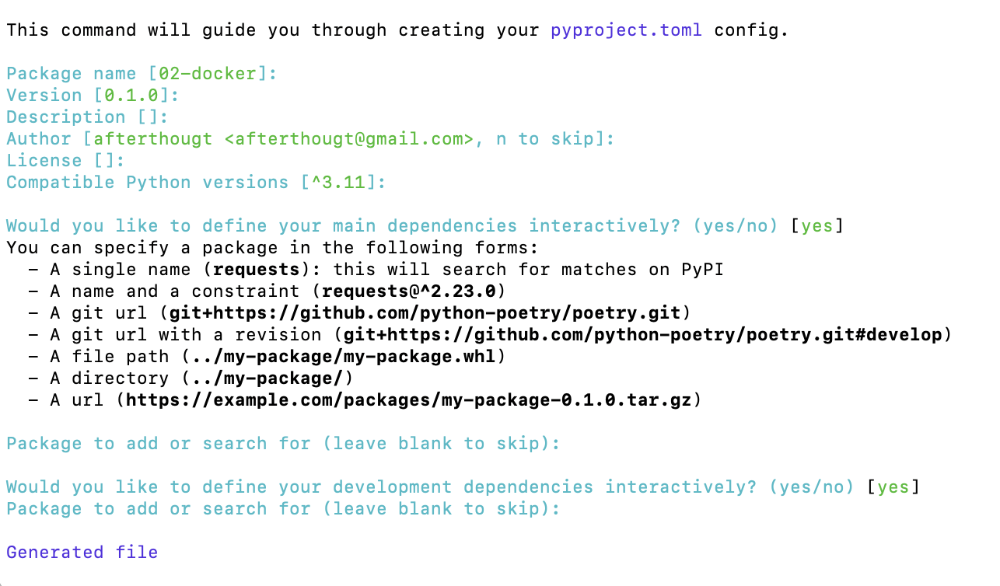

# [AI 서빙 기초] 도커 기초

## 가상화

- 특정 소프트웨어 환경을 만들고, 로컬과 프로덕션 서버에서 그대로 활용하는 것

### 의의

- 개발(local)과 운영(production) 서버의 환경 불일치 해소
- 어느 환경에서나 동일 환경으로 프로그램 실행 가능
- 개발 외 연구도 동일 환경 사용 가능

## Docker

- 컨테이너(Container) 기술을 쉽게 사용하기 위해 나온 도구
- 2013년 오픈 소스로 등장
- 컨테이너 기반 기술로 개발 및 운영의 빠른 확장 가능

## 예제

### PyTorch 등을 사용하여 개발한 파이썬 코드 실행을 위한 도커 이미지 생성 예제

1. 02-docker 폴더 생성(mkdir, make directory) 및 폴더 이동(cd, change directory)
    
    ```bash
    mkdir 02-docker
    cd 02-docker
    ```
    
2. 현재 파이썬 버전 정보 확인
    
    ```bash
    python -V
    ```
    
3. pyproject.toml 생성을 위한 poetry init. 아래 내용 등을 정할 수 있으며, 실습에서는 특별히 정할 것 없이 엔터 치면서 설정을 넘겨도 무방.
    
    ```bash
    poetry init
    ```
    
    
    
    - Package name
    - Version
    - Description
    - Author
    - License
    - Define main main dependencies interactively?
    - Package to add or search for
    - Define development dependencies interactively?
    - Confirm generation?
4. torch, torchvision 설치
    
    ```bash
    poetry add torch torchvision
    ```
    
5. Dockerfile 생성 및 파일 내용 수정
    1. Mac/Linux 기준
        
        ```bash
        touch Dockerfile
        nano Dockerfile
        ```
        
    2. Windows 명령 프롬프트(cmd) 기준
        
        ```bash
        type nul > Dockerfile
        notepad Dockerfile
        ```
        
    3. Windows 파워셸(PowerShell) 기준
        
        ```bash
        New-Item -ItemType File Dockerfile
        Invoke-Item DockerFile
        ```
        
6. Dockerfile 내용 입력
    
    ```bash
    FROM pytorch/pytorch:1.13.1-cuda11.6-cudnn8-runtime
    
    COPY . /app
    WORKDIR /app
    ENV PYTHONPATH=/app
    ENV PYTHONBUFFERED=1
    RUN pip install pip==23.0.1 && \
        pip install poetry==1.4.2 && \
        poetry export -o requirements.txt && \
        pip install -r requirements.txt
    CMD ["python", "main.py"]
    ```
    
    - 이때, pip와 poetry는 현재 로컬에 설치된 버전을 확인하여 주어야 한다. pip는 버전 23.0.1을, poetry는 버전 1.4.2를 사용 중인 것을 확인하고 위와 같이 파일 내용을 입력하였다.
7. 도커 실행 환경 설정 및 이미지 생성
    
    ```bash
    docker build --platform linux/arm64 -t 02-docker:latest .
    ```
    
    → 해석?
    
    ```bash
    docker [이미지 생성] [태그] [빌드할 이미지 이름]:[태그 이름] [이미지 위치(현재 폴더에 이미지 위치 시 .)]
    ```
    
    - 주의: 이때, 도커 데스크톱이 실행 중이어야 다음과 같은 오류가 뜨지 않는다.
        
        ```bash
        Cannot connect to the Docker daemon at unix:///var/run/docker.sock. Is the docker daemon running?
        ```
        
## My Docker Debugging Cases

- `docker pull mysql:8` 명령에 “Cannot connect to the Docker daemon at unix:///var/run/docker.sock. Is the docker daemon running?” 메시지를 보게 되는 경우
    
    → docker desktop 앱을 실행 후 cli에 재명령 시도.
    

## 참고
- 부스트캠프 - AI 서비스 개발 기초 by 변성윤