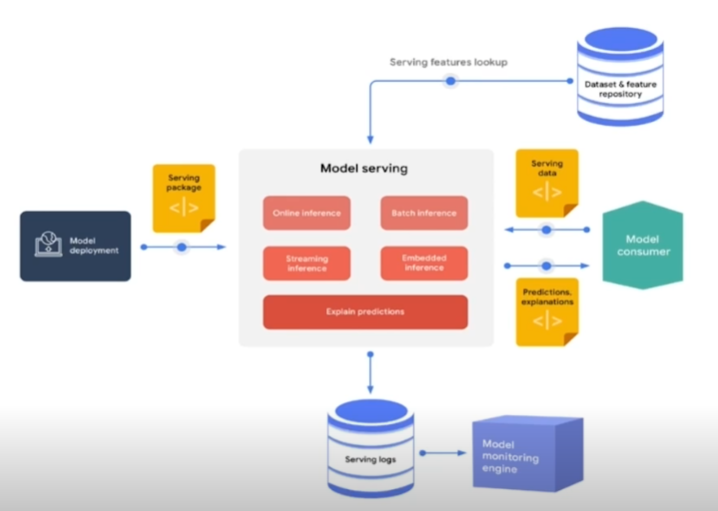
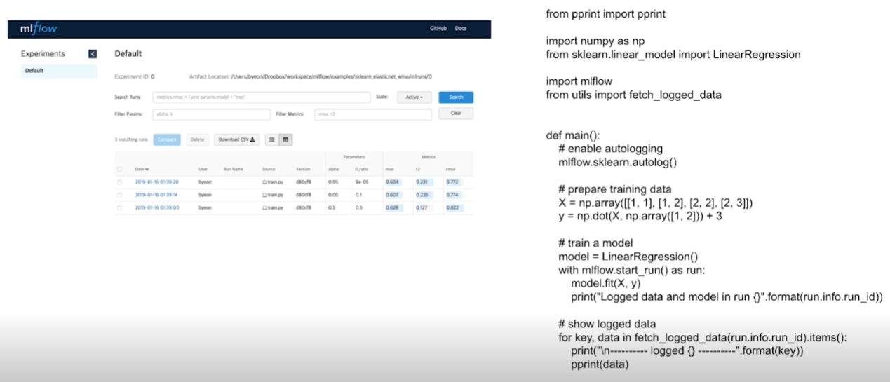
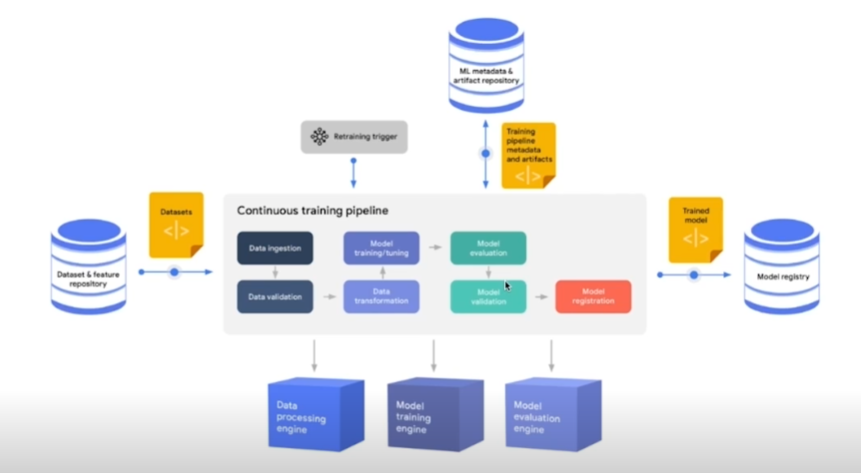

# [AI 서빙 기초] MLOps 들어가기

## MLOps 개론

### MLOps란?

- ML (Machine Learning) + Ops (Operations)
- 머신 러닝 모델을 운영하면서 반복적으로 필요한 업무를 자동화하는 과정
- 머신 러닝 엔지니어링 + 데이터 엔제니어링 + 클라우드 + 인프라
- 목표: 머신 러닝 모델 개발(ML dev)과 머신 러닝 모델 운영(Ops)에서 반복되는 문제를 최소화하고 비즈니스 가치 창출.

### 연구 관점의 ML vs. 프로덕션 관점의 ML

|  | Research ML | Production ML |
| --- | --- | --- |
| 데이터 | 고정(static) | 동적(dynamic, shifting) |
| 중요 요소 | 모델 성능(accuracy, RMSE 등) | 모델 성능, 빠른 추론 속도, 해석 가능 |
| 도전 과제 | 더 좋은 성능을 내는 모델(SOTA), 새 아키텍처 | 안정적 운영, 전체 시스템 구조 |
| 학습 | (데이터는 고정) 아키텍처, 파라미터 기반 재학습 | 시간의 흐름에 따라 데이터 변경 재학습 |
| 목적 | 논문 출판 | 서비스에서 문제 해결 |
| 표현 | 오프라인 | 온라인 |

### MLOps 학습 방법론?

1. MLOps에 대한 모든 것을 학습하는 방식.
2. MLOps의 각 요소에서 해결하고 싶은 문제를 파악하고, 이를 해결하기 위한 방법으로 어떤 방법을 사용할 것인지 학습하는 방식.

→ MLOps 생태계가 지속적으로 변화 및 발전하는 환경에서는 2 방식이 권장. (마치 학교에서 학습 vs. 회사에서 일하며 학습과 비슷한 것이 아닐까..)

## MLOps Component

### Infra(server, GPU)

- 예상 트래픽?
- 서버의 CPU나 메모리 성능?
- 스케일 업, 스케일 아웃 가능 여부
- 자체 서버 구축 vs. 클라우드 사용
    - 클라우드 .. AWS, GCP, Azure, NCP 등

### Serving

(출처: [https://cloud.google.com/resources/mlops-whitepaper](https://cloud.google.com/resources/mlops-whitepaper))

- 어느 정도 양의 데이터에 대해 예측?
- 배포, 데이터셋 & 피처 가져오기, 서버 로그 남기기, 소비자에게 예측 결과 전달하기 등.

### Experiments & Model Management

- mlflow 예시

### Feature Store

- 피처를 모아두는 역할.
- 정형 데이터에 대해 발전이 되어 있으나, 비정형 데이터에 대해선 그렇지 않음.

### Data Validation

- 필요성
    - 학습에서의 데이터와 프로덕션에서의 데이터 사이의 괴리를 최소화(비슷한 데이터 분포!).
- Data drift
    - 입력 데이터의 분포가 시간에 따라 변화하는 현상.
- Concept drift
    - 예측하려는 레이블과 관련된 기본 패턴이 시간에 따라 변화하는 현상.
- Model drift
    - 모델 성능이 시간에 따라 저하되는 현상. Data drift나 concept drift 때문일 수도, 과적합(overfitting)과 같은 다른 요인 때문일 수도 있음.

### Continuous Training

(출처: [https://cloud.google.com/resources/mlops-whitepaper](https://cloud.google.com/resources/mlops-whitepaper))

- 새로운 데이터가 입력으로 들어온다거나 매출 지표 등이 악화되는 경우 등 학습을 다시 할 필요성이 있는 경우.

### Monitoring

- 얼마나 수요가 있는지
- 어느 시간대에 제품 수요가 늘어나는지

### AutoML

### MLOps 구성요소 정리

- MLOps는 회사의 비즈니스 상황과 모델 운영 상황에 따라 우선순위가 달라짐.
- 모든 요소가 항상 존재해야 하는 것이 아님.
- 처음부터 MLOps를 진행하는 것이 오히려 비효율을 야기할 수 있음.
- 작은 단위의 MVP(minimal value product)로부터 시작하여 점점 운영 리소스가 많이 요구될 때 하나씩 구축하는 방식 권장.

## 참고
- 부스트캠프 - AI 서비스 개발 기초 by 변성윤