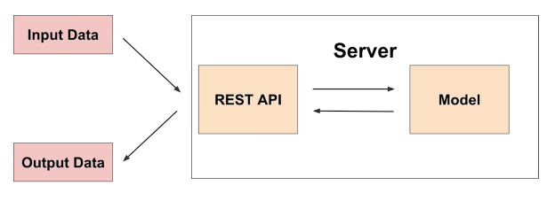
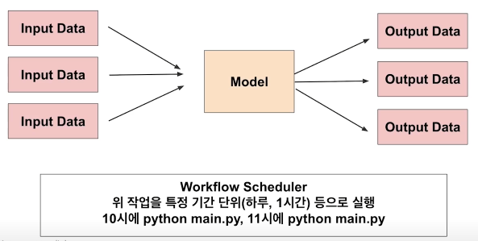

# [AI 서빙 기초] 모델 서빙

## 모델 서빙(Model Serving)

### 서빙(Serving) 기초

- 서비스화. 프로덕션 환경(실제 세계)에 모델을 사용 가능하도록 배포.
- 머신 러닝 모델을 개발하고, 현실 세계(앱, 웹)에서 사용 가능하게 만드는 행위.
- 크게 온라인 서빙과 배치 서빙, 두 가지 방식 존재.
- 그 외에 클라이언트(모바일 기기, IoT 디바이스 등)에 제공하는 엣지 서빙도 있음.

### 용어 정리

- 서빙(Serving): 모델을 웹/앱 서비스에 배포하는 과정. 모델의 서비스화 관점.
- 추론(Inference): 모델이 데이터 입력을 기반으로 예측하는 과정. 사용자(user)의 관점.
- 둘을 혼재하여 사용하는 경우가 있어 유의.

## 온라인 서빙(Online Serving)



- 한 번에 하나씩 실시간으로 서빙. 동시 주문에 대해 확장가능한(scalable) 서빙이 되도록 해야 함.

### 웹 서버

- HTTP를 통해 웹 브라우저에서 요청하는 HTML 문서나 오브젝트를 전송해주는 서비스 프로그램.
- 요청(Request)을 받으면 그 내용을 전송(Response)하는 프로그램.
- Computer software and underlying hardware that accepts requests via HTTP (the network protocol created to distribute web content) or its secure variant HTTPS (Wikipedia).

### API

- Application Programming Interface
- 운영체제나 프로그래밍 언어가 제공하는 기능을 제어할 수 있도록 만든 인터페이스.
- 예시
    - PyTorch 라이브러리의 경우, PyTorch API로는 torch, torch.nn, torch.nn.functional, … 등이 존재.

### 서빙 입력 — 단일 데이터 포인트

- 단일 데이터를 받아 실시간으로 예측하는 예제
- 기계 고장 예측 모델
    - 센서의 실시간 데이터를 바탕으로 특정 기계 부품의 N분 이내 고장 여부를 예측.
- 음식 배달 소요 시간 예측
    - 특정 지역의 과거 평균 배달 시간, 실시간 교통 정보, 음식 데이터 등을 기반으로 음식 배달 소요 시간 예측.

### 온라인 서빙 기초

- 머신 러닝 모델 서버에 요청 시, 필요한 경우 머신 러닝 모델 서버에서 데이터 전처리를 해야 할 수 있음(혹은 분리를 위해 전처리 서버와 머신 러닝 모델 서버를 나눠야 할 수도 있음).
- 서비스의 서버에 머신 러닝 서버를 포함하는 경우도, 별도의 서버를 운영하는 경우도 존재.
- 회사에서 개발 조직과 데이터 조직의 협업 방식에 따라 다르게 개발 가능.

### 온라인 서빙 구현 방식

1. 직접 API 웹 서버 개발
    - Flask, FastAPI 등을 사용하여 서버 구축
2. 클라우드 서비스 활용
    - AWS의 SageMaker, GCP의 Vertex AI 등
    - 특징
        - 클라우드 내부 실행 구조를 잘 알아야 문제 상황이 발견 시 잘 대처 가능.
        - 클라우드 서비스에서는 어떤 방식으로 AI 제품을 만들었는지 확인 가능하여 사용 경험은 추천/권장됨.
    - 장점
        - 직접 구축해야 하는 MLOps의 다양한 부분(API 만들기 등)이 생성됨.
        - 사용자 관점에선 PyTorch 사용하듯 학습 코드만 제공하면 API 서버가 생성됨.
        - 회사 상황에 따라 클라우드 서비스를 활용하는 것이 좋은 시기도 있음.
            - 소수 인원이 많은 업무를 감당해야 하는 경우.
    - 단점
        - 클라우드 서비스에 익숙해야 잘 활용 가능.
        - 비용 문제
3. 서빙 라이브러리 활용
    - TensorFlow Serving, Torch Serve, MLFlow, BentoML 등
    - FastAPI를 활용할 수 있으나, 서버에 대한 이해가 뒷받침되지 않으면 첫 구현 시 어려울 수 있음.
    - 다양한 방식으로 개발 가능한데, 매번 추상화된 패턴을 가질 수 있음.
    - 추상화된 패턴을 잘 제공하는 오픈 소스를 활용하는 방식.
    - BentoML 예시
        
        ```python
        # Import the IrisClassifier class defined above
        from iris_classifier import IrisClassifier
        
        # Create a iris classifier service instance
        iris_classifier_service = IrisClassifier()
        
        # Pack the newly trained model artifact
        iris_classifier_service.pack('model', clf)
        
        # Save the prediction service to disk for model serving
        saved_path = iris_classifier_service.save()
        ```
        
        위 코드 실행 후 아래 명령을 CLI에서 입력 후 배포.
        
        ```python
        bentoml serve IrisClassifier:latest
        ```
        
### 서빙 방법 선택 가이드

- 주어진 환경(회사의 일정, 인력, 예산, 요구 성능 등)을 고려 해야 함.
- 추천 방식
    1. 프로토타입 모델을 클라우드 서비스를 활용하여 배포(클라우드 비용을 감당 가능한 경우)
    2. 직접 FastAPI 등을 활용하여 서버 개발
    3. 서빙 라이브러리를 활용하여 개발

### 온라인 서빙 시 고려할 점

- 파이썬 버전, 패키지 버전 등 의존성 관리
- 지연 시간(latency)의 최소화
    - 지연 시간: 하나의 예측 요청 후 반환까지 걸리는 시간
- 재현 가능성
    - 불가능한 코드는 위험성이 있는 코드
    - virtualenv, poetry, docker 등의 학습 이유
- 입력 데이터를 기반으로 데이터베이스에 있는 데이터를 추출하여 모델 예측을 해야 하는 경우
    - 데이터는 다양한 공간(예컨대 데이터베이스, AWS S3 등)에 저장되어 있을 수 있음
    - 데이터 추출을 위해 쿼리를 실행하고, 결과를 받는 시간이 소요됨
- 모델 수행 연산
    - RNN, LSTM 등 딥 러닝 모델들은 회귀 분석보다 많은 비용을 요구함
    - 모델 경량화 작업의 필요성
- 결과 값에 대한 보정이 필요한 경우
    - 유효하지 않은 예측값이 반환될 수 있음
    - 0 미만의 값은 0으로 보정한다든지 등의 방법
- 해결 방법?
    - 데이터 전처리 서버의 분리
    - 모델 경량화
    - 병렬 처리(Ray)
    - 예측 결과 캐싱

## 배치 서빙(Batch Serving)



- 많은 양을 일정 주기로 한꺼번에 서빙
- 특정 시간대에 반복하여 실행
- Airflow, Cron Job 등으로 스케줄링 작업(Workflow scheduler)

### 배치 서빙

- 예시
    - 1일전 생성 콘텐츠에 대한 추천 리스트 예측
    - 1시간 뒤 수요 예측
    - Spotify의 추천 알고리즘 — Discover weekly
- 장점
    - 주피터 노트북에 작성한 코드를 함수화한 후 주기적으로 실행하는 간단한 구조
    - 온라인 서빙보다 구현이 수월하고 간단함. 한 번에 많은 데이터를 처리하여 지연 시간이 문제되지 않음.
- 단점
    - 실시간 활용 불가
    - Cold start 문제: 오늘 새로 생긴 콘텐츠는 추천 불가

### 작업 흐름 스케줄러(Workflow scheduler)

- Airflow(데이터 엔지니어링에서 자주 활용)
- Linux - Cron job

## 온라인 서빙 vs. 배치 서빙

### 출력 관점에서의 선택 기준

- API 형태로 바로 결과를 반환해야 한다면, 온라인 서빙.
- 서버와 통신이 필요한 경우라면, 온라인 서빙.
- 단위 시간에 한 번씩 예측해도 괜찮다면, 배치 서빙.

### 운용

- 실시간 모델 결과가 어떻게 활용될지에 대해 고려가 필요(예측해도 활용되지 않는다면 배치로 진행하여도 무방)
- 배치 서빙 결과를 데이터베이스에 저장하고, 서버는 데이터베이스의 데이터를 쿼리하여 주기적으로 조회하는 방식으로 사용 가능.
- 배치 서빙으로 모델을 운용하다가 점점 API 형태로 전환하는 방식도 가능.

## 참고
- 부스트캠프 - AI 서비스 개발 기초 by 변성윤