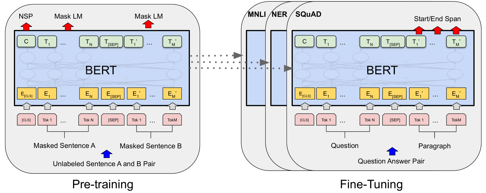
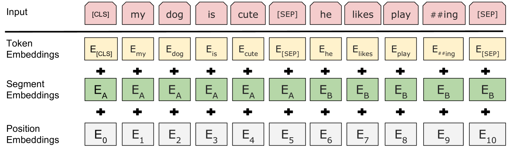
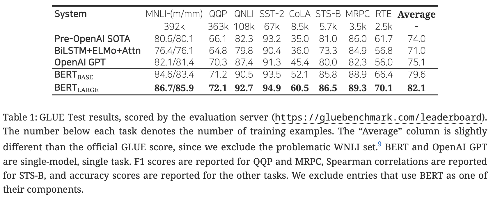
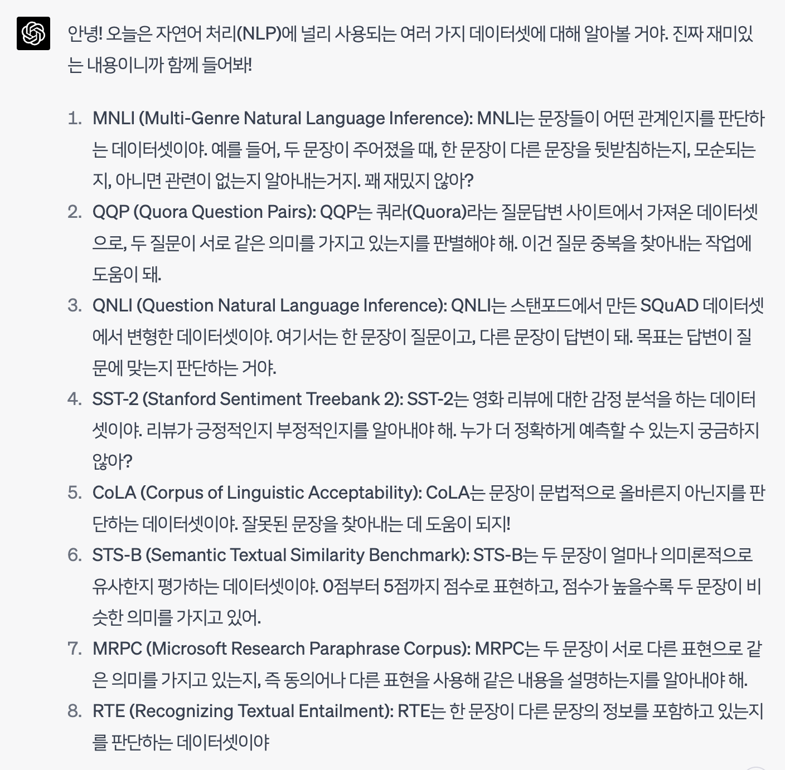
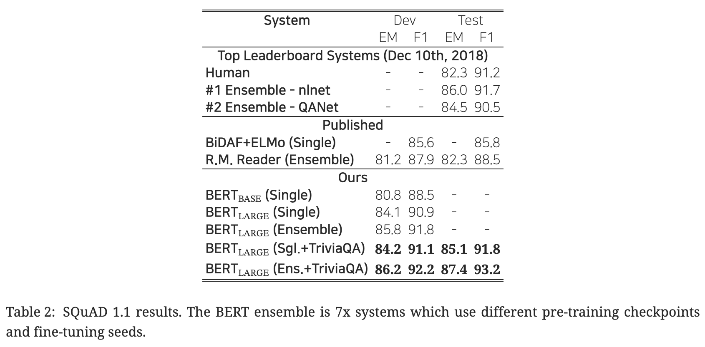
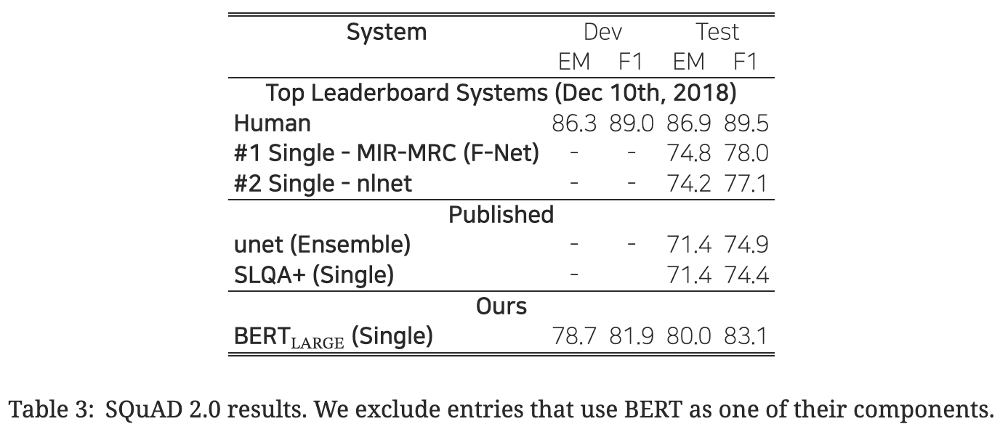
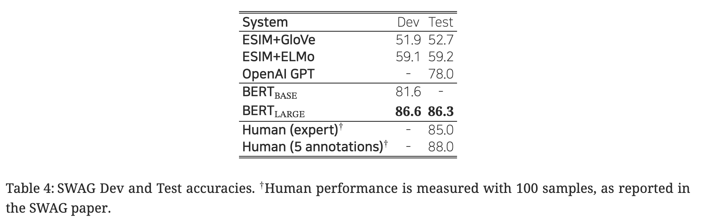
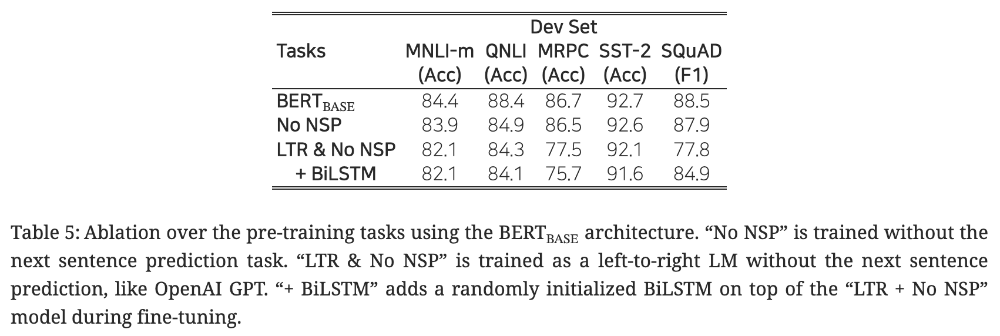
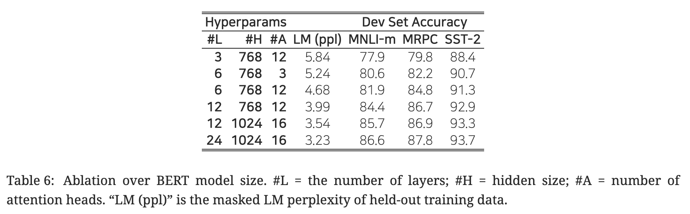
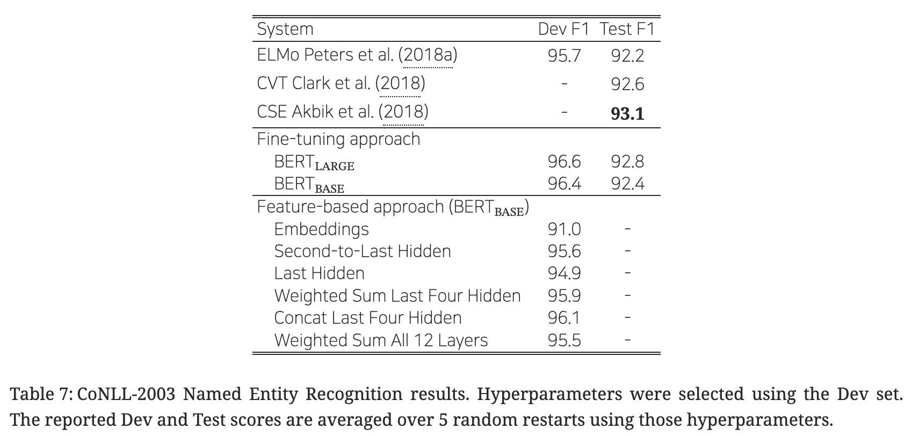

# [논문 리뷰 with ChatGPT] BERT: Pre-training of Deep Bidirectional Transformers for Language Understanding (NAACL 2019, BERT) 

## 📖 세 줄 이내 요약 📖

- 토큰 표상을 양방향으로 학습하기 위한 방법으로서 사전 학습 단계에서 (1) 마스킹(MLM; Masked Language Model) 기법과 (2) 다음 문장 예측(NSP; Next Sentence Prediction) 기법 제안.
- 충분히 사전 학습했다는 전제하에, 소규모 데이터셋에 대한 다운스트림 태스크 수행 시에도 파인 튜닝 단계에서 최소한의 파라미터를 부가하여 우수한 성능을 검증.
- Task-specific 아키텍처를 제치고 11개 영역에서 SOTA 달성한 task-agnostic 아키텍처의 제안.

## 초록

### 정의
- 트랜스포머를 거친 양방향 인코더 표상(Bidirectional Encoder Representations from Transformers).

### 의의
- 특별히 태스크에 맞춰진(task-specific) 구조가 필요없는 task-agnostic 아키텍처.

### 방법론
- 레이블링되지 않은 텍스트를 모든 계층에서 좌우, 양방향 공동으로 조건을 부가함.

### 결과
- 사전학습 BERT 모델 + 1 출력층 → 11개 NLP 영역에서 SOTA 달성. 다음 내용을 포함.
    - GLUE score to 80.5% (7.7% point absolute improvement)
    - MultiNLI accuracy to 86.7% (4.6% absolute improvement)
    - SQuAD v1.1 question answering Test F1 to 93.2 (1.5 point absolute improvement)
    - SQuAD v2.0 Test F1 to 83.1 (5.1 point absolute improvement)

## 1. 개요

### 1. 1. 배경

- 언어 모델(Language Modeling)의 사전 학습의 유효성이 증명되고 있는 사례
    - 문장 수준
        - 자연어 추론(Bowman et al. ([2015](https://ar5iv.labs.arxiv.org/html/1810.04805#bib.bib6)); Williams et al. ([2018](https://ar5iv.labs.arxiv.org/html/1810.04805#bib.bib51)))
        - 문장 재구성(Dolan and Brockett ([2005](https://ar5iv.labs.arxiv.org/html/1810.04805#bib.bib17)))
    - 토큰 수준
        - 개체명 인식 및 질의응답(Tjong Kim Sang and De Meulder ([2003](https://ar5iv.labs.arxiv.org/html/1810.04805#bib.bib44)); Rajpurkar et al. ([2016](https://ar5iv.labs.arxiv.org/html/1810.04805#bib.bib39)))

### 1. 2. 모델링 전략

- 일반적 언어 표상의 사전 학습을 위한 단방향 언어 모델의 목적 함수를 공유하는 형태.
- 사전 학습 언어 표상을 다운스트림 태스크에 활용하기 위한 두 가지 전략 소개.

#### 1. 2. 1. 피처 기반(feature-based)

- 태스크-특이적(task-specific) 아키텍처.
- 사전 학습 표상은 $$+\alpha$$의 피처로서 취급(부가적인 피처).
- 예) ELMo (Peters et al., 2018a)

#### 1. 2. 2. 파인 튜닝(fine-tuning)

- 사전 학습 표상에 태스크마다 하나의 출력층을 부가.
- 다운스트림 태스크 수행 시 모든 사전 학습 파라미터를 파인 튜닝하여 재학습.
- 예) Generative Pre-trained Transformer (OpenAI GPT) Radford et al. (2018)

### 1. 3. 기존 방식의 한계

- 단방향 학습: 사전 학습 시 아키텍처 다양성 저해.

### 1. 4. 논문의 기여

- 언어 표상의 양방향 사전 학습의 중요성 제고
    - 마스킹된 언어 모델(MLM; Masked Language Modeling) 방법.
    - 표상을 양방향으로 깊이 사전 학습하여 일방향성의 제약 완화.
- 태스크-특이적(task-specific) 아키텍처를 대체 → 많은 엔지니어링 작업 부담의 완화.
- 11가지 NLP 태스크에서 SOTA 달성

## 2. 관련 연구(Related Works)

### 2. 1. 비지도 방식 피처 기반 접근법

Unsupervised feature-based approaches

#### 2. 1. 1. 신경망 기법 사용 유무

- 비신경망 기반
    - Brown et al. ([1992](https://ar5iv.labs.arxiv.org/html/1810.04805#bib.bib7)); Ando and Zhang ([2005](https://ar5iv.labs.arxiv.org/html/1810.04805#bib.bib3)); Blitzer et al. ([2006](https://ar5iv.labs.arxiv.org/html/1810.04805#bib.bib5))
- 신경망 기반
    - Mikolov et al. ([2013](https://ar5iv.labs.arxiv.org/html/1810.04805#bib.bib31)); Pennington et al. ([2014](https://ar5iv.labs.arxiv.org/html/1810.04805#bib.bib34))

#### 2. 1. 2. 임베딩 방식 — 단어, 문장, 문단 수준

- ‘사전 학습된 단어 임베딩 방식’이 ‘맨 처음부터(from scratch) 임베딩하는 방식’보다 우월.
- 사전 학습 단어 임베딩 방식
    - 좌 → 우 언어 모델링
        - Mnih and Hinton ([2009](https://ar5iv.labs.arxiv.org/html/1810.04805#bib.bib32))
    - 좌우 문맥 내 잘못된 단어와 올바른 단어 구별
        - Mikolov et al. ([2013](https://ar5iv.labs.arxiv.org/html/1810.04805#bib.bib31))
- 문장 임베딩
    - Kiros et al. ([2015](https://ar5iv.labs.arxiv.org/html/1810.04805#bib.bib25)); Logeswaran and Lee ([2018](https://ar5iv.labs.arxiv.org/html/1810.04805#bib.bib28))
- 문단 임베딩
    - Le and Mikolov ([2014](https://ar5iv.labs.arxiv.org/html/1810.04805#bib.bib26))
- 문장 표상 학습 방식?
    - 다음 문장 후보의 순서 나열
        - Jernite et al. ([2017](https://ar5iv.labs.arxiv.org/html/1810.04805#bib.bib23)); Logeswaran and Lee ([2018](https://ar5iv.labs.arxiv.org/html/1810.04805#bib.bib28))
    - 이전 문장이 주어질 때 다음 문장 내 단어를 왼쪽에서 오른쪽 순서로 생성
        - Kiros et al. ([2015](https://ar5iv.labs.arxiv.org/html/1810.04805#bib.bib25))
    - 오토인코더 파생 목적 함수의 노이즈 제거
        - Hill et al. ([2016](https://ar5iv.labs.arxiv.org/html/1810.04805#bib.bib20))

#### 2. 1. 3. ELMo

- 맥락에 민감한(context-sensitive) 피처 추출.
- 좌→우 언어 모델 및 우→좌 방향의 언어 모델로부터 나온 토큰별 문맥 표상 벡터를 이어붙임(concatenation).

### 2. 2. 비지도 방식 파인 튜닝 접근법

Unsupervised fine-tuning approaches

- 최초 연구
    - 레이블이 없는 텍스트로부터 단어 임베딩 파라미터만 사전 학습.
- 문장/문서 인코더의 맥락 토큰 표상 학습 방식
    - ‘사전 학습 → 파인 튜닝’.
    - 즉 레이블링되지 않은 텍스트로부터 사전 학습 후, 지도학습으로 다운스트림 태스크에 파인 튜닝.
- 장점
    - 처음부터 학습해야 할 파라미터 수가 매우 적음.
    - OpenAI GPT Radford et al. (2018) → GLUE 벤치마크의 많은 문장 수준 태스크에서 SOTA 달성.

### 2. 3. 정답 레이블 있는 데이터로부터 전이 학습

Transfer learning from supervised data

- 방대한 데이터에서 학습 후 전이 학습의 효과성 증명되고 있었음.
- 컴퓨터 비전 분야에서도 ‘사전 학습 → 파인 튜닝’ 패러다임.

## 3. BERT

- 의의: 다양한 태스크에 대해 통합적인 아키텍처를 제공.

#### 모델 아키텍처(Model architecture)

- 다층 양방향 트랜스포머(A multi-layer bidirectional Transformer).
- 트랜스포머 아키텍처에 대한 설명은 ‘Vaswani et al., Attention Is All You Need (NIPS 2017)’을 참고.
- 셀프 어텐션 블록 수 $$L$$, 은닉 층 차원 수 $$H$$, 셀프 어텐션 헤드 개수 $$A$$에 대하여
    - BERT-base
        - 하이퍼파라미터 설정: $$L=12,H=768,A=12$$.
        - 파라미터 수: 1.1억(110M)
    - BERT-large
        - 하이퍼파라미터 설정: $$L=24,H=1023,A=16$$.
        - 파라미터 수: 3.4억(340M)
- vs. OpenAI GPT
    - 비교를 위해 BERT-base의 모델 사이즈는 OpenAI GPT와 같게 설정.
    - BERT는 양방향 셀프 어텐션, GPT는 단방향 셀프 어텐션(문맥 정보를 왼쪽에서부터만 추출하도록 함).

#### 입출력 표상(Input/output representations)

- 두 쌍의 문장을 하나의 토큰 문장화
    - 다양한 다운스트림 태스크에 일반화시키기 위한 목적.
    - “문장(sentence)”: 실제 언어적으로 관점에서의 문장을 의미하는 것이 아니라 임의의 길이의 인접한 텍스트.
    - “시퀀스(sequence)”: 한 문장 혹은 두 문장이 이어붙은 한 덩어리 형태.

- BERT의 사전 학습 및 파인 튜닝 아키텍처는 출력층을 제외하고는 동일.
- 다운스트림 태스크 해결 시 모델 파라미터는 똑같이 초기화(공유).
- 입력의 형태
    - `[CLS] 문장A [SEP] 문장B`
    - [CLS], [SEP]: 특수 토큰.
- WordPiece 임베딩 사용(3만여 토큰 단어)

- 입력 표상 = 토큰 임베딩 + 세그먼트(분할) 임베딩 + 위치 임베딩

### 3. 1. BERT 사전 학습(Pre-training BERT)

#### 3. 1. 1. 마스킹 언어 모델(MLM; Masked Language Model)

- 마스킹의 필요성(Why masking?)
    - 직관적으로, 양방향으로 깊게 쌓는 아키텍처 성능이 (1) 좌 → 우의 단방향 모델 혹은 (2) 좌→우 모델과 우→좌 모델을 단순히 이어붙인(concatenation) 얕은 방식보다 월등할 것.
    - 다만 단순히 양방향으로 단어 표상을 학습하는 것은 간접적으로 단어를 관찰한 뒤 그 단어를 예측(”see itself”)하게 하는 부정행위(cheating)가 됨.
- 마스킹 방법
    - 각 시퀀스 내 전체 WordPiece 토큰의 15% 정도를 임의로 마스킹.
    - 마스킹된 단어만 예측(전체 입력 시퀀스 재구성 x).
- 한계점 및 그 보완
    - 파인 튜닝 과정에는 “[MASK]” 토큰이 등장하지 않으나, 사전 학습 시에는 등장하는 불균형(mismatch) 발생.
    - 상기 15% 확률로 마스킹 선택된 토큰을 다음과 같이 재분류하여 치환.
        - 80% → [MASK] 토큰
        - 10% → 임의의 다른 토큰
        - 10% → 원래 토큰(이 경우 치환이 일어나지 않음)

#### 3. 1. 2. 다음 문장 예측(NSP; Next Sentence Prediction)

- 질의응답(QA; Question Answering)이나 자연어 추론(NLI; Natural Language Inference)은 두 문장 간 관계에 대한 이해를 밑바탕으로 하나, 언어 모델이 이를 직접적으로 포착하진 못 함.
- 문장 간 관계의 학습 방법
    - 단일 언어 말뭉치(monolingual corpus)에서 반반 추출
        - 절반(50%)은 ‘문장, 다음 문장’으로 시퀀스 구성; IsNext 레이블.
        - 나머지 절반(50%)은 ‘문장, 다음 문장 아닌 임의 문장’으로 시퀀스 구성; NotNext 레이블.
    - 최종 모델의 다음 문장 예측 정확도는 97 - 98% 수준.

#### 3. 1. 3. 사전 학습 데이터

- BooksCorpus (8억 단어; 800M words) Zhu et al. ([2015](https://ar5iv.labs.arxiv.org/html/1810.04805#bib.bib56))
- 영어 위키피디아 (25억 단어; 2,500M words)
    - 리스트, 테이블, 헤더 등 무시하고 텍스트 부분만 추출.

### 3. 2. BERT 파인 튜닝(Fine-tuning BERT)

- 기존 파인 튜닝 방법
    - (스테이지 1) 텍스트 쌍을 각각 인코딩 → (스테이지 2) 양방향 크로스 어텐션 적용.
- BERT 파인 튜닝 방법
    - 상기 두 스테이지를 셀프 어텐션을 사용하여 통합: 텍스트 쌍을 [SEP] 토큰을 사이에 두고 이어붙임.
    - 입력단
        1. 다른 말로 바꾸어 표현하기(Paraphrasing): 문장 쌍 (문장 A와 문장 B가 동일한 의미를 가짐)
        2. 문장 수반 여부(Entailment): 가설-전제 쌍 (문장 A와 문장 B의 논리적 관계를 판단)
        3. 질의 응답(Question Answering): 질문-지문 쌍 (문장 A가 질문, 문장 B가 답변을 포함하는 지문)
        4. 텍스트 분류/시퀀스 태깅(Text Classification/Sequence Tagging): 텍스트 쌍 (문장 A와 무의미한 텍스트 쌍)
    - 출력단
        - 토큰 수준 작업 (예: 시퀀스 태깅, 질의 응답): 토큰 표현이 출력층에 공급되어 작업을 수행.
        - 분류 작업 (예: 수반 여부, 감성 분석): [CLS] 토큰의 표현이 출력층에 공급되어 작업을 수행.
- 파인 튜닝 비용
    - 1 Cloud TPU로 최대 1시간 혹은 GPU로 수 시간 이내 파인 튜닝 가능.
    - 사전 학습 비용에 비해 저렴.

- Table 1 간략 설명
    - 상대적으로 우수한 성능을 보이는 태스크
        - 감성 분석(SST-2; 94.9)
        - 질의에 대한 응답의 적절성(QNLI; 92.7)
    - 상대적으로 빈약한 성능을 보이는 태스크
        - 문법성 판단(CoLA; 60.5)
        - 논리적 내포성(RTE; 70.1)
        - 질의 간 의미의 중복성(QQP; 72.1)
    - 중간 성능의 태스크
        - 다른 말로 바꾸어 문장 표현이 되었는지 판별(MRPC; 89.3)
        - 문장 간 관계(MNLI; 86.7/85.9)
        - 문장 간 의미론적 유사 관계(STS-B; 86.5)

-  데이터셋에 대한 설명

    

## 4. 실험(Experiments)

### 4. 1. GLUE

- 정답 레이블 수 $$K$$에 대해 [CLS] 토큰의 최종 은닉 벡터 $$C\in\mathbb R^H$$와 분류층 파라미터 $$W\in\mathbb R^{K\times H}$$의 행렬곱에 log softmax를 취하여 분류 문제를 풂.
    
    $$
    \hat y=\log\text{softmax}(CW^T)
    $$
    
- 하이퍼파라미터 설정
    
    $$
    \begin{aligned}\text{bsz}&=32\\\text{eps}&=3\\\text{lr}&\in\{5\text{e}-5,4\text{e}-5,3\text{e}-5,2\text{e}-5\}\end{aligned}
    $$
    
- 참고
    - BERT-large의 경우, 작은 규모의 데이터셋에 대한 파인 튜닝이 가끔 불안정해서 몇 차례 임의로 실험 재시작(random restarts)을 해줌.
    - 분류기 초기화 설정 다르게 해주고, 파인 튜닝 데이터도 여러 가지 방법으로 섞어줌.

### 4. 2. SQuAD v1.1

- 10만여 개 크라우드소싱 질의 응답 쌍 데이터셋.

- 사람 수준 성능(human-level performance)와 대등한 수준인 기존 Ensemble - nlnet.
- BERT-large (Single + TriviaQA)가 위 성능 수준.
- BERT-large (Ensemble + TriviaQA)는 위 수준보다도 1.5%p 정도 우수.
- TriviaQA에 파인 튜닝하지 않고서도 기존 아키텍처들을 크게 앞서는 우수한 성능.

### 4. 3. SQuAD v2.0

- SQuAD v.1.1
    - 주어진 지문과 관련된 질문에 대한 정답을 찾는 것이 목표이며, 정답의 형태는 지문의 특정 부분.
- SQuAD v.2.0
    - SQuAD v.1.1의 확장 버전. 주어진 질문에 대해 지문에서 정답을 찾을 수 없는 경우도 포함. 즉 지문에서 정답을 찾거나, 질문에 대한 정답이 없음을 인식하는 능력이 필요.
- ‘정답없음’ 모델링 방법
    
    $$
    \hat s_{i,j}\le s_\text{null}+\tau
    $$
    
    이때,
    
    $$
    \begin{aligned}\hat s_{i,j}&=\max_{j\ge i}S\cdot T_i+E\cdot T_j\\s_\text{null}&=S\cdot C+E\cdot C\end{aligned}
    $$
    
    그리고 $$\tau$$는 검증 세트의 F1 점수를 최대화하는 값으로 설정하며, $$S\in\mathbb R^H$$는 시작 벡터, $$E\in\mathbb R^H$$는 끝 벡터.
    

### 4. 4. SWAG

- 상식 추론 능력 평가를 위한 11.3만여 개 문장 쌍.
- 주어진 문장에 대해, 네 가지 선택지 중 가장 그럴듯한 연속성 있는 문장을 선택하는 태스크 수행.

## 5. 소거 연구(Ablation Studies)

### 5. 1. 사전 학습의 영향

- 네 가지 모델을 비교
    1. BERT-base: 마스킹 기법(MLM) 사용 + 다음 문장 예측(NLP) 사용.
    2. No NSP: 마스킹 기법(MLM) 사용.
    3. LTR(left-to-right) & No NSP: OpenAI GPT와 같이 마스킹 기법 없는 단방향 언어 모델.
    4. + BiLSTM: 3번 모델에 양방향 LSTM 부가.
- 결과
    - 사전 학습에서 마스킹 기법(MLM) & 다음 문장 예측(NSP)의 필요성 확인.

### 5. 2. 모델 크기의 영향

- ‘모델 크기 키우기 → 대규모 태스크(번역, 언어 모델링 등)에서의 지속적인 성능 향상’ 가설에 대한 막연한 믿음이 있었음. 그런데 BERT에서는 이러한 믿음을 실제 실험을 통해 확인해보고자 함.
- 사전 학습이 충분히 이루어진다는 전제하에, 모델 크기를 스케일업 하는 것은 소규모의 태스크에서도 상당한 성능 향상을 기대할 수 있음.
- 소규모의 다운스트림 태스크에서조차도 표현력이 풍부한 사전 학습 표상을 활용하기 위한 방법?
    - 사전 학습 후 바로 다운스트림 태스크에 파인 튜닝
    - 임의로 초기화되는 파라미터 수를 최소한으로 부가

### 5. 3. 피처 기반 접근법과 BERT

- 피처 기반 접근법(Feature-based approaches)의 장점
    1. 모든 태스크가 트랜스포머의 인코더 아키텍처만을 사용하여 풀리지는 않음 → 구체적인 태스크에 맞춰진 아키텍처의 필요성 O.
    2. 파인 튜닝 방법에 비해 저비용.
- 비교 연구
    - 피처 기반 접근법과 파인 튜닝 방식 비교를 진행. 파인 튜닝 방식의 우수성 검증.
    - 그러나 피처 기반 접근법에서도 좋은 성능을 보이는 만큼, BERT는 효과적인 기법임을 재확인.

## 6. 결론

### 논문의 기여

- 양방향으로 깊이 있게 사전 학습이 가능한 아키텍처를 제안함으로써 광범위한 NLP 태스크를 수행하게 함.
- 우수한 일반화 성능을 가진 아키텍처의 제안.

## 참고
- [BERT: Pre-training of Deep Bidirectional Transformers for Language Understanding](https://ar5iv.labs.arxiv.org/html/1810.04805){:target="_blank"}
