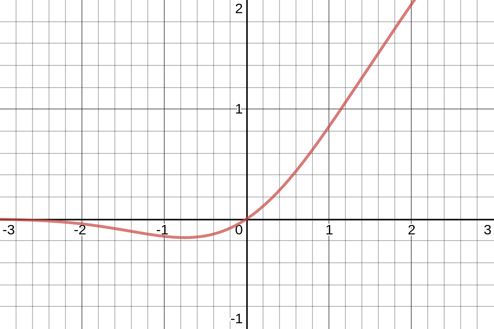
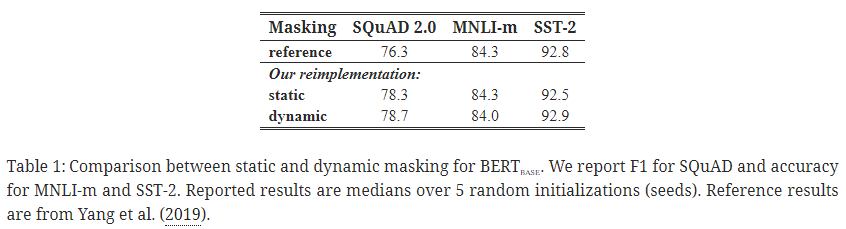
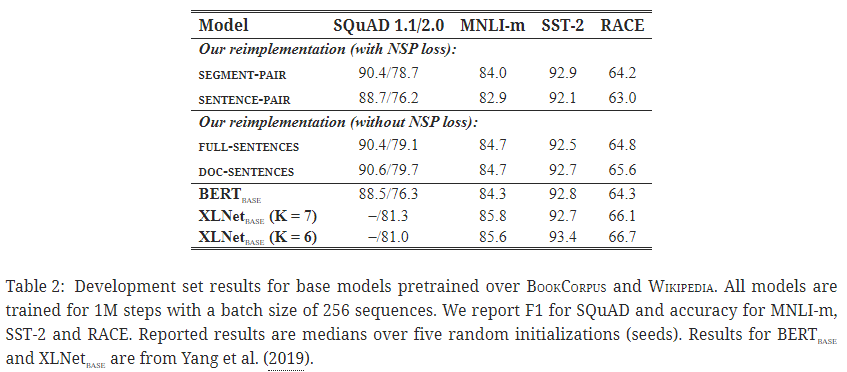
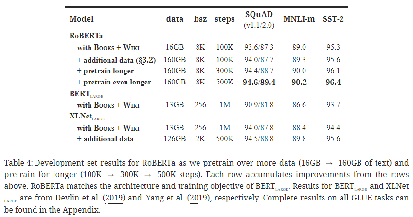
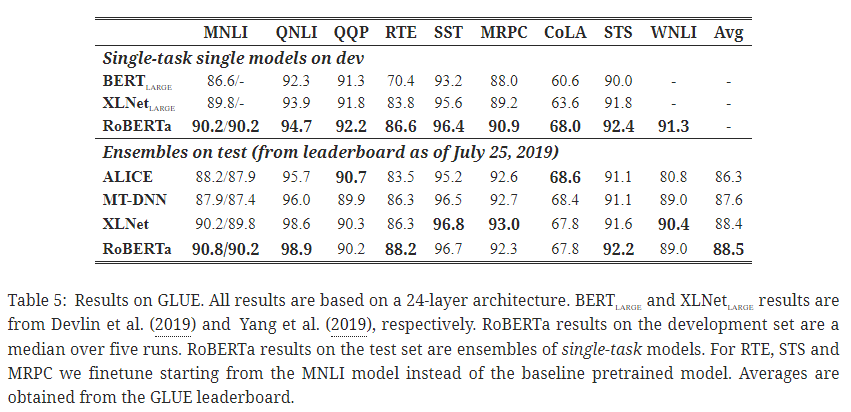
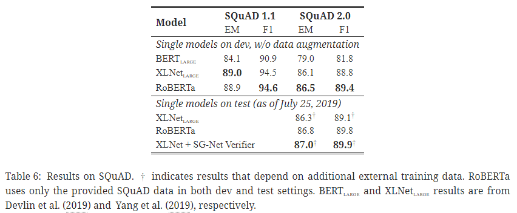
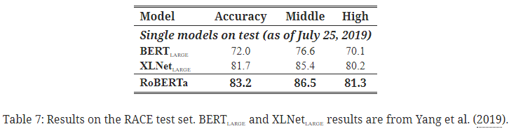
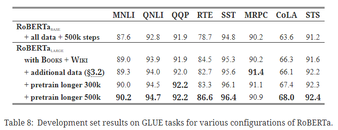
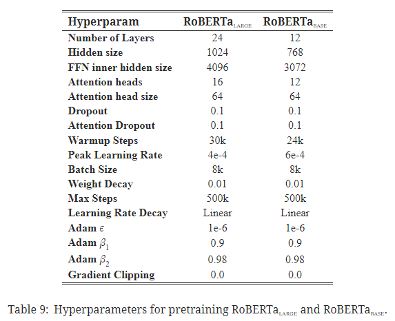
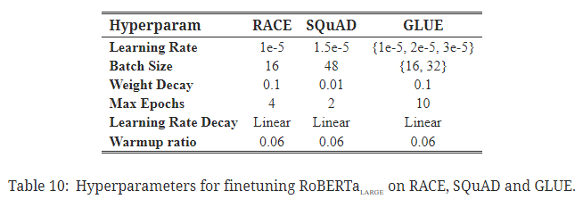

# [논문 리뷰] RoBERTa: A Robustly Optimized BERT Pretraining Approach

# RoBERTa: A Robustly Optimized BERT Pretraining Approach

## 논문의 기여

- BERT 논문의 간과점을 보완하여 재설계.
- 하이퍼파라미터 튜닝 및 학습 데이터 크기 조정 등의 효과 검증.

## 1. 개요

#### 1. 0. 1. 자기 학습(Self-training) 방법론 예시

- ELMo Peters et al. ([2018](https://ar5iv.labs.arxiv.org/html/1907.11692#bib.bib33)); GPT Radford et al. ([2018](https://ar5iv.labs.arxiv.org/html/1907.11692#bib.bib34)); BERT Devlin et al. ([2019](https://ar5iv.labs.arxiv.org/html/1907.11692#bib.bib9)); XLM Lample and Conneau ([2019](https://ar5iv.labs.arxiv.org/html/1907.11692#bib.bib23)); XLNet Yang et al. ([2019](https://ar5iv.labs.arxiv.org/html/1907.11692#bib.bib48))

#### 1. 0. 2. 한계

1. 방법론의 어떠한 측면이 성능 향상에 기여하는지 가려내는 것이 불분명.
2. 학습 비용은 방대하여 튜닝 횟수에는 제약 존재.
3. 학습 데이터는 종종 비공개 형태이고 다양한 사이즈를 가짐.

→ 모델링 발전 효과를 객관적으로 평가하기 어려움.

#### 1. 0. 3. 극복 방법 제안

1. (1) 더 방대한 데이터를 (2) 더 큰 규모의 배치로 (3) 더 오랜 학습 시간.
2. 다음 문장 예측(NSP) 기법을 제거.
3. 더 긴 시퀀스에 대해 학습.
4. 학습 데이터에 적용된 마스킹 패턴에 동적 변화 부가.

($$+\alpha$$) 다른 비공개 데이터셋과 규모면에서 맞먹는 CC-News 데이터셋을 도입하여 학습셋의 규모 효과 검증.

## 2. 배경

- BERT Devlin et al. ([2019](https://ar5iv.labs.arxiv.org/html/1907.11692#bib.bib9))에 대한 간략 요약.
- 해당 논문에 대한 보다 자세한 내용: [**BERT: Pre-training of Deep Bidirectional Transformers for Language Understanding (NAACL 2019, BERT)**](https://afterthougt.github.io/cs/2023-05-06-bert/)

### 2. 1. 설정

- BERT의 입력 설정
    
    두 세그먼트(토큰 시퀀스; 각 세그먼트는 최소 하나 이상의 자연스러운 문장을 포함) $$x_1,\cdots,x_N$$과 $$y_1,\cdots,y_M$$에 대하여 BERT의 입력 형태는 다음과 같음.
    
    $$
    [\text{CLS}],x_1,\cdots,x_N,[\text{SEP}],y_1,\cdots,y_M,[\text{EOS}]
    $$
    
    이때, 최대 시퀀스 길이(max_seq_len) $$L$$에 대하여 $$M+N<T$$을 만족.
    
- 레이블링 되지 않은 거대 말뭉치(corpus) 데이터에 대해 사전 학습 後 레이블링된 다른 태스크에 파인 튜닝(fine-tuning).

### 2. 2. 아키텍처

BERT의 아키텍처는 Vaswani et al. ([2017](https://ar5iv.labs.arxiv.org/html/1907.11692#bib.bib43))을 참고.

### 2. 3. 학습 목적

#### 2. 3. 1. 마스킹 언어 모델(MLM; Masked Language Model)

- 특수 토큰 $$[\text{MASK}]$$으로 임의의 토큰을 치환.
- 목적 함수: 크로스 엔트로피(cross-entropy). 마스킹된 원래 토큰 예측.
- 임의 마스킹 & 치환은 학습 이전 딱 한 번 발생.

#### 2. 3. 2. 다음 문장 예측(NSP; Next Sentence Prediction)

- 목적 함수: 이진 분류 손실 함수(binary classification loss). 두 세그먼트가 연달아 오는지 예측.
- 양성 셋 $$\sim$$ 텍스트 말뭉치(text corpus)의 연속된 문장.
- 음성 셋 $$\sim$$ 서로 다른 문서의 세그먼트.
- 자연어 추론 성능 제고를 위해 NSP 목적 함수 설계.

### 2. 4. 최적화

- Adam Kingma and Ba ([2015](https://ar5iv.labs.arxiv.org/html/1907.11692#bib.bib20))
    
    $$
    \begin{aligned}\beta_1&=0.9\\\beta_2&=0.99\\\epsilon&=1\text{e}-6\\\lambda&=0.01\end{aligned}
    $$
    
    이때, $$\lambda$$는 $$L_2$$의 weight decay.
    
- 학습률 $$\text{lr}=1\text{e}-4$$를 10000 스텝 동안 유지 후 선형 감쇠.
- 드롭아웃율 $$p=0.1$$ (모든 층 및 어텐션 가중치에 대해).
- 활성화 함수 GELU Hendrycks and Gimpel ([2016](https://ar5iv.labs.arxiv.org/html/1907.11692#bib.bib15)).
    
    $$
    \begin{aligned}\text{GELU}(x)&=x\Phi(x)\\&=x\cdot\frac{1}{2}\left(1+\text{erf}(x/\sqrt{2})\right)\end{aligned}
    $$
    
    - GELU 함수 모양
        
        
        
    
    이때, $$\Phi(x)$$: 표준 정규 누적 분포 함수(standard Gaussian cumulative distribution function).
    
- 최대 시퀀스 길이 $$L=512$$ 제한하에 $$B=256$$개의 미니배치를 $$S=1,000,000$$회 사전 학습하여 업데이트.

### 2. 5. 데이터

- BookCorpus Zhu et al. ([2015](https://ar5iv.labs.arxiv.org/html/1907.11692#bib.bib51))
- English Wikipedia (16GB 규모의 비압축 텍스트)

## 3. 실험 설정

### 3. 1. 구현

- 기본 BERT 하이퍼파라미터 세팅에서 바꾼 것
    - 피크 학습률 & 워밍업 스텝 수
    - Adam의 $$\beta_2=0.98$$ (안정성을 위해)
    - 임의로 짧은 시퀀스 추가 X.
    - Mixed precision floating point
    - 램 용량 32GB의 V100 8대

### 3. 2. 데이터

- 추가 데이터셋
    - CC-News Nagel ([2016](https://ar5iv.labs.arxiv.org/html/1907.11692#bib.bib29)) (76GB after filtering)
    - OpenWebText Gokaslan and Cohen ([2019](https://ar5iv.labs.arxiv.org/html/1907.11692#bib.bib13)) (38GB)
    - Stories Trinh and Le ([2018](https://ar5iv.labs.arxiv.org/html/1907.11692#bib.bib42)) (31GB)

### 3. 3. 평가

#### 3. 3. 1. GLUE

- 자연어 이해를 평가하기 위한 9가지 데이터셋
    - CoLA Warstadt et al. ([2018](https://ar5iv.labs.arxiv.org/html/1907.11692#bib.bib46))
    - Stanford Sentiment Treebank (SST) Socher et al. ([2013](https://ar5iv.labs.arxiv.org/html/1907.11692#bib.bib39))
    - Microsoft Research Paragraph Corpus (MRPC) Dolan and Brockett ([2005](https://ar5iv.labs.arxiv.org/html/1907.11692#bib.bib10))
    - Semantic Textual Similarity Benchmark (STS) Agirre et al. ([2007](https://ar5iv.labs.arxiv.org/html/1907.11692#bib.bib1))
    - Quora Question Pairs (QQP) Iyer et al. ([2016](https://ar5iv.labs.arxiv.org/html/1907.11692#bib.bib18))
    - Multi-Genre NLI (MNLI) Williams et al. ([2018](https://ar5iv.labs.arxiv.org/html/1907.11692#bib.bib47))
    - Question NLI (QNLI) Rajpurkar et al. ([2016](https://ar5iv.labs.arxiv.org/html/1907.11692#bib.bib37))
    - Recognizing Textual Entailment (RTE) Dagan et al. ([2006](https://ar5iv.labs.arxiv.org/html/1907.11692#bib.bib7)); Bar-Haim et al. ([2006](https://ar5iv.labs.arxiv.org/html/1907.11692#bib.bib3)); Giampiccolo et al. ([2007](https://ar5iv.labs.arxiv.org/html/1907.11692#bib.bib12)); Bentivogli et al. ([2009](https://ar5iv.labs.arxiv.org/html/1907.11692#bib.bib4))
    - Winograd NLI (WNLI) Levesque et al. ([2011](https://ar5iv.labs.arxiv.org/html/1907.11692#bib.bib24)).

#### 3. 3. 2. SQuAD

- The Stanford Question Answering Dataset (SQuAD)
- SQuAD v1.1 → 질의마다 응답이 존재.
- SQuAD v2.0 → 응답이 존재하지 않는 질의가 존재.
    - ‘질의에 응답이 가능한지’ 여부를 판단하는 이진 분류기 부가
        
        → 분류 + span loss 더해서 공동 학습.
        

#### 3. 3. 3. RACE

- The ReAding Comprehension from Examinations (RACE) Lai et al. ([2017](https://ar5iv.labs.arxiv.org/html/1907.11692#bib.bib22))
- 중국 중고등학생을 대상으로 설계된 영어 시험.
- 28,000여 지문과 100,000여 질의들(1지문당 평균 3이상의 질의).
- 다른 독해 데이터셋에 비해 지문 길이가 상당히 긴 편이고, 추론 비중이 매우 높음.

## 4. 학습 과정 분석

- BERT-base (L=12, H=768, A=12, 110M params)

### 4. 1. 정적 vs. 동적 마스킹

#### 비교

- BERT 방식
    - 정적 마스킹
    - 학습 데이터를 10회 복제 후, 40회의 epochs에 대해 10가지 다른 방식의 마스킹을 적용.
        
        → 각 학습 시퀀스는 학습 도중 같은 마스크를 네 번 만남.
        
- RoBERTa 방식
    - 동적 마스킹
    - 시퀀스를 모델에 공급할 때마다 마스킹 패턴을 생성.

#### 결과

- (논문 표현으로는) 동적 마스킹 ≥ 정적 마스킹
- (실제) SQuAD 2.0 및 SST-2에서는 0.4 정도 성능 향상. MNLI-m에서는 0.3 정도 성능 하락.

### 4. 2. 모델 입력 형식과 다음 문장 예측(NSP)

#### 비교

- 세그먼트 쌍 + 다음 문장 예측(NSP)
    - BERT 방식.
- 문장 쌍 + 다음 문장 예측(NSP)
    - 문장 쌍으로만 데이터셋을 구성하면 최대 시퀀스 길이 512보다 훨씬 짧아 배치 크기를 늘려 총 토큰 수를 위 방식과 비슷하도록 함.
    - 가장 낮은 성능.
- 완벽한 문장
    - 문서 내 연속된 문장을 최대 토큰 수 제한 512에 맞게 나열. 문서 간 이동이 발생하는 경우, 추가 구분자 토큰을 부가하여 문장을 계속 추가.
- 문서 문장
    - 문서 내 문장으로만 구성하고, 배치 크기를 늘려 최대 토큰 수 제한 512에 맞추도록 함.

#### 결과

- 개별 문장들은 다운스트림 태스크에 성능 하락을 야기하는 것을 확인.
    
    → 장거리 의존성(long-range dependencies)를 학습할 수 없기 때문으로 추측.
    
- NSP loss 없애기 ≥ NSP loss 사용 → Q. 비교를 어떻게 해야 할지..?
- 단일 문서 내 문장으로 제한하기 ≥ 다중 문서에서 문장 추출 후 이어붙이기.

### 4. 3. 대규모 배치 학습

- 대규모 배치로 학습하는 것이 MLM의 ppl (perplexity)도 개선하고, 엔드 태스크 성능도 개선함.
- 배치 규모가 클수록 분산 데이터 병렬 학습이 쉬워짐.

### 4. 4. 텍스트 인코딩

- BPE (Byte-Pair Encoding): 학습 말뭉치에서 추출한 부분 단어(subword) 단위를 사용하는 기법.
- BPE 어휘 크기는 일반적으로 10,000 ~ 100,000여 개.
- BERT의 경우 30,000여 개 정도 수준의 BPE 어휘 사용.
- Radford et al. ([2019](https://ar5iv.labs.arxiv.org/html/1907.11692#bib.bib35))의 BPE 사용.
    - BPE가 약간의 성능 하락을 보였으나 인코딩 사용의 보편성을 더 고려함.

## 5. RoBERTa

### 5. 1. GLUE 결과

### 5. 2. SQuAD 결과

### 5. 3. RACE 결과

## 6. 관련 연구

- 언어 모델링 Dai and Le ([2015](https://ar5iv.labs.arxiv.org/html/1907.11692#bib.bib8)); Peters et al. ([2018](https://ar5iv.labs.arxiv.org/html/1907.11692#bib.bib33)); Howard and Ruder ([2018](https://ar5iv.labs.arxiv.org/html/1907.11692#bib.bib17))
- 기계 번역 McCann et al. ([2017](https://ar5iv.labs.arxiv.org/html/1907.11692#bib.bib27))
- 마스킹 언어 모델링 Devlin et al. ([2019](https://ar5iv.labs.arxiv.org/html/1907.11692#bib.bib9)); Lample and Conneau ([2019](https://ar5iv.labs.arxiv.org/html/1907.11692#bib.bib23))
- 파인 튜닝 Howard and Ruder ([2018](https://ar5iv.labs.arxiv.org/html/1907.11692#bib.bib17)); Radford et al. ([2018](https://ar5iv.labs.arxiv.org/html/1907.11692#bib.bib34)), and pretraining with some variant of a masked language model objective.
- 멀티 태스크 파인 튜닝 Dong et al. ([2019](https://ar5iv.labs.arxiv.org/html/1907.11692#bib.bib11))
- 개체 임베딩 통합 Sun et al. ([2019](https://ar5iv.labs.arxiv.org/html/1907.11692#bib.bib41))
- 스팬(span) 예측 Joshi et al. ([2019](https://ar5iv.labs.arxiv.org/html/1907.11692#bib.bib19))
- 자동회귀 사전 학습(Autoregressive pretraining) Song et al. ([2019](https://ar5iv.labs.arxiv.org/html/1907.11692#bib.bib40)); Chan et al. ([2019](https://ar5iv.labs.arxiv.org/html/1907.11692#bib.bib6)); Yang et al. ([2019](https://ar5iv.labs.arxiv.org/html/1907.11692#bib.bib48)).
- 거대 규모의 모델 & 데이터 Devlin et al. ([2019](https://ar5iv.labs.arxiv.org/html/1907.11692#bib.bib9)); Baevski et al. ([2019](https://ar5iv.labs.arxiv.org/html/1907.11692#bib.bib2)); Yang et al. ([2019](https://ar5iv.labs.arxiv.org/html/1907.11692#bib.bib48)); Radford et al. ([2019](https://ar5iv.labs.arxiv.org/html/1907.11692#bib.bib35)).

## 7. 결론

- 상당한 성능 향상을 위해 (1) 더 오랜 시간 학습, (2) 더 큰 배치 규모 사용, (3) 더 많은 데이터 준비, (4) NSP 목적 함수 제거, (5) 더 긴 시퀀스에 대해 학습, (6) 마스킹 패턴의 동적 변형 기법을 사용하는 것이 좋다.

## 부록

### GLUE 전체 결과

### 사전 학습 하이퍼파라미터

### 파인 튜닝 하이퍼파라미터

- learning rate, batch size, weight decay를 변화시켜줄 필요성?
- warmup ratio의 경우 0.06으로 고정.

## 참고
- [RoBERTa: A Robustly Optimized BERT Pretraining Approach](https://ar5iv.labs.arxiv.org/html/1907.11692){:target="_blank"}
