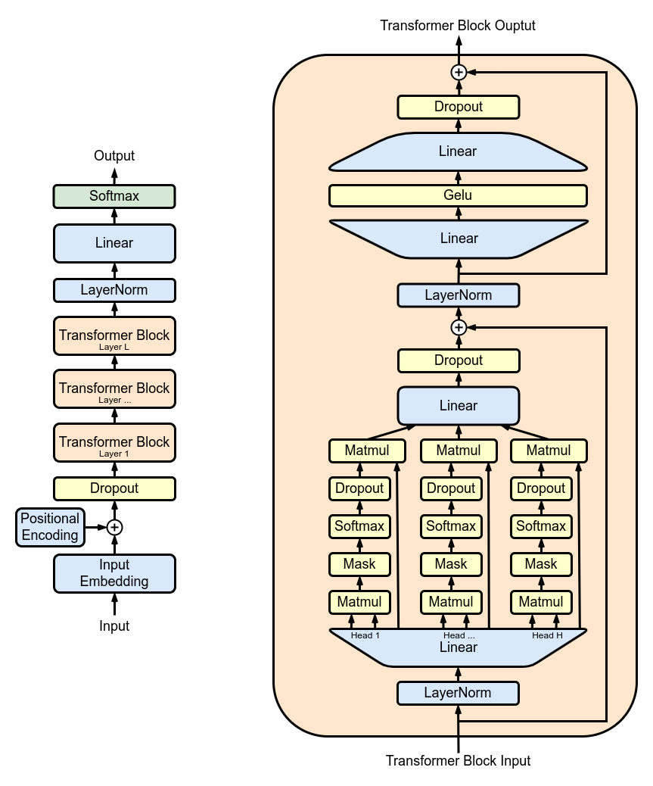

# [논문 리뷰] Improving Language Understanding by Generative Pre-Training (OpenAI blog 2018, GPT-1)

## 참고: GPT-1, GPT-2, GPT-3 비교

(출처: [GPT-2 - Wikipedia](https://en.wikipedia.org/wiki/GPT-2))

|  | 아키텍처 | 파라미터 수 | 학습 데이터 |
| --- | --- | --- | --- |
| GPT-1 | 12개의 헤드가 달린 트랜스포머 디코더 블록 12개의 적층 후 softmax | 1.2억 (0.12B) | https://en.wikipedia.org/wiki/BookCorpus:https://en.wikipedia.org/wiki/GPT-2#cite_note-31 4.5 GB의 텍스트 데이터, 다양한 장르의 미출간 도서 7000여 권 |
| GPT-2 | Normalization이 수정된 GPT-1 구조 | 15억 (1.5B) | WebText: 40 GB의 텍스트 데이터, 800만 문서, Reddit 사이트에서 ‘좋아요’를 받은 4500만여 웹페이지. |
| GPT-3 | 대규모 스케일링이 가능해진 GPT-2 구조 | 1750억 (175B) | 570 GB의 일반 텍스트, 4000억(0.4T)여 토큰. 수집 데이터: CommonCrawl, WebText, 영문 Wikipedia, Books1 & Books2 말뭉치. |

## 초록(Abstract)

#### 배경

- 자연어를 이해한다는 것?
    - 텍스트 함의, 질의응답, 의미 유사도, 평가문서 분류 등 광범위한 태스크를 포괄.

#### 한계

- 접근 가능한 데이터의 비대칭적 특성
    - 각 태스크를 지도학습하기 위한 레이블링된 데이터는 희소한 반면, 레이블링되지 않은 텍스트 말뭉치는 풍부.

#### 극복 방안

- 생성형 사전 학습(generative pre-training) 후 선별형 파인 튜닝(discriminative fine-tuning).

#### 결과

- 성능 실험한 12개 태스크 중 9개 영역에서 상당한 갭으로 SOTA 달성.
    - 상식 추론(commonsense reasoning) — 8.9%p 성능 향상(Stories Cloze Test).
    - 질의응답(question answering) — 5.7%p 성능 향상(RACE).
    - 텍스트 함의(textual entailment) — 1.5%p 성능 향상(MultiNLI).
    - GLUE 멀티태스크 벤치마크 — 5.5%p 성능 향상.

## 1 개요(Introduction)

#### 배경

- 미가공 텍스트(raw text)를 학습하는 능력은 자연어 처리에서 지도 학습에 대한 의존성을 줄이는 데 매우 중요. Why? 레이블링된 자원이 희소하기 때문.
- 한편, 비지도 학습 방식으로 표상을 잘 학습(learning good representations)하는 것이 상당한 성능 향상을 이끌어낸다는 사실이 알려져왔음. 가장 잘 드러난 예 — 단어 임베딩을 사전 학습한 모델의 광범위한 자연어 처리 태스크에의 응용.

#### 한계

- 레이블링되지 않은 텍스트에서 단어 레벨의 정보를 활용해 의미있는 성능 향상을 이끌어 내는 것이 어려운 이유?
    1. 텍스트 표상 학습 시 어떤 종류의 목적 함수가 전이 학습 시 효과적인지 모호.
    2. 목표로 하는 자연어 처리 태스크에 전이 학습 시 효과적 방법론에 대한 의견 일치 부재.

## 2 관련 연구(Related Work)

#### 자연어 처리에서의 준準지도 학습(Semi-supervised learning for NLP)

- 초기 접근법
    - 레이블 없는 데이터(unlabeled data; 정답 없는 데이터)에서 단어나 어구 수준에서 통계적 접근 방식을 취함 → 이 데이터를 지도 학습 모델의 피처로써 사용.
- 지난 몇 년 간의 접근법
    - 레이블 없는 말뭉치에서 학습한 단어 임베딩 사용.
    - 한계: 주로 단어 수준의 정보를 전이하는 데서 그침. 실제로 원하는 것은 보다 고수준의 의미론적 정보를 포착하는 것.
- 최근 접근법
    - 레이블링되지 않은 데이터에서 단어 수준보다 고수준의 의미를 활용하고 학습하는 방법론의 발전. 어절 수준, 문장 수준의 임베딩 등.

#### 비지도 사전 학습(Unsupervised pre-training)

- 비지도 사전 학습은 준지도 학습의 특수한 경우.
    - 목적: 좋은 초기 지점을 찾는 것(지도 학습 목적 함수를 수정하는 것 X).
- 초기 연구
    - 이미지 분류와 회귀 태스크에서의 테크닉 탐색.
- 이후의 연구
    - 사전 학습을 regularization(정규화)을 위한 하나의 방식으로써 활용.
- 최신 연구
    - 이미지 분류, 음성 인식, 개체 모호성 해소, 기계 번역과 같은 태스크에서의 신경망 기법.

#### 보조 학습 목적 함수(Auxiliary training objectives)

- 보조 비지도 학습 목적 함수(auxiliary unsupervised training objectives)는 준지도 학습의 대안.
- 초기 연구(by Collobert & Weston)
    - 다양한 보조 자연어 처리 태스크.
    - 품사 태깅, 구문 분석, 개체명 인식, 언어 모델링 → 의미론적 역할 레이블링.
- 최근 연구(Rei)
    - 타겟 태스크 목적 함수에 보조 언어 모델링 도입 → 시퀀스 레이블링에 대해 성능 향상 확인.
- 본 연구
    - 보조 목적 함수를 도입하는데, 비지도 사전 학습에서 타겟 태스크의 여러 언어학적 측면을 선행 학습함에 유의.

## 3 구조(Framework)

(출처: [GPT-2 - Wikipedia — Original GPT architecture](https://en.wikipedia.org/wiki/GPT-2#/media/File:Full_GPT_architecture.png))

- 트랜스포머([Attention Is All You Need (NIPS 2017, Transformer)](https://afterthougt.github.io/cs/2023-04-04-attention-is-all-you-need/))의 마스킹 멀티-헤드 어텐션 블록(Masked Multi-Head Attention block) 12개를 반복적으로 쌓아 정규화 기법(normalization, regularization - dropout 등)을 적용한 구조에 입력 임베딩 & 위치 임베딩(Input Embedding & Positional Embedding) 정보를 입력으로 넣어줘 학습시킨 형태.
- 더 간단하게, 트랜스포머의 디코더에서 인코더와 연결된 MHA(multi-headed attention) 블록을 제외한 구조를 12개 반복 적층한 구조.

### 3.1 비非지도 사전 학습(Unsupervised pre-training)

- 문맥 윈도우 $$k$$개의 토큰 후에 올 다음 단어를 예측하는 언어 모델링(language modeling)에서 다음 목적 함수 $$L_1$$을 최대화하는 문제:
    
    $$
    L_1(\mathcal U)=\sum_i\log P(u_i\vert u_{i-k},\cdots,u_{i-1}\vert\Theta)
    $$
    
    이때, $$\mathcal U$$는 $$N$$개의 $$u_i$$ 토큰으로 이루어진 말뭉치, $$\Theta$$는 신경망 파라미터.
    
- 한편, GPT-1은 트랜스포머의 디코더만을 여러 층 적층하여 이러한 언어 모델링을 구현:
    
    $$
    \begin{aligned}h_0&=UW_e+W_p\\h_l&=\text{transformer block}(h_{l-1}),\forall i\in[1,n]\\P(u)&=\text{softmax}(h_nW_e^T).\end{aligned}
    $$
    
    이때, $$U=(u_{-k},\cdots,u_{-1})$$는 토큰들의 문맥 벡터, $$n$$은 디코더 층 수, $$W_e,W_p$$는 각각 토큰 임베딩 행렬 및 위치 임베딩 행렬.
    

### 3.2 지도指導(감독監督; 교사敎師) 파인 튜닝(Supervised fine-tuning)

- 레이블링된 데이터셋 $$\mathcal C$$가 주어졌을 때, 풀고자 하는 태스크는 다음과 같은 분류 문제:
    
    $$
    P(y\vert x^1,\cdots,x^m)=\text{softmax}(h_l^mW_y).
    $$
    
- 그리고 다음 목적 함수 $$L_2$$를 최대화하는 문제:
    
    $$
    L_2(\mathcal C)=\sum_{(x,y)}\log P(y\vert x^1,\cdots,x^m).
    $$
    

#### 파인 튜닝에 보조 목적 함수(auxiliary objective) 도입

- 한편, (a) 위와 같은 지도 학습 방식 파인 튜닝에서의 일반화 성능을 높이고 (b) 수렴을 가속화하기 위해 가중치 $$\lambda$$를 도입하여 다음과 같은 목적 함수 $$L_3$$를 최대화하는 문제를 풂:
    
    $$
    L_3(\mathcal C)=L_2(\mathcal C)+\lambda L_1(\mathcal C).
    $$
    

### 3.3 작업 특화적 입력 변환(Task-specific input transformations)

- 문장 분류를 포함한 몇 가지 태스크는 바로 파인 튜닝이 가능.
- 한편, 질의응답, 텍스트 함의와 같은 태스크들은 (문서, 질의, 응답)의 트리플렛이라든가 문장 순서쌍과 같은 구조화된 입력 형태를 가지는 특성 때문에 약간의 트릭이 필요함.
- 입력 변환 (input transformations): 구조화 입력 → 시퀀스 형태로 변환. 순회 방식 (traversal-style approach).
- 모든 변환은 임의로 초기화된 시작 토큰 (start token) 및 끝 토큰 (end token) 포함.

#### 문장 함의(Textual entailment)

#### 유사도(Similarity)

- 두 문장의 내재적인 순서라는 게 없으므로 순서를 뒤집은 입력까지 입력 변환하여 각각 시퀀스 표상 $$h_l^m$$을 얻고 이를 요소 간 합(element-wise addition)을 거쳐 선형 출력 층으로 전달.

#### 질의응답과 상식 추론(Question Answering and Commonsense Reasoning)

- 문서 $$z$$, 질의 $$q$$, 가능한 답변의 집합 $$\{a_k\}$$에 대해, 다음을 입력 변환:
    
    $$
    [z;q;\$;a_k].
    $$
    

## 4 실험(Experiments)

### 4.1 설정(Setup)

#### 비지도 사전 학습(Unsupervised pre-training)

- BooksCorpus 데이터셋을 사전 학습 시 사용.
    - 7000여 개의 서로 다른 미출간 도서.
    - 모험, 판타지, 로맨스 등 다양한 장르.
    - 장기적 정보의 조건 학습을 위한 긴 연속적인 텍스트 구간 포함.
- 1B Word Benchmark
    - 문장 단위로 섞어 장기적 구조를 파괴.
    - 이 데이터셋에 대해 매우 낮은 수준인 perplexity = 18.4 기록.

#### 모델 사양(Model specifications)

- 아키텍처
    - 마스킹 셀프 어텐션된 디코더 12층만을 적층한 트랜스포머.
    - 768 차원의 states & 12개의 어텐션 헤드.
    - Position-wise feed-forward 망에 대해, 3072 차원의 inner states 사용.
- 최적화 알고리즘
    - Adam.
    - max(learning rate) = 2.5e-4.
    - 학습률(learning rate)은 최초 2000 업데이트까지 0부터 선형 증가 후 cosine 스케줄링에 따라 0까지 감소.
- 데이터
    - 64개의 임의 샘플링된 미니 배치에 대해 100 epochs만큼 학습.
    - 연속된 512 토큰.
    - Weight initialization의 경우 $$\mathcal N(0, 0.02)$$를 따름. Why? LayerNorm이 모델 전반에 사용되었기 때문.
    - 4만 merges의 BPE(bytepair encoding) 어휘 사용.
- Regularization(정규화)
    - 드롭아웃율 = 0.1.
        - Residual dropout.
        - Embedding dropout.
        - Attention dropout.
    - 수정된 L2 정규화.
        - 모든 non bias 혹은 gain weights에 대해 $$w=0.01$$.
- 활성화 함수(Activation function)
    - GELU(Gaussian Error Linear Unit).
    - Sinusoidal 버전 대신 동적 위치 임베딩 사용.
- 데이터 클리닝
    - *fifty* 라이브러리
        - BooksCorpus 원문 텍스트 클리닝.
        - 일부 문장부호 및 공백 표준화.
    - *spaCy* 토크나이저

#### 파인 튜닝 세부 사항(Fine-tuning details)

- 특별한 언급이 없다면, 비지도 사전 학습 시 사용한 하이퍼파라미터 설정을 따름.
- 드롭아웃(dropout)
    - Classifier에 대해 추가. 드롭아웃율 0.1.
- 학습율(learning rate) = 6.25e-5.
- 배치 크기(batch size) = 32.
- 대부분의 경우, epochs = 3 정도면 충분.
- 학습율 스케줄러
    - 선형(linear) 학습율 감쇠.
    - Warmup = 0.2% 초과, $$\lambda$$ = 0.5

### 4.2 지도 파인 튜닝

#### 자연어 추론(Natural language inference)

- 자연어 추론
    - 두 문장의 관계 예측 — 함의(entailment), 모순(contradictino), 중립(neutral)의 세 가지 관계 중 하나.
- 한계점
    - 어휘적 함의(lexical entailment)
    - 상호 참조(coreference)
    - 어휘 및 구문적 모호성(lexical and syntactic ambiguity)
- 다섯 가지 평가 데이터셋
    - 이미지 캡션, 음성 대본, 인기 소설, 정부 보고서, 위키백과 기사, 과학 시험, 뉴스 기사 등의 다양한 소스.
- 결과
    - (5 中) 4개 데이터셋에서 SOTA. MNLI에서 최대 1.5%p, SciTatil에서 5%p, QNLI에서 5.8%p, SNLI에서 0.6%p 향상.
- 토의
    - NLI 데이터셋에서 강력한 성능을 보인다는 것은 멀티태스크 학습(multi-task training)에서 이점이 있을 것으로 예상되나 아직 탐구하지 않음.

#### 질의응답 및 상식 추론(Question answering and commonsense reasoning)

- 질의응답 & 상식 추론
    - 단일 혹은 다중 문장 추론을 요하는 태스크.
- 데이터셋
    - RACE
        - 중국 중고등학교 시험에서 출제된 영어 지문 및 관련 질문으로 구성.
        - CNN이나 SQuAD와 같은 데이터셋보다 추론 유형의 질문이 더 많이 포함.
        - 장거리 문맥을 다루는 학습에 대한 좋은 평가 자료.
    - Story Cloze Test
        - 두 가지 선택 중 다중 문장 이야기에 대한 올바른 결말 선택 포함.
- 결과
    - Story Cloze에 대해 최대 8.9%p, RACE에 대해 전반적으로 5.7%p의 성능 향상.
- 결론
    - 장거리 문맥을 효과적으로 처리하는 능력 확인.

#### 의미적 유사도(Semantic similarity) & 분류(Classification)

- 의미적 유사도
    - 두 문장의 의미적 동등 여부 예측.
    - 다른 표현(rephrasing) 인식, 부정의 이해, 구문적 모호성 처리를 위함.
- 의미적 유사도 검증 데이터셋
    - MRPC (Microsoft Paraphrase Corpus)
    - QQP (Quora Question Pairs)
    - STS-B (Semantic Textual Similarity benchmark)
- 의미적 유사도 검증 결과
    - STS-B에서 1%p 성능 향상. QQP에서 단일 태스크 BiLSTM + ELMo + Attn 대비 4.2%p의 절대적인 향상.
- 분류
- 분류 검증 데이터셋
    - Corpus of Linguistic Acceptability (CoLA)
        - 문장의 문법성이 올바른지에 대한 전문가 판단 포함.
        - 학습 모델의 선천적 언어적 편항 평가.
    - Stanford Sentiment Treeband (SST-2)
        - 표준 이진 분류 작업
- 분류 검증 결과
    - CoLA 45.4%
    - SST-2 91.3%
    - GLUE 벤치마크 72.8% (이전 SOTA 68.9%)

## 5 해석(Analysis)

#### 전이된 층 수에 따른 영향(Impact of number of layers transferred) & 제로샷 특성(Zero-shot behaviors)

- 전이 층 수의 영향
    - 전이 층 수가 많을수록 감성 분석, 언어적 수용성, 질의응답 등 자연어 처리 태스크에서 성능 향상 관측 → 모델의 각 층은 타겟 태스크를 푸는 데 유용한 기능을 포함.
- 제로샷 특성
    - 트랜스포머 기반 언어 모델의 사전 학습이 왜 효과적인지 알아보기 위한 가설
        - 기저 생성 모델의 태스크 수행 방법 학습 → 언어 모델링 능력 향상.
        - 전이학습 능력? 트랜스포머의 구조화된 어텐션 메모리 > LSTM.
    - 지도 파인 튜닝 없이 사전 학습만으로 태스크를 수행하는 실험
        - 생성형 사전 학습은 다양한 태스크 관련 기능을 학습하는 데 도움이 됨.
        - LSTM 기반 모델의 경우, 제로샷 성능에 있어 트랜스포머 기반 모델 대비 분산(variance)이 높은 특성을 보인다는 사실 발견 → 트랜스포머의 유도적 편향(inductive bias)이 전이에 도움됨을 확인.

#### 소거 연구(Ablation studies)

1. 파인 튜닝 동안 보조 언어 모델링 목적 함수(auxiliary LM objective) 없이 실험
    - NLI와 QQP에 보조 목적 함수가 도움됨을 확인.
    - 데이터셋 규모가 클수록 보조 목적 함수의 도움을 받음.
2. 트랜스포머 vs. 단층 2048 유닛 LSTM(나머지 조건 동일)
    - MRPC 데이터셋에 대해서만 LSTM이 성능이 높았음(outperform).
3. 사전학습 없이 타겟 태스크를 바로 학습한 아키텍처와의 비교
    - 모든 태스크에서 성능 하락이 심하였음. 평균 14.8%p 정도의 성능 하락.

## 6 결론(Conclusion)

#### 기여

- 여러 태스크에 일반화된, 태스크 독립적(task-agnostic) 모델.
- 장거리의 인접 텍스트를 다양한 말뭉치에 대해 사전 학습함으로써 실세계 지식의 상당 부분을 습득.
- 장거리 의존성 처리.

## 참고
- [Improving Language Understanding by Generative Pre-Training](https://cdn.openai.com/research-covers/language-unsupervised/language_understanding_paper.pdf){:target="_blank"}
