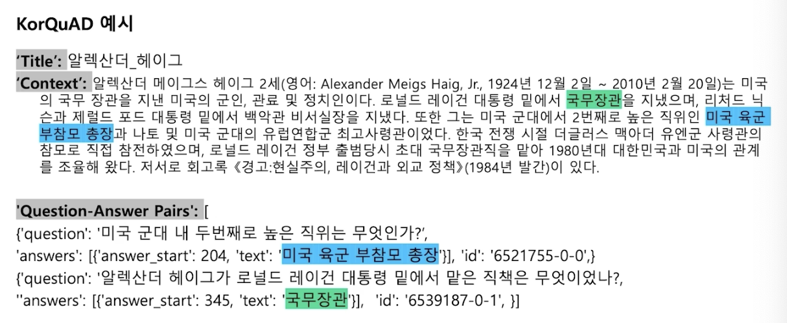

# [NLP/자연어 처리] 기계독해 개요(MRC Intro)

💡 **목적: 사용자의 질문에 응답할 수 있는 QA 모델을 밑바닥부터 개발!**

**(예) Q. 세종대왕이 태어난 해는 언제야? A. 1397년 5월 15일**

## 기계독해 개요(Introduction to MRC)

MRC: Machine Reading Comprehension

### 기계독해 종류(Types of MRC)

- 응답 추출 데이터셋(Extractive Answer Datasets)
    - (설명) 질의에 대한 응답이 항상 주어진 지문의 segment(or span)로서 존재한다.
    - (예시) SQuAD, KorQuAD, NewsQA, Natural Questions 등
- 설명 기반/이야기 기반 응답 데이터셋(Descriptive/Narrative Answer Datasets)
    - (설명) 응답이 지문 내에서 추출한 span이 아니고 질의를 보고 생성된 sentence(혹은 자유 형식)의 형태이다.
    - (예시) MS MARCO, Narrative QA
- 객관식 데이터셋(혹은 다중선택형 데이터셋, Multiple-choice Datasets)
    - (설명) 질의에 대한 응답을 여러 개의 answer candidates 중 하나로 고르는 형태이다.
    - (예시) MCTest, RACE, ARC 등

### 기계독해 난제(Challenges in MRC)

- 단어 구성이 비유사하나 동등한 의미를 가진 문장을 이해해야 하는 경우
- 주어진 질문에 대한 응답을 지문에서 찾을 수 없는 경우
- 다중 홉 추론(Multi-hop reasoning): 질의에 대한 supporting fact를 여러 문서에서 찾아야만 응답을 할 수 있는 경우
    - (예시) HotpotQA, QAngaroo

### 기계독해 평가 방법(MRC Evaluation Metrics)

- Exact Match(EM) / F1 score
    - 응답 추출 데이터셋(extractive answer datasets) 및 객관식 데이터셋(multiple-choice datasets)에 적합하다.
    - Exact Match(EM)
        
        예측한 응답과 사실이 정확히 일치하는 샘플의 비율을 계산한다.
        
    - F1
        
        예측한 응답과 사실 사이의 공통된 토큰 수를 TP로 두고 F1 계산한다.
        
- ROUGE-L / BLEU
    - 설명 기반/이야기 기반 응답 데이터셋(descriptive/narrative answer datasets)
    - 사실과 예측한 응답 사이의 공통부분(overlapping)을 계산한다.
    - ROUGE-L
        
        예측과 사실 사이의 recall
        
    - BLEU(Bilingual Evaluation Understudy)
        
        예측과 사실 사이의 precision
        

## 유니코드와 토큰화(Unicode & Tokenization)

- 기계독해뿐만 아니라 다른 자연어 처리 태스크에서도 중요한 주제

### 유니코드(Unicode)

- 전세계 모든 문자를 일관되게 표현하고 다룰 수 있도록 만들어진 문자셋
- 각 문자마다 숫자 하나에 매핑한다.

#### 비교: UTF-8 인코딩

- 문자 타입에 따라 다른 길이의 바이트를 할당(동적 할당 방식)
    - 1 바이트: 표준 아스키(Standard ASCII)
    - 2 바이트: 아랍어, 히브리어, 대부분의 유럽 스크립트
    - 3 바이트: 대부분의 현대 글자(한글 포함) - BMP(Basic Multi-lingual Plane)
    - 4 바이트: 기타 유니코드 글자(이모지 등)
- 현재 가장 많이 쓰이는 인코딩 방식이다.

### 파이썬에서 유니코드 다루기

- 파이썬은 버전 3부터 string 타입은 유티코드 표준을 사용한다.
- `ord`
    - 문자를 유니코드 16진수(code point)로 변환한다.
- `chr`
    - 유니코드 16진수(code point)를 문자로 변환한다.

### 유니코드와 한국어

- **한국어**는 **한자 다음으로(!)** 유니코드에서 많은 코드를 차지하고 있는 언어라고 한다.

#### 완성형

- 현대 한국어 자모 조합으로 나타낼 수 있는 모든 완성형 한글 11,172자
- 가 ~ 힣(U+AC00 ~ U+D7A3)

#### 조합형

- 조합을 통해 글자를 만들 수 있는 초성, 중성, 종성
- U+1100 ~ U+11FF, U+A960 ~ U+A97F, U+D780 ~ U+D7FF

### 토큰화(Token化, Tokenization)

- 텍스트를 토큰 단위로 나누는 것
    - 단어(영어의 경우 띄어쓰기 기준), 형태소, 서브워드(subword) 등 여러 토큰 기준이 사용된다.
- 서브워드 토큰화(Subword tokenization)
    - 자주 사용되는 글자 조합은 한 단위로 취급하며, 자주 쓰이지 않는 조합은 서브워드로 쪼갠다.
    - “##-”: 디코딩(토큰화 반대 과정)을 할 때 앞 토큰에 띄어쓰기 없이 연을됨을 뜻한다.

### BPE(Byte-Pair Encoding, 바이트쌍 인코딩)

- 데이터 압축용으로 제안된 알고리즘으로, 자연어 처리에서 토큰화 시 활발하게 사용되고 있다. Data-driven 방법론.
- 방식 — 아래 과정 1, 2를 반복한다:
    1. 가장 자주 나오는 글자 단위의 연속한 두 음절(bi-gram or byte-pair)을 다른 글자로 치환한다.
    2. 치환된 글자를 저장해둔다.

## 데이터셋 살펴보기(Looking into the Dataset)

### KorQuAD

- LG CNS가 AI 언어 지능 연구를 위해 공개한 질의응답 및 기계독해 한국어 데이터셋
    - 인공지능이 한국어 질문에 대한 답변을 하도록 필요한 학습 데이터셋
    - 1,550개의 위키피디아 문서에 대해서 10,649건의 하우 문서들과 크라우드 소싱을 통해 제작한 63,952개의 질의응답쌍으로 구성되어 있다(학습(training) 데이터셋 60,407, 검증(dev) 데이터셋 5,774, 시험(test) 데이터셋 3,898).
    - 누구나 데이터를 내려받고, 학습한 모델을 제출하여 공개된 리더보드에서 평가를 받을 수 있다. → 의의: 객관적인 기준을 가진 연구 결과 공유가 가능해졌다.
    - 현재 v1.0 및 v2.0이 공개되어 있다.
        - v2.0의 경우 보다 긴 분량의 문서를 포함하며, 단순 자연어 문장뿐만 아니라 복잡한 표와 리스트 등을 포함하는 HTML 형태로 표현되어 있어 문서 전체 구조에 대한 이해가 필요하다.

#### KorQuAD 데이터 수집 과정

- SQuAD v1.0 데이터 수집 방식을 벤치마크하여 표준성을 확보하였다.

#### HuggingFace datasets 라이브러리에서 KorQuAD 데이터셋 접근하기

- 접근 가능한 모든 데이터셋이 메모리에 매핑되어 있으며 캐싱되어 있어(memory-mapped & cached) 데이터를 불러오는 과정에서 발생할 수 있는 메모리 공간 부족이나 전처리 과정 반복의 번거로움 등을 피할 수 있다.
- NumPy, pandas, PyTorch, TensorFlow2 등과 호환 가능하다.

```python
from datasets import load_dataset

dataset = load_dataset('squad_kor_v1', split='train')
```

#### KorQuAD 데이터 예시



## 참고

- 부스트캠프 AI Tech 기계 독해(MRC) 강의
