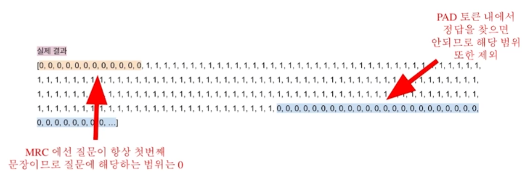

# [NLP/자연어 처리] 응답 추출 기계독해(Extraction-based MRC)

## 응답 추출 기계독해(Extraction-based MRC)

### 문제 정의

질의(question)에 대한 응답(answer)이 항상 주어진 지문(context) 내에 일정 범위(span)로 존재한다.

(예) SQuAD, KorQuAD, NewsQA, Natural Questions, etc.

### 평가 방법

- EM (Exact Match) 점수
    - 응답(모델의 예측)과 문제의 정답이 캐릭터 단위로 완벽하게 일치할 경우에만 1점, 그렇지 않으면 0점을 부여한다.
- F1 점수
    - 응답(모델의 예측)과 문제의 정답이 같은 경우 TP로 계산되며, 응답 토큰 수에 대한 TP 비율인 정밀도(precision)와 정답 토큰 수에 대한 TP 비율인 재현율(recall)의 조화 평균으로 계산한다.

### 개요

## 전처리(Pre-processing)

### 토큰화(Tokenization)

- 텍스트를 보다 작은 단위인 토큰(token)으로 나누는 것
    - 띄어쓰기 기준, 형태소, 서브워드(subword) 등 여러 단위의 토큰 기준이 사용된다.
    - 최근 미학습단어(OOV, Out-Of-Vocabulary) 문제를 해결해주고 정보학적으로 이점을 가진 바이트쌍 인코딩(BPE, Byte-Pair Encoding)을 주로 사용한다.
    - 이하에서는 바이트쌍 인코딩(BPE) 방법 중 하나인 워드피스(WordPiece) 토큰화 방법을 사용한다.
        - (예) “미국 군대 내 두 번째로 높은 직위는 무엇인가?”
        - (WordPiece 토큰화 사용 시) [’미국’, ‘군대’, ‘내’, ‘두’, ‘번째’, ‘##로’, ‘높은’, ‘직’, ‘##위는’, ‘무엇인가’, ‘?’]

### 특수 토큰(Special Tokens)

- 예시: [CLS], [SEP], [PAD] 등

### 어텐션 마스크(Attention Mask)

- 입력 시퀀스 중 어텐션 연산 시 무시할 토큰을 표시한다.
- 0은 무시하며, 1은 연산에 포함한다.
- 보통 [PAD]와 같이 무의미한 특수 토큰을 무시하기 위해 사용한다.

### 토큰 타입 인덱스(Token Type IDs)

- 입력이 둘 이상의 시퀀스일 때(예컨대 질문 및 지문), 각각에게 ID를 부여하여 모델이 구분해 해석하도록 유도한다.

### 모델 출력

- 정답은 문서 내 존재하는 연속된 단어 토큰(span)이므로 그 시작과 끝 위치를 알면 정답을 맞힐 수 있다.
- 응답 추출 방식(extraction-based approach)에서는 답안을 생성하기보다는 시작 위치와 끝 위치를 예측하도록 학습한다. → 즉 토큰 분류 문제를 풀게 되는 것.

## 파인튜닝(Fine-tuning, 미세조정)

### BERT 파인튜닝

## 후처리(Post-processing)

### 불가능한 답 제거하기

- 다음과 같은 경우 후보군에서 제거한다.
    - 끝 위치가 시작 위치보다 앞서는 경우
    - 예측 위치가 지문을 벗어난 경우(예컨대, 질의 문장 내에 응답이 존재하는 경우)
    - 미리 설정한 최대 시퀀스 길이(max_seq_len)보다 길이가 더 긴 경우

### 최적의 답안 찾기

1. 시작 및 끝 위치 예측에서 점수가 가장 높은 N개를 각각 찾는다.
2. 불가능한 시작 및 끝 조합을 제거한다.
3. 가능한 조합들을 점수 합의 내림차순으로 정렬한다.
4. 점수가 가장 큰 조합을 최종 예측으로 선정한다.
5. Top-k가 필요한 경우 차례대로 내보낸다.

## 참고

- 부스트캠프 AI Tech 기계 독해(MRC) 강의
