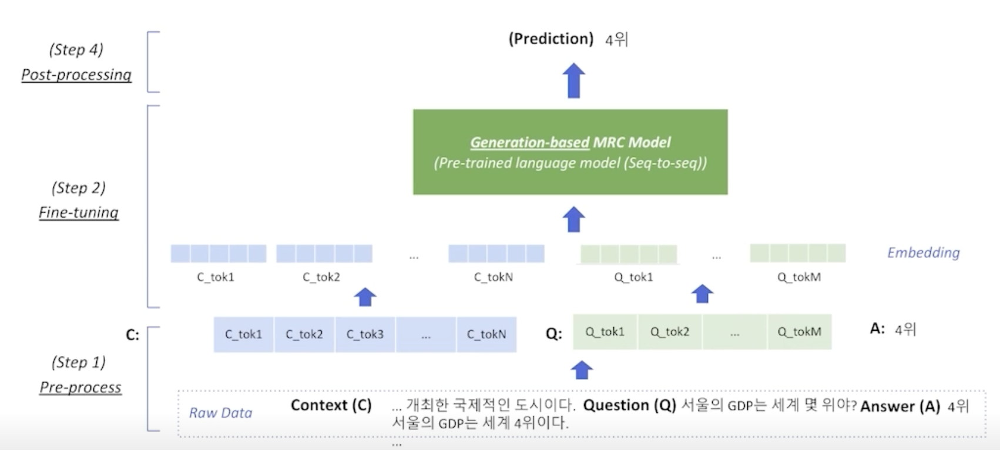
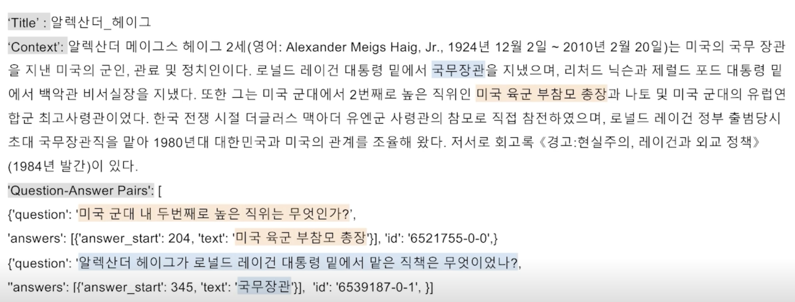
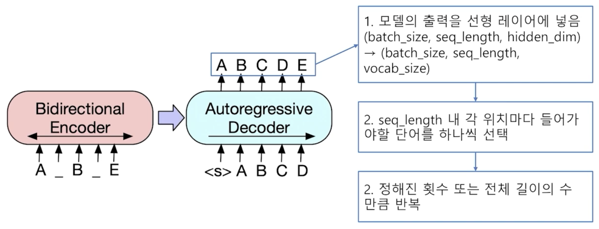
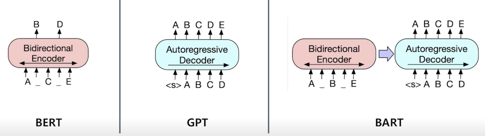
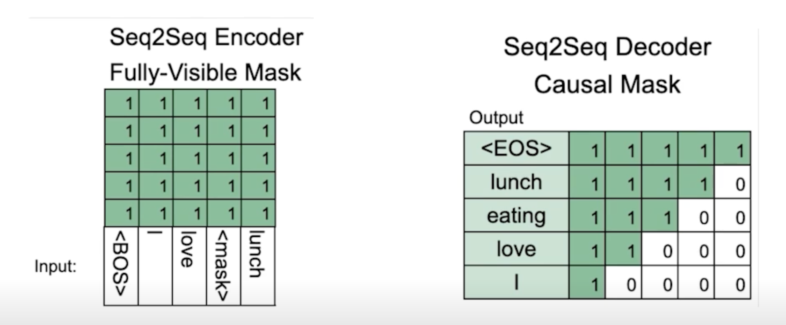
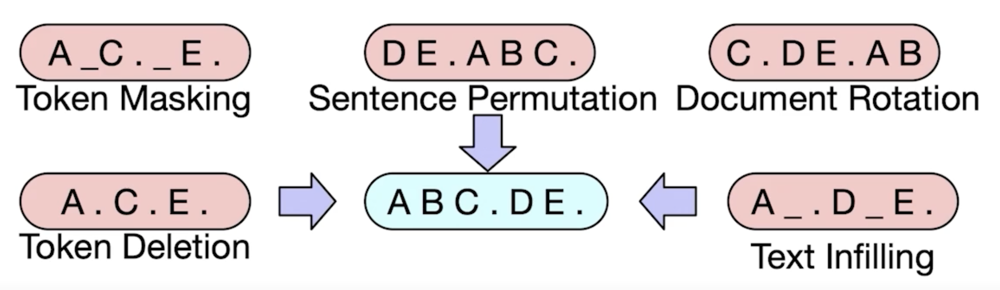
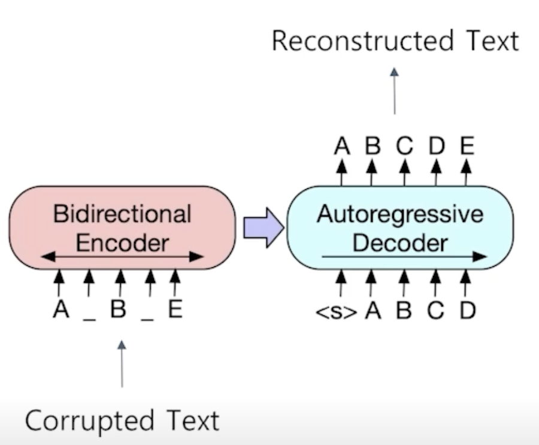
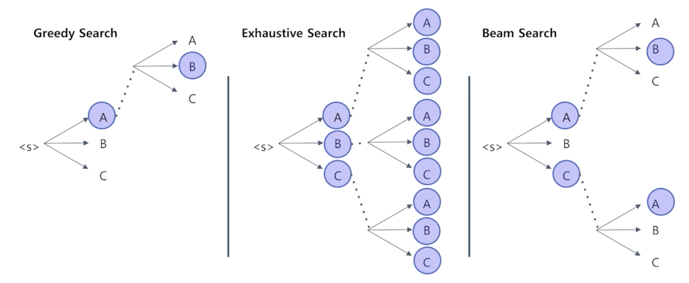

# [NLP/자연어 처리] 생성 기반 기계 독해(Generation-based MRC)

## 생성 기반 기계 독해(Generation-based MRC)

### 문제 정의

- 주어진 지문(context)과 질의(question)을 보고 응답을 생성 → 생성 문제(generation)
- 모든 ‘응답 추출 기계 독해’ 문제는 ‘생성 기반 기계 독해’ 방식으로 대체가 가능하다. 역은 성립하지 않는다. 즉 지문에 직접적으로 정답이 포함되어 있지 않은 경우에는 응답 추출 기반(이하 ‘추출 기반’) 방식의 기계 독해로는 한계가 있다. 이 경우는 생성 기반으로 푸는 것이 이점을 가진다.

### 평가 방법

- 생성 기반의 기계 독해의 경우 추출 방식과 방법면에서 기계독해 문제를 푸는 접근법이 달라 EM, F1과 같은 평가 방법을 적용할 수도 있긴 하나, ROUGE-L나 BLEU 점수와 같은 평가 방식을 채택하기도 한다.

### 특징

- 지문 내에서 토큰의 시작 위치와 끝 위치의 계산이 불필요한 일종의 seq2seq 모델

### 비교: 추출 기반 방식 vs. 생성 기반 방식

1. MRC 모델 구조
    - 생성 기반: Seq2seq 사전 학습 언어 모델 구조
    - 추출 기반: 사전 학습 언어 모델 + 분류기
2. 손실 함수(loss) 계산을 위한 응답의 형태 및 예측의 형태
    - 생성 기반: 자유 형식의 텍스트
    - 추출 기반: 지문 내 연속한 토큰(span)
        
        → 추출 기반 방식의 경우, F1 계산을 위해 텍스트로의 별도 변환 과정이 필요하다.
        

## 전처리(Pre-processing)

### 입력 표현 데이터 예시

### 토큰화

- 토큰화: 텍스트 의미를 가진 작은 단위로 나눈 것(형태소)
- 추출 기반 기계 독해(Extraction-based MRC)와 같이 워드피스(WordPiece) 토큰화 방식을 사용한다.
    - 워드피스 토큰화 사전 학습 단계에서 먼저 학습에 사용한 전체 데이터 말뭉치(corpus)에 대해서 구촉되어 있어야 한다.
    - 구축 과정에서 미리 각 단어 토큰들에 대해 순서를 부여(인덱싱, indexing)해둔다.
- 토크나이저(Tokenizer)는 입력 텍스트를 토큰화한 뒤, 각 토큰을 미리 만들어 둔 단어 사전에 따라 인덱스로 변환한다.

#### 워드피스 토크나이저(WordPiece Tokenizer) 사용 예시

- 질의: “미국 군대 내 두 번째로 높은 직위는 무엇인가?”
- 토큰화된 질문: [’미국’, ‘군대’, ‘내’, ‘두’, ‘번째’, ‘##로’, ‘높’, ‘##은’, ‘직위’, ‘##는’, ‘무엇’, ‘##인’, ‘##가’, ‘?’]
- 인덱스로 바뀐 질문: [101, 23545, 8910, …]
- 인덱스로 바뀐 질문은 보통 input_ids(또는 input_token_ids)로 부른다.
- 모델의 기본 입력은 input_id만 필요하나, 그 외에도 추가적인 정보가 필요하다.

### 특수 토큰(Special Tokens)

- 학습 시에만 사용되며 단어 자체의 의미를 가지지 않는 특수한 토큰
- 예시: SOS(Start of Sentence), EOS(End of Sentence), CLS, SEP, PAD, UNK 등
- 추출 기반 기계 독해에서는 CLS, SEP, PAD 토큰을 사용한다.
- 생성 기반 기계 독해에서도 PAD 토큰은 사용된다. CLS, SEP 토큰은 사용 가능하나, 자연어를 이용하여 정해진 텍스트 형식으로 데이터를 생성한다.

### 부가 정보(Additional Information)

#### 어텐션 마스크(Attention Mask)

- 추출 기반 기계 독해에서와 같이 어텐션 연산을 수행할지 결정하는 어텐션 마스크가 존재한다.

#### 토큰 타입 인덱스(Token Type IDs)

- BERT와 달리 BART에서는 입력 시퀀스에 대한 구분이 없어 토큰 타입 인덱스가 존재하지 않는다.
- 따라서 추출 기반 기계 독해와 달리 입력에 토큰 타입 인덱스가 들어가지 않는다.

### 응답 출력

- 토큰 인덱스 시퀀스
    - 추출 기반 기계 독해에서는 텍스트를 생성해내는 대신 시작 및 끝 토큰의 위치를 출력하는 것이 모델의 최종 목표였다.
    - 생성 기반 기계 독해는 그보다 조금 더 어려운 실제 텍스트를 생성하는 과제를 수행한다.
    - 전체 시퀀스의 각 위치마다 모델이 아는 모든 단어들 중 하나의 단어를 맞히는 분류 문제를 푼다.

## 모델(Model)

### BART

- 기계 독해, 기계 번역, 요약, 대화 등 시퀀스-시퀀스 문제의 사전 학습을 위한 노이즈 제거 오토인코더(denoising autoencoder).
- 노이즈 제거 오토인코더: 없던 노이즈를 주입(injection)하는 과정이 있고, 노이즈가 없던 원 텍스트를 복원하는 문제를 풀기 때문에 해당 표현도 사용한다.

### BART 인코더 & 디코더

- 인코더의 경우 BERT와 같이 양방향(bi-directional)
- 디코더의 경우 GPT처럼 단방향(uni-directional, autoregressive)

### BART 사전 학습

- 텍스트에 노이즈를 부가하고 원래 텍스트를 복원하는 문제를 푸는 것으로 사전 학습한다.

## 사후처리(Post-processing)

### 탐색(Searching)

- 탐욕적 탐색(Greedy Search)
    - 장점
        1. 간단하고 직관적인 방법으로, 구현이 비교적 간단하다.
        2. 메모리 사용량이 적으며, 계산 비용이 적다.
    - 단점
        1. 최적해를 보장하지 않고, 지역 최적해(local minima)에 갇힐 수 있으며 최적해와 거리가 먼 선택을 할 가능성이 존재한다.
        2. 이전 결정에 대한 수정이 불가능하며, 한 번 결정된 선택은 수정되지 않는다.
- 완전 탐색(Exhaustive Search)
    - 장점
        1. 모든 가능성을 탐색하므로 최적해를 보장한다.
        2. 작은 문제에 대해서는 효과적이다.
    - 단점
        1. 문제의 규모가 조금만 커져도 계산 비용이 기하급수적으로 증가하여 현실적이지 못 한 방법론이다.
        2. 메모리 사용량이 많아지는 경향이 있다.
- 빔 탐색(Beam Search)
    - 장점
        1. 최적해에 근접한 해를 상대적으로 빠르게 찾을 수 있다.
        2. 메모리 사용량을 제한하면서 탐색할 수 있는 가능성의 수를 조절할 수 있다. 이때 Top-k로 100개, 1000개 등 최적해를 매 타입스텝마다 갱신하여 최적해 구성을 조정한다.
    - 단점
        1. 탐색 범위 내에서의 최적해를 보장하지 않는다.
        2. 빔의 크기에 따라 다양성과 성능 사이의 트레이드오프가 발생할 수 있다.
        3. 최적해보다 낮은 품질의 해에 수렴할 가능성이 있다.

## 참고

- 부스트캠프 AI Tech 기계 독해 강의 by 서민준 교수(KAIST)
