# [NLP/자연어 처리] 단락(段落) 검색 — 희소(稀少) 임베딩 & 조밀(稠密) 임베딩(Passage Retrieval — Sparse Embedding & Dense Embedding)

## 단락段落 검색 개요(Introduction to Passage Retrieval)

### 단락 검색(Passage Retrieval)

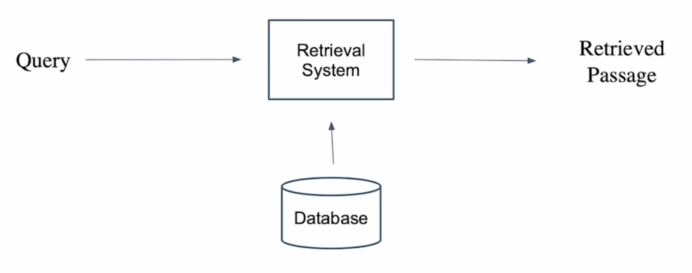

질문(query)에 맞는 문서(passage)를 찾는 것

### 기계 독해로 단락 검색하기(Passage Retrieval with MRC)

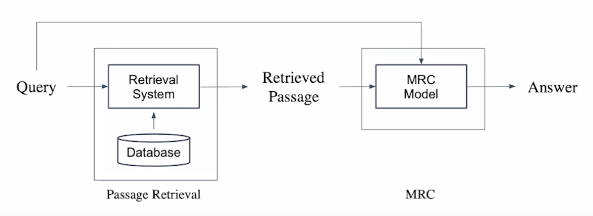

- 범주제 분야(Open-domain) 질의응답: 대규모 문서에서 질의에 대한 응답 찾기
    - 단락 검색 $$\rightarrow$$ 기계 독해의 두 단계(2-stage)로 만들 수 있다.

### 단락 검색 개관(Overview of Passage Retrieval)

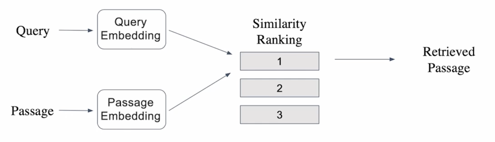

질문(Query)의 임베딩 벡터와 각 단락(passage)의 임베딩 벡터 간의 내적을 계산하여 질문과 각 단락과의 유사도를 계산하며, 유사도 순위의 오름차순(유사도의 내림차순)으로 단락을 선별한다.

## 단락 임베딩(Passage Embedding)

### 단락 임베딩 공간(Passage Embedding Space)

- 단락 임베딩 벡터 공간
- 단락의 벡터 변환을 사용하여 단락 간 유사도 등을 일정 알고리즘을 통해 계산할 수 있다.

## 희소稀少 임베딩(Sparse Embedding)

## 희소 임베딩 아이디어

- 모든 문서로부터 단어 말뭉치 $$V$$를 구성하고, 문서마다 개별 단어의 존재 유무를 체크한다.
    
    → 모든 문서가 단어 말뭉치의 크기 $$\vert V\vert$$ 차원의 벡터에 대응된다.
    
- 희소 임베딩 소개
    1. BoW(Bag-of-Words) 구성 방법 → n-gram
        - 유니그램(Uni-gram, 1-gram)
            
            (예) It was the best of times → It, was, the, best, of, times
            
        - 바이그램(Bi-gram, 2-gram)
            
            (예) It was the best of times → It was, was the, the best, best of, of times
            
    2. 단어 가중치(Term value) 결정 방법
        - 단어의 문서 내 등장 여부(binary)
        - 단어의 문서 내 등장 빈도(term frequency) 등
            
            → (예) TF-IDF
            
- 특징
    1. 임베딩 벡터 차원 수가 term의 개수와 같다.
    2. Term 중복을 정확하게 잡아내야 할 때 유용하다.
    3. 의미가 비슷(semantically similar)하나 다른 단어인 경우 제대로 비교를 할 수 없다.

## TF-IDF

### TF-IDF(Term Frequency - Inverse Document Frequency) 소개

- TF(Term Frequency): 단어 등장 빈도
- Inverse Document Frequency(IDF) 단어가 제공하는 정보의 양

(예) It was the best of times

→ It, was, the, of: 자주 등장하나 제공하는 정보량이 적다.

→ best, times: 상대적으로 많은 정보량을 담고 있다.

### TF(Term Frequency)

해당 문서 내 단어의 등장 빈도

1. 원元/原개수(Raw count)
2. 문서 길이에 따른 조정: 원시 개수 / 단어 수(Adjusted for document length: raw count / number of words, TF)
3. 기타 변형: 이진, 로그 정규화 등(Other variants: binary, log normalization, etc.)

### IDF(Inverse Document Frequency)

단어가 제공하는 정보량

$$
\text{IDF}(t)=\log\frac{N}{\text{DF}(t)}
$$

이때, DF(Document Frequency, 문서 빈도)는 단어(term) $$t$$가 등장한 문서(document)의 개수, $$N$$은 총 문서(document) 개수.

### TF & IDF 조합

문서 $$d$$ 내 각 단어 $$t$$에 대해

$$
\text{TF-IDF}(d,t)=\text{TF}(d,t)\times\text{IDF}(t).
$$

1. 관사 ‘a’, ‘the’ 등의 관사 → 낮은 TF-IDF 값.
    - TF는 높을 수 있으나 IDF가 0에 가까울 것(거의 모든 문서에 등장).
2. 자주 등장하지 않는 고유 명사(예컨대 사람 이름, 지역 이름 등) → 높은 TF-IDF 값.
    - IDF가 커지면서 전체적인 TF-IDF 값 증가.

### BM25

- TF-IDF 개념을 바탕으로 문서 길이까지 고려하여 점수를 매기는 측정 공식
    - TF 값에 한계를 지정해두어 일정한 범위를 유지하도록 한다.
    - 평균적인 문서 길이보다 더 짧은 문서에서 단어가 포함된 경우, 그 문서에 대해 가중치를 부여한다.
    - 실제 검색 엔진, 추천 시스템 등에서 여전히 많이 사용되는 알고리즘

$$
\text{BM25}(D,Q)=\sum_{\text{term}\in Q}\text{IDF}(\text{term})\cdot\frac{\text{TF-IDF}(D,\text{term})\cdot(k_1+1)}{\text{TF-IDF}(D,\text{term})+k_1\cdot\left(1-b+b\cdot\frac{\vert D\vert}{\text{avgdl}}\right)}
$$

이때, $$\text{avgdl}$$은 문서의 평균 길이(average document length).

## 조밀稠密 임베딩 개요(Introduction to Dense Embedding)

### 희소 임베딩 표상의 한계(Limitations of Sparse Embedding Representations)

- TF-IDF 벡터는 희소한(sparse) 특성을 지닌다.
- 벡터 간 유사성을 고려할 수 없다.
- 차원 수가 매우 크다(다만, 압축 형식(compressed format)으로 극복 가능. 예컨대 인접 행렬(adjacency matrix) 형태로 저장하지 않고 간선 리스트(edge list) 형태로, 원소가 0이 아닌 두 정점쌍 (u, v)의 집합을 저장하는 방식).

### 조밀 임베딩(Dense Embedding)

- 희소 임베딩의 한계 보완
    - 더 작은 차원의 고밀도 벡터(차원 수 = 50 ~ 1000)
    - 각 차원이 특정 단어(term)에 대응되지 않는다.
    - 대부분의 요소가 0이 아닌 값.

### 비교: 희소 임베딩 vs. 조밀 임베딩(Embedding Comparison: Sparse vs. Dense)

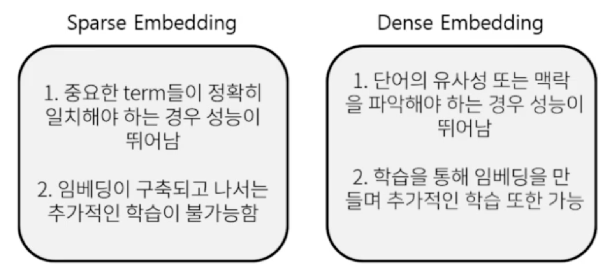

→ 최근 사전 학습 모델의 등장 및 검색 기술 발전에 힘입어 조밀 임베딩을 보다 활발히 사용!

### 조밀 임베딩 기반 단락 검색 개관(Overview of Passage Retrieval with Dense Embedding)

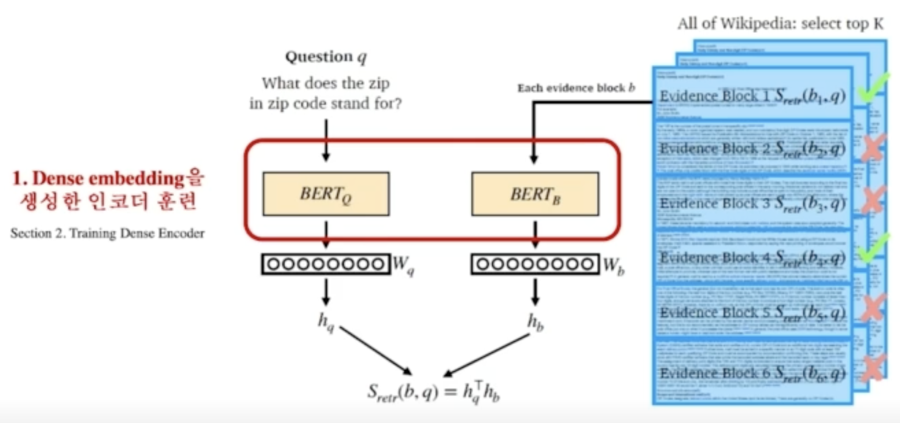

- 보통 질의(question)에서 임베딩 벡터를 추출할 때와 지문(passage)에서 임베딩 벡터를 추출할 때 다른 인코더를 사용하나, 위와 같이 같은 인코더도 사용 가능하다.

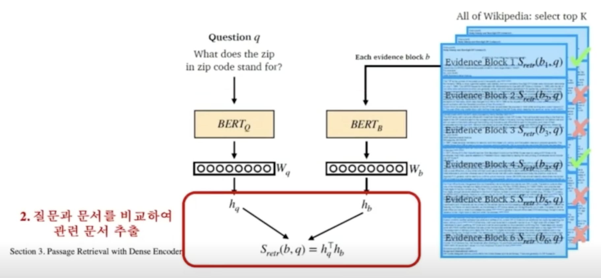

## 조밀 인코더의 학습(Training Dense Encoder)

### 조밀 인코더 후보

- BERT와 같은 사전 학습 언어 모델(PLM, Pre-trained Language Model)이 자주 사용된다. 그밖에도 다양한 신경망 구조 또한 가능하다.

### 조밀 인코더의 학습 목표 & 학습 데이터셋

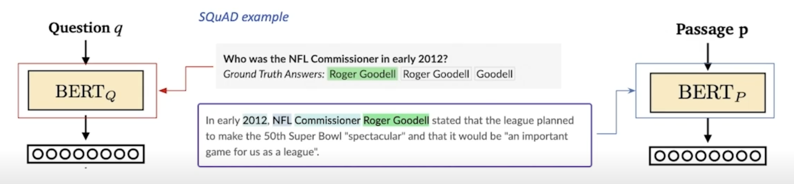

- 학습 목표: 연관된 질의 임베딩 및 지문 임베딩 간의 거리를 좁히는 것(또는 내적(inner product) 값을 크게 하는 것). 즉 높은 유사도를 가지게 하는 것.
- 난제: **연관된 질의(question)와 지문(passage) 쌍을 어떻게 찾을 것인가?**
    
    → 기존 기계 독해 데이터셋 활용!
    

### 음성 샘플링(네거티브 샘플링, Negative Sampling)

#### 방향성

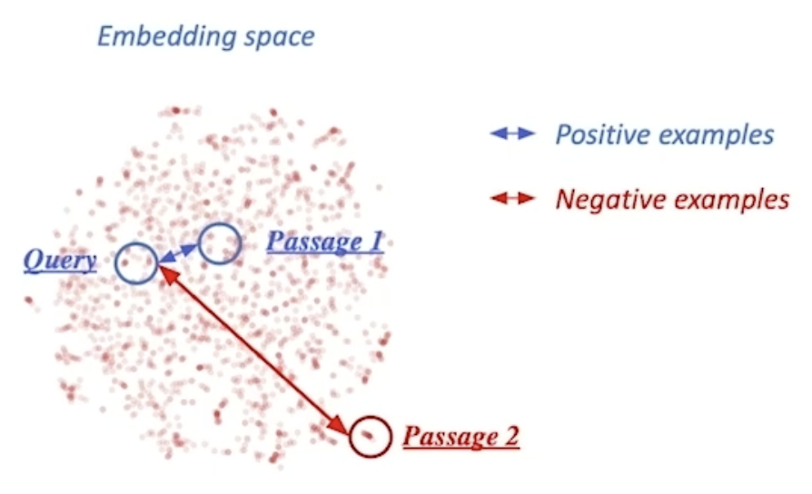

1. 연관된 질의와 지문 간의 조밀 임베딩 거리를 좁히는 것(높은 유사도) → 양성(positive)
2. 연관되지 않은 질의와 질문 간의 조밀 임베딩 거리는 멀어지게 함 → 음성(negative)

#### 음성 샘플 선별 예시

1. 말뭉치(corpus) 내에서 임의로 선별하기
2. 상대적으로 더 헷갈리는 음성 샘플 선별하기(예: 높은 TF-IDF 점수를 가지지만 답을 포함하지 않는 샘플)

### 목적 함수

- 연관된 지문(Positive passage)에 대한 음의 로그 가능도 손실 함수(negative log likelihood loss)를 사용한다.
- 주어진 $$i$$번째 질의 $$q_i$$, 해당 질의와 연관된 지문 $$p_i^+$$ 및 비연관 복수의 지문 $$p_{i,j}^-(j=1,\cdots,n)$$에 대해 다음과 같이 데이터셋을 구성한다:
    
    $$
    \mathcal D=\{\langle q_i,p_i^+,p_{i,1}^-,\cdots,p_{i,n}^-\rangle\}_{i=1}^m.
    $$
    
    이때 음의 로그 가능도 손실 함수는 다음과 같이 계산한다:
    
    $$
    L(q_i,p_i^+,p_{i,1}^-,\cdots,p_{i,n}^-)=-\log\frac{e^{\text{sim}(q_i,p_i^+)}}{\text{sim}(q_i,p_i^+)+\sum\limits_{j=1}^ne^{\text{sim}(q_i,p_{i,j}^-)}}.
    $$
    

### 평가 지표

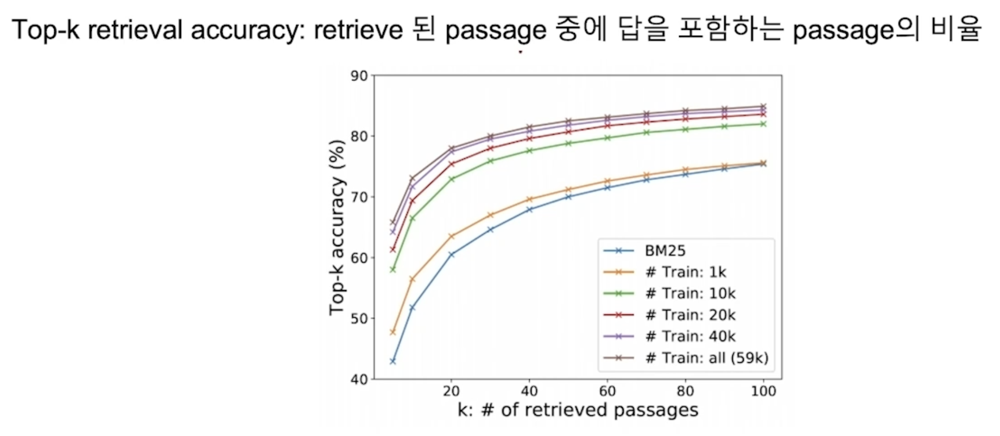

- Top-k 복원 정확도
    
    복원된 지문 중 정답을 포함하는 지문의 비율
    

## 조밀 인코더로 단락 검색하기(Passage Retrieval with Dense Encoder)

### 조밀 인코더 → 복원

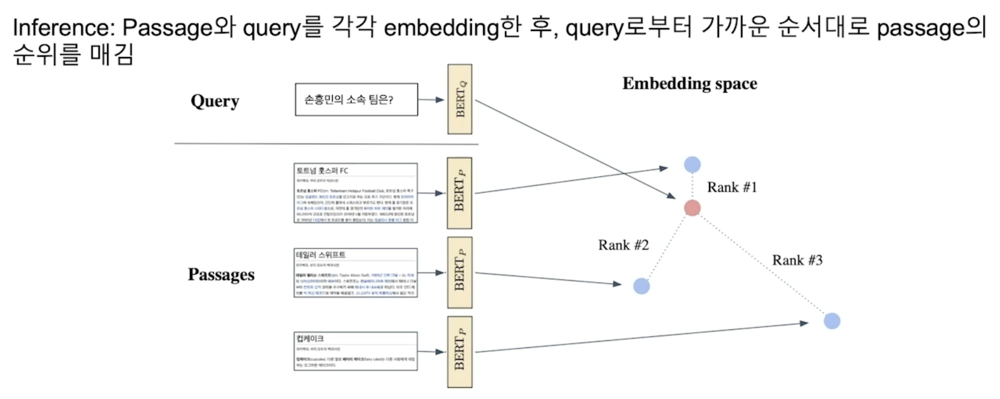

- 질의와 지문의 각 임베딩 간의 유사도의 내림차순으로 정렬한다.

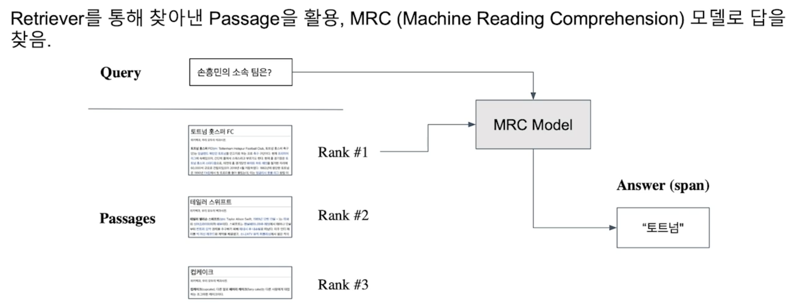

- 복원기로 찾아낸 지문을 활용하며, 기계 독해 모델로 정답을 찾는 방식이다.

### 더 나은 조밀 인코딩 방법?

- 학습 방법 개선(예: DPR)
- 인코더 모델 개선 — BERT보다 더 크고 정확한 사전 학습 모델
- 데이터 개선 — 더 많은 데이터와 전처리 등

## 참고

부스트캠프 AI Tech 기계 독해 강의 by 서민준 교수(KAIST)
