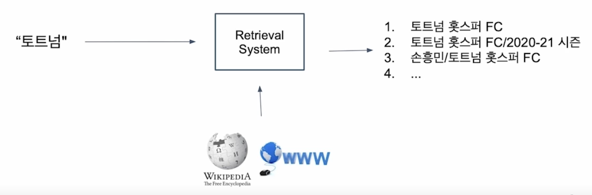

# [NLP/자연어 처리] 지문 복원(Passage Retrieval) — 희소稀少 임베딩(Sparse Embedding)

## 지문 복원 개요(Introduction to Passage Retrieval)

### 지문 복원(Passage Retrieval)

질문(query)에 맞는 문서(passage)를 찾는 것

### 기계 독해로 지문 복원하기(Passage Retrieval with MRC)

- 범주제 분야(Open-domain) 질의응답: 대규모 문서에서 질의에 대한 응답 찾기
    - 지문 복원과 기계 독해를 두 단계(2-stage)로 이어서 만들 수 있다.

### 지문 복원 개관(Overview of Passage Retrieval)

질문(Query)과 지문(passage)을 임베딩한 뒤 유사도로 순위를 매키고, 유사도 순위의 오름차순으로 지문을 선별한다.

## 지문 임베딩 및 희소 임베딩(Passage Embedding and Sparse Embedding)

### 지문 임베딩 공간(Passage Embedding Space)

- 지문 임베딩 벡터 공간
- 지문의 벡터 변환을 사용하여 지문 간 유사도 등을 일정 알고리즘을 통해 계산할 수 있다.

### 희소 임베딩(Sparse Embedding)

- 모든 문서로부터 단어 말뭉치 $$V$$를 구성하고, 문서마다 개별 단어의 존재 유무를 체크
    
    → 모든 문서가 단어 말뭉치의 크기 $$\vert V\vert$$ 차원의 벡터에 대응된다.
    
- 희소 임베딩 소개
    1. BoW(Bag-of-Words) 구성 방법 → n-gram
        - 유니그램(Uni-gram, 1-gram)
            
            (예) It was the best of times → It, was, the, best, of, times
            
        - 바이그램(Bi-gram, 2-gram)
            
            (예) It was the best of times → It was, was the, the best, best of, of times
            
    2. 단어 가중치(Term value) 결정 방법
        - 단어의 문서 내 등장 여부(binary)
        - 단어의 문서 내 등장 빈도(term frequency) 등
            
            → (예) TF-IDF
            
- 특징
    1. 임베딩 벡터 차원 수가 term의 개수와 같다.
    2. Term 중복을 정확하게 잡아내야 할 때 유용하다.
    3. 의미가 비슷(semantically similar)하나 다른 단어인 경우 제대로 비교를 할 수 없다.

## TF-IDF

### TF-IDF(Term Frequency - Inverse Document Frequency) 소개

- TF(Term Frequency): 단어 등장 빈도
- Inverse Document Frequency(IDF) 단어가 제공하는 정보의 양

(예) It was the best of times

→ It, was, the, of: 자주 등장하나 제공하는 정보량이 적다.

→ best, times: 상대적으로 많은 정보량을 담고 있다.

### TF(Term Frequency)

해당 문서 내 단어의 등장 빈도

1. 원元/原개수(Raw count)
2. 문서 길이에 따른 조정: 원시 개수 / 단어 수(Adjusted for document length: raw count / number of words, TF)
3. 기타 변형: 이진, 로그 정규화 등(Other variants: binary, log normalization, etc.)

### IDF(Inverse Document Frequency)

단어가 제공하는 정보량

$$
\text{IDF}(t)=\log\frac{N}{\text{DF}(t)}
$$

이때, DF(Document Frequency, 문서 빈도)는 단어(term) $$t$$가 등장한 문서(document)의 개수, $$N$$은 총 문서(document) 개수.

### TF & IDF 조합

문서 $$d$$ 내 각 단어 $$d$$에 대해

$$
\text{TF-IDF}(t,d)=\text{TF}(t,d)\times\text{IDF}(t).
$$

1. 관사 ‘a’, ‘the’ 등의 관사 → 낮은 TF-IDF 값.
    - TF는 높을 수 있으나 IDF가 0에 가까울 것(거의 모든 문서에 등장).
2. 자주 등장하지 않는 고유 명사(예컨대 사람 이름, 지역 이름 등) → 높은 TF-IDF 값.
    - IDF가 커지면서 전체적인 TF-IDF 값 증가.

### BM25

- TF-IDF 개념을 바탕으로 문서 길이까지 고려하여 점수를 매기는 측정 공식
    - TF 값에 한계를 지정해두어 일정한 범위를 유지하도록 한다.
    - 평균적인 문서 길이보다 더 짧은 문서에서 단어가 포함된 경우, 그 문서에 대해 가중치를 부여한다.
    - 실제 검색엔진, 추천 시스템 등에서 여전히 많이 사용되는 알고리즘

$$
\text{BM25}(D,Q)=\sum_{\text{term}\in Q}\text{IDF}(\text{term})\cdot\frac{\text{TFIDF}(\text{term},D)\cdot(k_1+1)}{\text{TFIDF}(\text{term},D)+k_1\cdot\left(1-b+b\cdot\frac{\vert D\vert}{\text{avgdl}}\right)}
$$

이때, $$\text{avgdl}$$은 문서의 평균 길이(average document length).

## 참고

부스트캠프 AI Tech 기계 독해 강의 by 서민준 교수(KAIST)