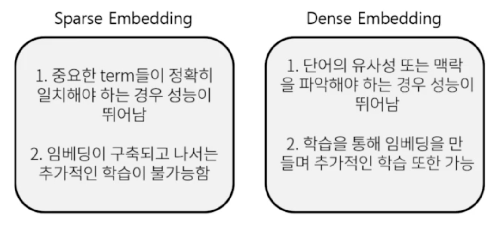
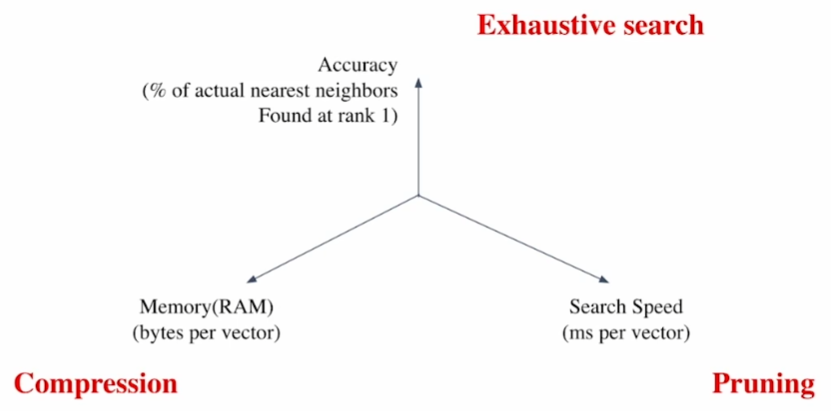
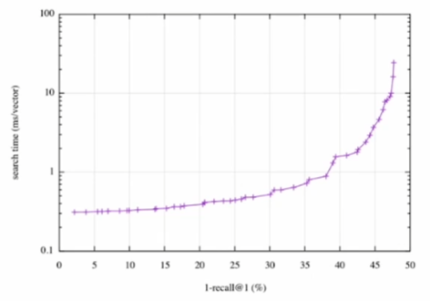
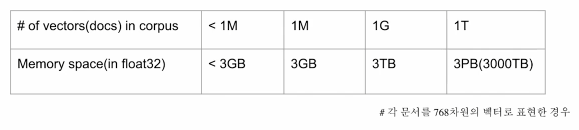
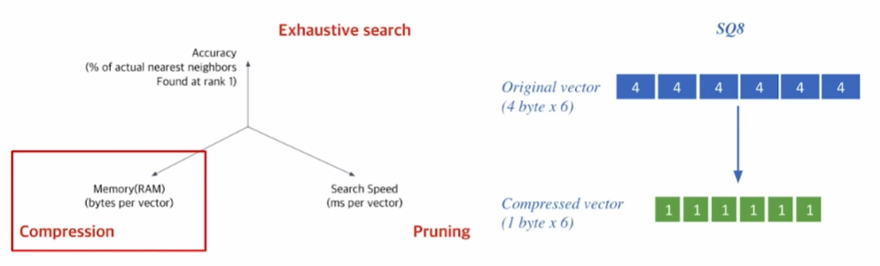
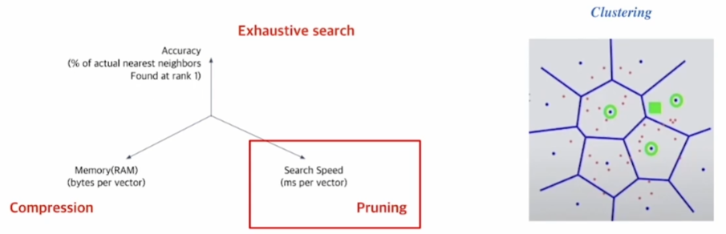
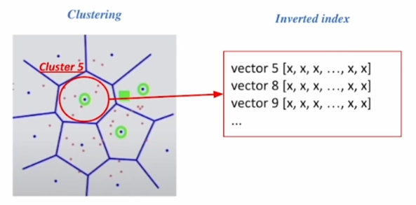
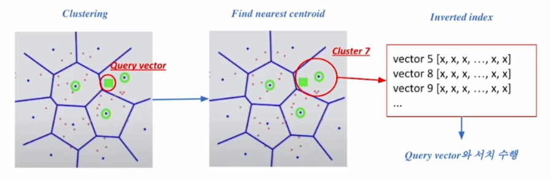
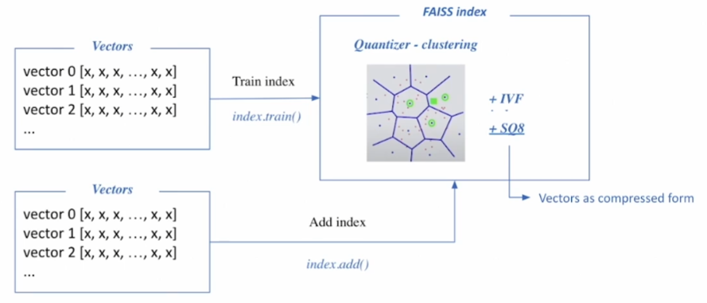
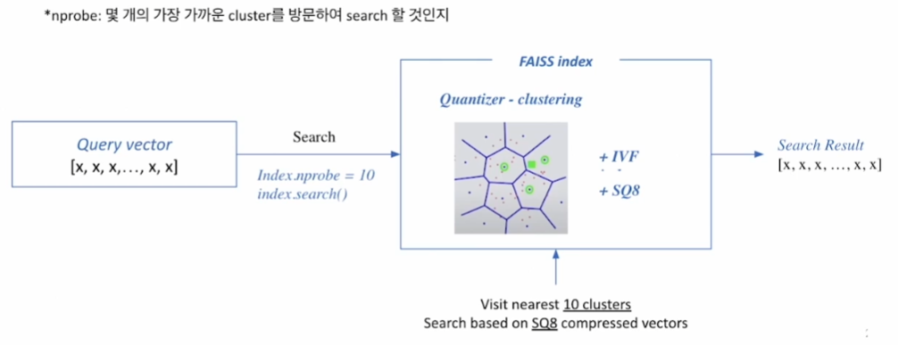

# [NLP/자연어 처리] Faiss로 확장하기(Scaling up with Faiss)

## 단락 검색 및 유사도 검색(Passage Retrieval and Similarity Search)

### MIPS(Maximum Inner Product Search, 최대 내적 검색)

- 목적
    - 주어진 질문(query) 벡터 $$q$$에 대해 복수의 단락(passage) 벡터 $$v$$’s 중 질문과 가장 관련 있는 벡터를 찾는 것. 이 문제는 내적(inner product)이 최대가 되는 단락 벡터를 찾는 문제로 귀결된다. 즉 다음을 만족하는 단락 벡터 인덱스를 찾는 것:
    
    $$
    \arg\max_{v_i\in V}q^Tv_i.
    $$
    

### 단락 검색에서의 MIPS



### MIPS의 난제

- 실제로 검색해야 하는 데이터는 훨씬 방대!
    - 위키피디아의 경우 5,000,000 여 문서 존재
    - 조 단위까지 커질 수 있다는 문제!
    
    → 즉 모든 문서 임베딩(document embeddings), 단락 임베딩(passage embeddings)을 일일이 확인하며 검색하는 것은 불가능하다.
    

### 유사도 검색에서의 상충 관계(Trade-offs in similarity search)



1. 검색 빠르기(Search Speed)
    - 질문 당 유사한 벡터 $$k$$개를 찾는 데 얼마나 걸리는지?
        
        → 가지고 있는 벡터량이 클수록 더 오래 걸린다.
        
2. 메모리 사용량(Memory(RAM) Usage)
    - 벡터 사용 시 어디에서 가져올 것인가?
        
        → RAM에 모두 올려둘 수 있으면 빠르나 큰 RAM 용량을 요구한다.
        
        → 디스크에서 계속 불러와야 한다면 속도가 느려진다는 한계점이 존재한다.
        
3. 정확도(Accuracy)
    - 브루트 포스(Brute-force, ‘대입 노가다(노동) 식’) 검색 결과와 얼마나 비슷한가?
        
        → 속도와 정확도는 일반적으로 상충(트레이드 오프, trade-off) 관계에 있다.
        

### 검색 빠르기 vs. 정확도



- 검색 시간(search time, $$y$$축) vs. 재현율(recall, $$x$$축) 그래프.
- 더 정확한 검색을 위해서는 더 오랜 시간을 소모하여야 한다.

### 말뭉치 규모 확대에 따른 검색 공간 확장(Increasing search space by bigger corpus)

- 말뭉치(corpus) 규모가 커질수록
    - 검색 공간이 커짐에 따라 검색이 어려워진다.
    - 저장해 둘 메모리 공간 요구 또한 증가한다.
    - 희소 임베딩(Sparse embedding)의 경우 이 문제가 훨씬 심하다.
- 예시
    
    
    
    - 각 문서를 768차원의 벡터로 표현하는 경우, 10억 건의 문서는 3TB의 메모리 공간을 요구한다.

## 유사도 검색에서 근사치 내기(Approximating Similarity Serach)

### 압축 — 스칼라 양자화(Compression — Scalar Quantization(SQ))



- 압축(Compression)
    - 벡터 압축으로 하나의 벡터가 적은 용량을 차지
        
        → 압축량 ↑
        
        → 메모리 요구 ↓, 정보 손실 ↑
        
- 예시: 스칼라 양자화(Scalar Quantization, SQ)
    
    4 바이트 부동(浮動) 소수점(floating point)
    
    → 1 바이트(8 비트) 무부호 정수(無符號整數, unsigned integer)
    

### 프루닝(Pruning — Inverted File(IVF))

#### 프루닝(Pruning, 가지치기)

- 검색 공간을 줄여 검색 속도 개선(데이터셋의 부분집합만 방문)
    
    → 군집화(클러스터링, clustering) & IVF(Inverted File, 역전 기록철(逆轉記錄綴))를 활용한 검색
    

#### 단계

1. 군집화: 전체 벡터 공간을 $$k$$개의 군집으로 나눈다. 예컨대, K—평균 군집화.
    
    
    
2. IVF: 벡터의 인덱스 = 역逆 리스트 구조
    
    
    
    → 각 군집의 센트로이드(centroid, 기하학적 중심) 인덱스와 해당 군집의 벡터들이 연결되어 있는 형태
    

#### 정리



1. 주어진 질의 벡터에 근접한 센트로이드 벡터를 찾는다.
2. 찾은 군집의 inverted list 내 벡터들에 대해 검색을 수행한다.

## Faiss 개요(Introduction to Faiss)

[Faiss GitHub](https://github.com/facebookresearch/faiss)

- Faiss(Facebook AI Similarity Search)
    
    
    
    - 메타(舊 페이스북)에서 만들고 모니터링 중인 고속 근사(fast approximation)를 위한 라이브러리.
    - 효율적인 유사도 검색 및 조밀 벡터(dense vectors)의 군집화를 목적으로 한다.
    - 오픈 소스이고, 사용도 편리하며, 대규모(large-scale) 처리에 특화되어 있어 규모 확장(scaling up) 시 용이하게 활용 가능하다.
    - 백본(Backbone, 뼈대가 되는 구현 코드)은 C++로 되어 있으나, 래퍼(wrapper)는 Python으로 되어 있어 쉽게 활용할 수 있다.

### Faiss로 단락 검색하기

1. 인덱스와 맵 벡터들을 학습한다.
    
    
    
    - Faiss를 사용하려면 군집을 확보해야 한다. 즉 데이터의 분포를 살펴보고 센트로이드를 지정하기 위해 학습 데이터가 필요하다.
2. Faiss 인덱스를 기반으로 검색한다.
    
    
    
    - 예컨대, 가장 가까운 10개의 군집을 방문한 뒤 SQ8 기반으로 검색을 하고 상위 k개를 검색 결과로 내보내준다.

## Faiss 확장하기(Scaling up with Faiss)

### Faiss 기초

- 브루트 포스로 모든 벡터와 질문을 비교하는 가장 단순한 인덱스 만들기

#### 준비하기

```python
d = 64  # 벡터 차원
nb = 100_000  # 데이터베이스 크기
nq = 10_000  # 질문 개수
xb = np.random.random((nb, d)).astype('float32')  # 데이터베이스 예시
xq = np.random.random((nq, d)).astype('float32')  # 질문 예시
```

#### 인덱스 만들기

```python
index = faiss.IndexFlatL2(d)  # 인덱스 빌드하기
index.add(xb)  # 인덱스에 벡터 추가하기
```

- 유의: 학습이 필요하지 않은 이유?
    
    → 프루닝과 SQ를 활용하지 않기 때문. 그래서 `index.train()`이 없고 `index.add()`만 존재.
    

#### 검색하기

```python
k = 4  # 가장 가까운 벡터 4개를 찾고자 할 때
dist, idx = index.search(xq, k) # 검색하기
# dist: 질문과의 거리
# idx: 검색된 벡터의 인덱스
```

### Faiss로 IVF

- IVF 인덱스 만들기
- 군집화를 통해 가까운 군집 내 벡터들만 비교 수행
- 빠른 검색 가능
- 군집 내에서는 여전히 전체 벡터와 거리를 비교(Flat)

#### IVF 인덱스

```python
nlist = 100  # 군집 개수
quantizer = faiss.IndexFlatL2(d)

index = faiss.IndexIVFFlat(quantizer, d, nlist)  # IVF 만들기
index.train(xb)  # 군집 학습하기
index.add(xb)  # 군집에 벡터 추가하기

dist, idx = index.search(xq, k)  # 검색하기
```

### Faiss로 IVF-PQ

- 벡터 압축 기법 PQ 활용하기
- 전체 벡터를 저장하지 않고 압축된 벡터만을 저장한다.
- 메모리 사용량을 줄일 수 있다.

#### IVF-PQ 인덱스

```python
nlist = 100  # 군집 개수
m = 8  #Subquantizer 개수
quantizer = faiss.IndexFlatL2(d)

index = faiss.IndexIVFPQ(quantizer, d, nlist, m, 8)
index.train(xb)  # 군집 학습하기
index.add(xb)  # 군집에 벡터 추가하기

dist, idx = index.search(xq, k)  # 검색하기
```

- 챌린지에 필요하다면, SQ를 먼저 시도한 뒤 PQ로 넘어가는 것을 추천!

### GPU로 Faiss 빠르게 하기

- GPU의 빠른 연산 속도를 활용할 수 있다.
    - 거리 계산을 위한 행렬곱 등에서 유리하다.
- GPU 메모리 제한이나 메모리 랜덤 액세스(random access) 시간이 늦은 것 등이 단점이다.
- 여러 GPU를 활용하면 연산 속도를 한층 더 높일 수 있다.

#### 단일 GPU 인덱스

```python
res = faiss.StandardGpuResources()  # 단일 GPU 사용하기

index_flat = faiss.IndexFlatL2(d)  # 인덱스(CPU) 빌드하기

# GPU 인덱스로 옮기기
gpu_index_flat = faiss.index_cpu_to_gpu(res, 0, index_flat)
gpu_index_flat.add(xb)
dist, idx = gpu_index_flat.search(xq, k)  # 검색하기
```

#### 다중 GPU 인덱스

```python
cpu_index = faiss.IndexFlatL2(d)

# GPU 인덱스로 옮기기
gpu_index_flat = faiss.index_cpu_to_all_gpus(cpu_index)
gpu_index_flat.add(xb)
dist, idx = gpu_index_flat.search(xq, k)  # 검색하기
```

## 참고

- 부스트캠프 AI Tech 기계 독해 강의 by 서민준 교수(KAIST)