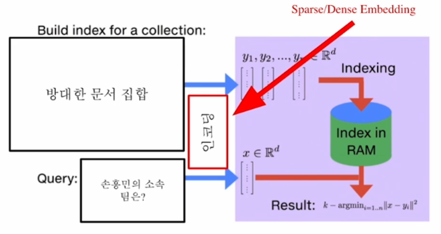

# [NLP/자연어 처리] 지문 복원(Passage Retrieval) — 조밀稠密 임베딩(Dense Embedding)

## 조밀 임베딩 개요(Introduction to Dense Embedding)

### 희소 임베딩 표상의 한계(Limitations of Sparse Embedding Representations)

- TF-IDF 벡터는 희소한(sparse) 특성을 지닌다.
- 벡터 간 유사성을 고려할 수 없다.
- 차원 수가 매우 크다(다만, 압축 형식(compressed format)으로 극복 가능. 예컨대 인접 행렬(adjacency matrix) 형태로 저장하지 않고 간선 리스트(edge list) 형태로, 원소가 0이 아닌 두 정점쌍 (u, v)의 집합을 저장하는 방식).

### 조밀 임베딩(Dense Embedding)

- 희소 임베딩의 한계 보완
    - 더 작은 차원의 고밀도 벡터(차원 수 = 50 ~ 1000)
    - 각 차원이 특정 단어(term)에 대응되지 않는다.
    - 대부분의 요소가 0이 아닌 값.

### 비교: 희소 임베딩 vs. 조밀 임베딩(Embedding Comparison: Sparse vs. Dense)

→ 최근 사전 학습 모델의 등장 및 검색 기술 발전에 힘입어 조밀 임베딩을 보다 활발히 사용!

### 조밀 임베딩 기반 지문 복원 개관(Overview of Passage Retrieval with Dense Embedding)

- 보통 질의(question)에서 임베딩 벡터를 추출할 때와 지문(passage)에서 임베딩 벡터를 추출할 때 다른 인코더를 사용하나, 위와 같이 같은 인코더도 사용 가능하다.

## 조밀 인코더의 학습(Training Dense Encoder)

### 조밀 인코더 후보

- BERT와 같은 사전 학습 언어 모델(PLM, Pre-trained Language Model)이 자주 사용된다. 그밖에도 다양한 신경망 구조 또한 가능하다.

### 조밀 인코더의 학습 목표 & 학습 데이터셋

- 학습 목표: 연관된 질의 임베딩 및 지문 임베딩 간의 거리를 좁히는 것(또는 내적(inner product) 값을 크게 하는 것). 즉 높은 유사도를 가지게 하는 것.
- 난제: **연관된 질의(question)와 지문(passage) 쌍을 어떻게 찾을 것인가?**
    
    → 기존 기계 독해 데이터셋 활용!
    

### 음성 샘플링(네거티브 샘플링, Negative Sampling)

#### 방향성

1. 연관된 질의와 지문 간의 조밀 임베딩 거리를 좁히는 것(높은 유사도) → 양성(positive)
2. 연관되지 않은 질의와 질문 간의 조밀 임베딩 거리는 멀어지게 함 → 음성(negative)

#### 음성 샘플 선별 예시

1. 말뭉치(corpus) 내에서 임의로 선별하기
2. 상대적으로 더 헷갈리는 음성 샘플 선별하기(예: 높은 TF-IDF 점수를 가지지만 답을 포함하지 않는 샘플)

### 목적 함수

- 연관된 지문(Positive passage)에 대한 음의 로그 가능도 손실 함수(negative log likelihood loss)를 사용한다.
- 주어진 $$i$$번째 질의 $$q_i$$, 해당 질의와 연관된 지문 $$p_i^+$$ 및 비연관 복수의 지문 $$p_{i,j}^-(j=1,\cdots,n)$$에 대해 다음과 같이 데이터셋을 구성한다:
    
    $$
    \mathcal D=\{\langle q_i,p_i^+,p_{i,1}^-,\cdots,p_{i,n}^-\rangle\}_{i=1}^m.
    $$
    
    이때 음의 로그 가능도 손실 함수는 다음과 같이 계산한다:
    
    $$
    L(q_i,p_i^+,p_{i,1}^-,\cdots,p_{i,n}^-)=-\log\frac{e^{\text{sim}(q_i,p_i^+)}}{\text{sim}(q_i,p_i^+)+\sum\limits_{j=1}^ne^{\text{sim}(q_i,p_{i,j}^-)}}.
    $$
    

### 평가 지표

- Top-k 복원 정확도
    
    복원된 지문 중 정답을 포함하는 지문의 비율
    

## 조밀 인코더로 지문 복원하기(Passage Retrieval with Dense Encoder)

### 조밀 인코더 → 복원

- 질의와 지문의 각 임베딩 간의 유사도의 내림차순으로 정렬한다.

- 복원기로 찾아낸 지문을 활용하며, 기계 독해 모델로 정답을 찾는 방식이다.

### 더 나은 조밀 인코딩 방법?

- 학습 방법 개선(예: DPR)
- 인코더 모델 개선 — BERT보다 더 크고 정확한 사전 학습 모델
- 데이터 개선 — 더 많은 데이터와 전처리 등

## 참고

부스트캠프 AI Tech 기계 독해 강의 by 서민준 교수(KAIST)
