# [NLP/자연어 처리] 단락 검색과 기계 독해 연결하기(Linking Retrieval and MRC)

## 오픈 도메인 질의응답 개요(Introduction to Open-domain Question Answering(ODQA))

- 기계 독해(MRC): **지문이 주어진 상황**에서의 질의응답
    
    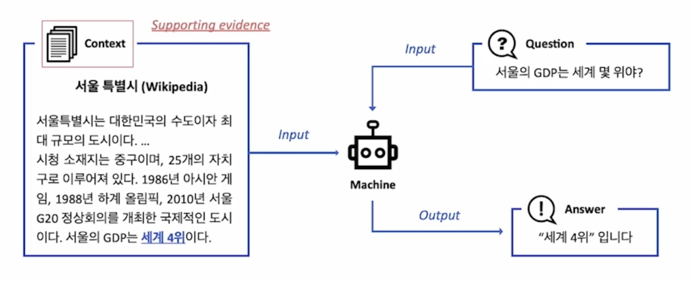
    
- 오픈 도메인 질의응답(ODQA): **지문이 따로 주어지지 않은 상황**에서의 질의응답
    
    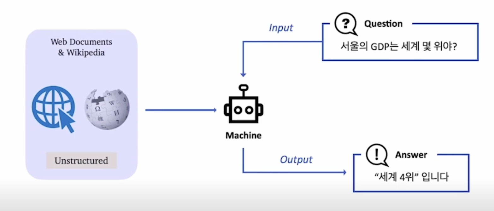
    
    - 예시: 현대의 검색 엔진(구글 등) - 연관 문서뿐만 아니라 질의에 대한 응답을 함께 제공한다.

### ODQA의 역사

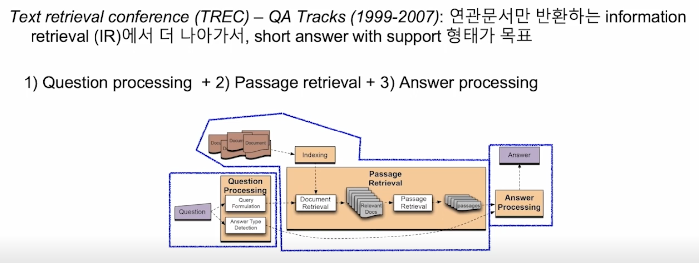

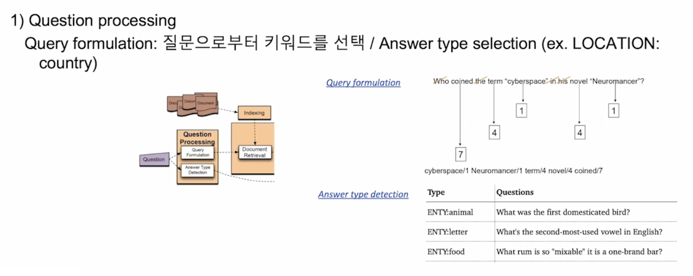

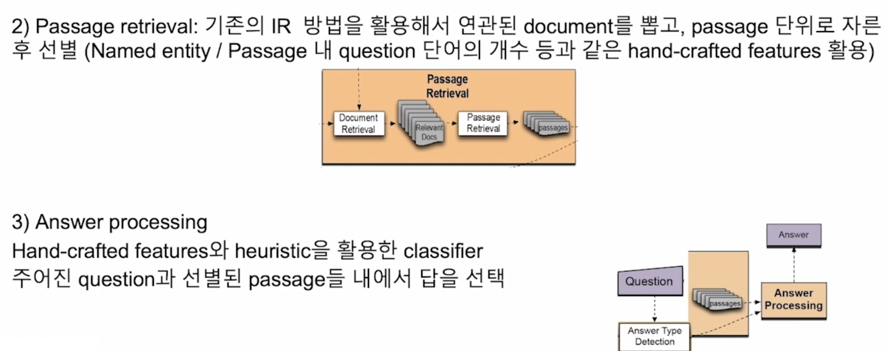

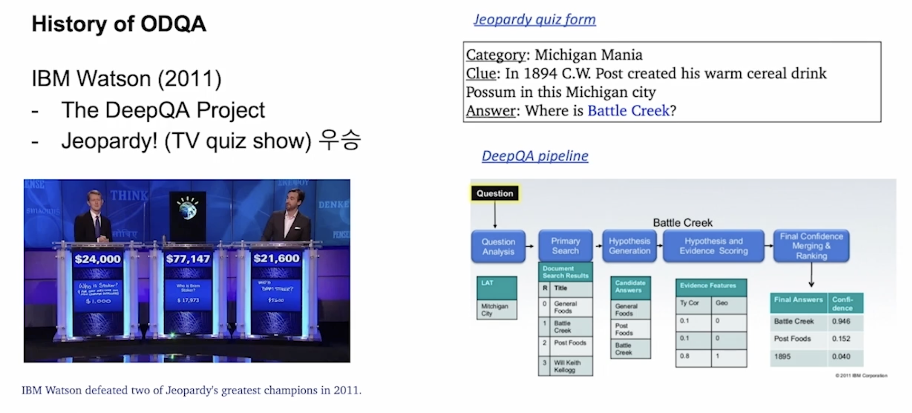

### 최근 ODQA 연구

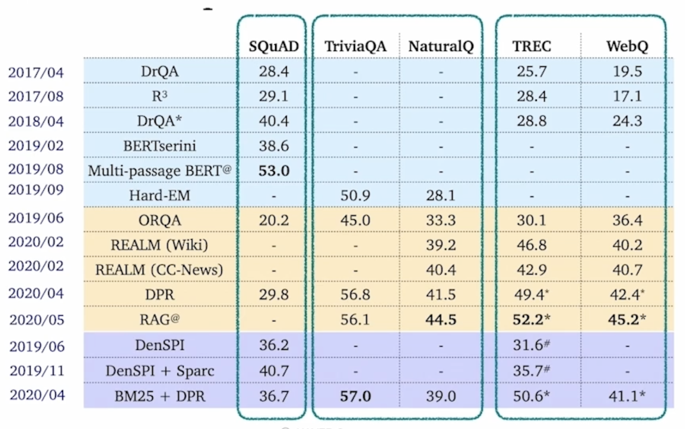

## 검색 도구 — 읽기 도구 접근법(Retriever-Reader Approach)

### 검색 도구 - 읽기 도구 접근법

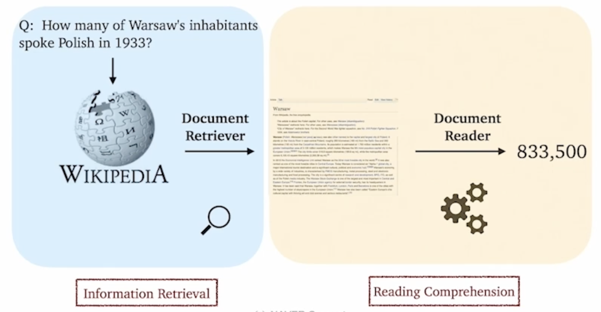

- 검색 도구(Retriver): 데이터베이스에서 관련 문서를 검색한다.
- 읽기 도구(Reader): 검색된 문서에서 질의에 대한 응답을 찾아낸다.

### 학습

- 검색 도구
    - TF-IDF, BM25 → 학습 X
    - Dense → 학습 O
- 읽기 도구
    - SQuAD와 같은 기계 독해 데이터셋으로 학습
    - 학습 데이터를 추가하기 위해 원격 지도(distant supervision)를 활용한다.

### 원격 지도(Distant Supervision)

- 질의응답만 있는 데이터셋(CuratedTREC, WebQuestions, WikiMovies)에서 기계 독해 학습 데이터 만들기. 근거 문서가 필요하다.
    1. 위키피디아에서 검색 도구를 이용하여 관련성 높은 문서를 검색한다.
    2. 너무 짧거나 긴 문서, 질문의 고유명사를 포함하지 않는 등 부적합한 문서를 제거한다.
    3. 응답이 문서 내 연속된 단어 토큰으로 들어있지 않은 문서(extact match로 들어있지 않은 문서)를 제거한다.
    4. 남은 문서 중 사용 단어를 기준으로 질의와 연관성이 가장 높은 단락을 근거로써 사용한다.
- 각 데이터셋별 원격 지도를 적용한 예시
    
    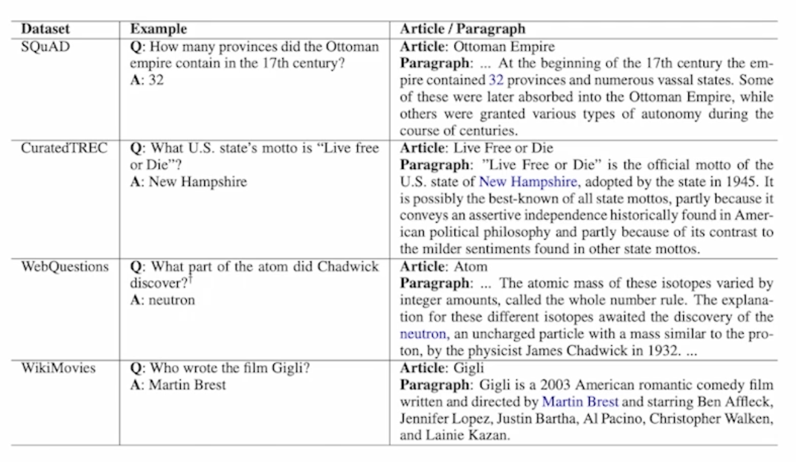
    

### 추론

- 검색 도구가 질문과 가장 관련성 높은 5개 문서를 출력한다.
- 읽기 도구는 5개 문서를 읽고 답변을 예측한다.
- 읽기 도구가 예측한 답변 중 가장 점수가 높은 것을 최종 답변으로 사용한다.

## 문제점 및 최근 접근법(Issues & Recent Approaches)

### 인덱싱 시점에서의 텍스트의 다른 세분화 수준(Different granularities of text at indexing time)

- 위키피디아에서 각 텍스트의 세분화 단위를 문서, 단락, 또는 문장으로 정의할지 결정하여야 한다.
    - 글(Article) ~ 508만
    - 문단(Paragraph) ~ 2950만
    - 문장(Sentence) ~ 7590만
- 검색 단계에서 상위 $$k$$의 문서를 추출할지 정해야 한다. 세분화 정도에 따라 $$k$$값이 달라질 수밖에 없다.
    
    예컨대, 글 수준 → $$k=5$$, 문단 수준 → $$k=29$$, 문장 수준 → $$k=78$$
    
    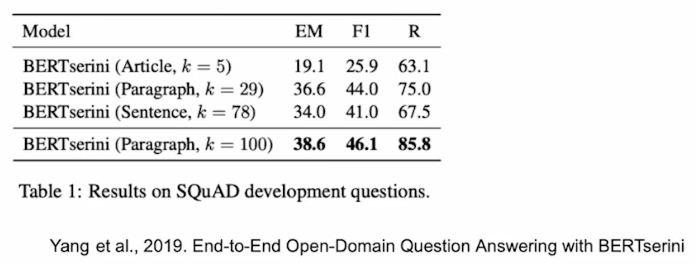
    

### 단일 단락 학습 vs. 다중 단락 학습

- 단일 단락(Single-passage)
    - 현재 $$k$$개의 단락들을 읽기 도구(reader)가 각각 확인하고 특정 응답 구간(answer span)에 대한 예측 점수를 나타낸다. 그리고 이 중 가장 높은 점수를 가진 응답 구간을 고르도록 한다.
    
    → 이 경우 각 검색 단락들에 대한 직접적인 비교라고 볼 수 있다.
    
    → 따로 읽기 도구 모델이 보는 것이 아니라 전체를 한 번에 보게 하면 어떨지?
    
- 다중 단락(Multiple-passage)
    - 검색된 단락 전체를 하나의 단락으로 취급하고, 읽기 모델이 그 안에서 응답 구간 하나를 찾도록 한다.
    - 다만, 이 경우 문서가 너무 길어지므로 GPU에 더 많은 메모리를 할당해야 한다. 이에 따라 처리해야 하는 연산량이 많아진다.

### 각 단락의 중요성

검색 도구 모델에서 추출된 상위 $$k$$개의 단락들의 검색 점수를 읽기 도구 모델에 전달한다.

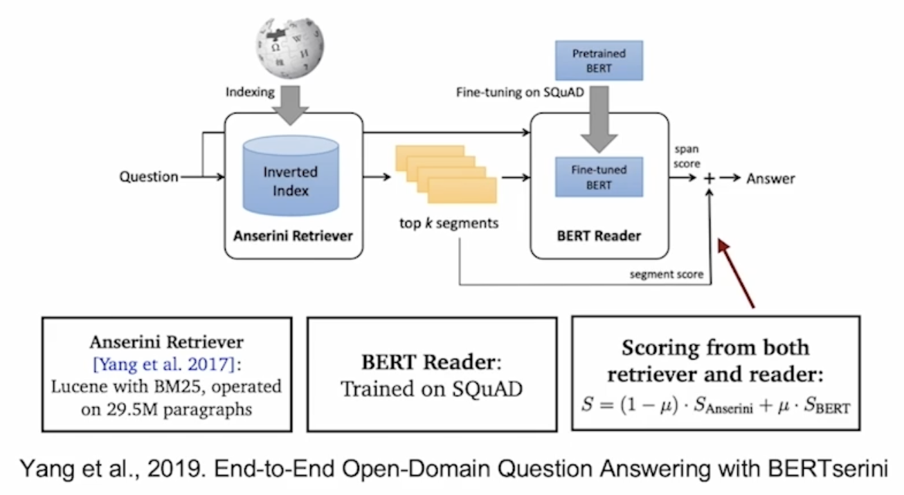

## 참고

- 부스트캠프 AI Tech 기계 독해 강의 by 서민준 교수(現 KAIST, Twelve Labs)