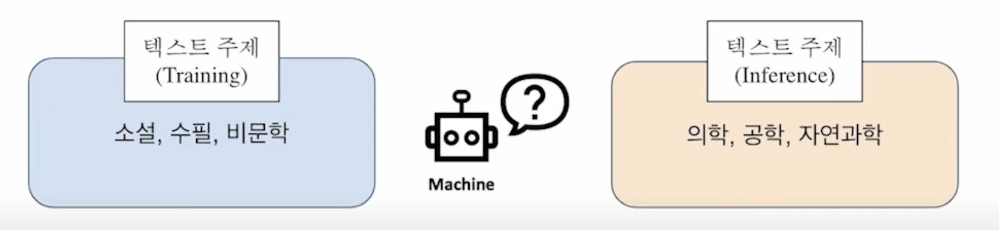
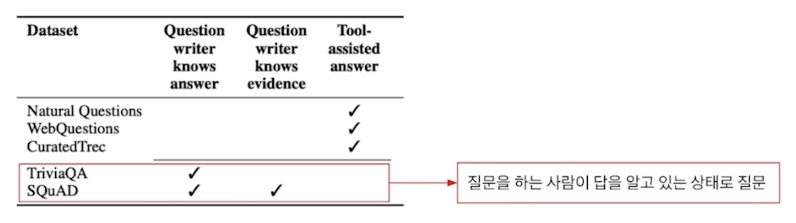
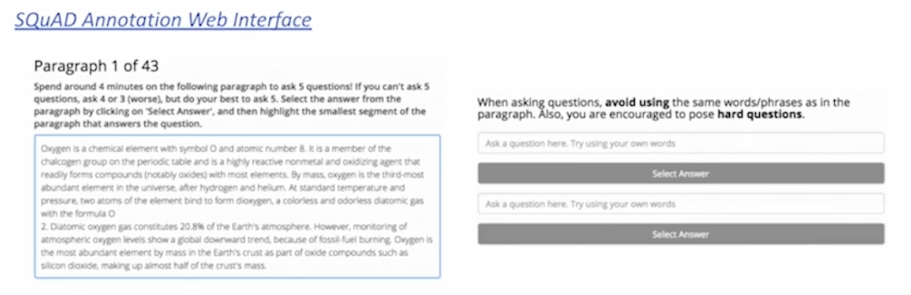
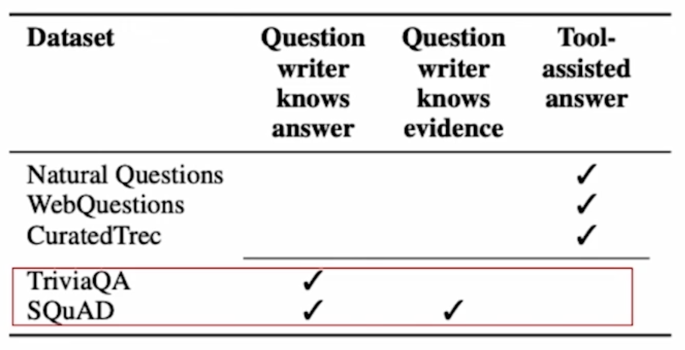
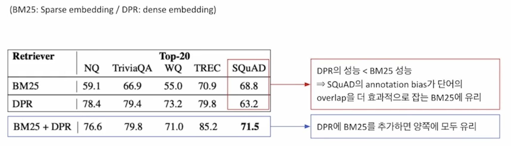
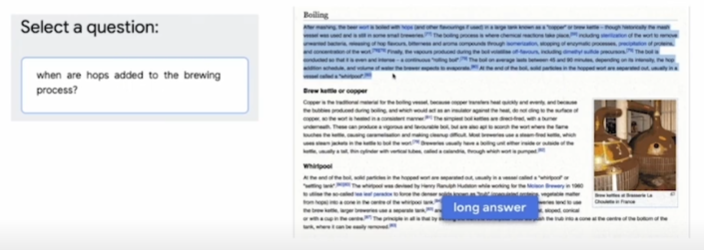

# [NLP/자연어 처리] 학습 편향 줄이기(Reducing Training Bias)

## 편향이란?(What is Bias?)

### 편향의 종류

#### 학습에서의 편향(Training bias)

- 학습 시 과적합을 막거나 사전 지식을 주입하기 위해 특정 형태의 함수를 선호하여 생기는 편향(inductive bias)

#### 편향된 현실 세계(A biased world)

- 현실 세계가 편향되어 있기 때문에 모델에 원하지 않는 속성이 학습되어 생기는 편향(historical bias)
- 성별과 직업 간 관계 등 표면적인 상관관계로 인해 원하지 않는 속성이 학습되어 생기는 편향(co-occurrence bias)

#### 데이터 생성 시점의 편향(Bias in data generation)

- 입력과 출력을 정의한 방식으로 인해 생기는 편향(specification bias)
- 데이터 샘플링 방식으로 인해 생기는 편향(sampling bias)
- 주석자로 인해 생기는 편향(annonator bias)

### 성별 편향(Gender bias)

- 대표적인 편향의 예시
- 특정 성별과 행동을 연관시킴에 따라 예측 오류가 발생한다.

### 표본 추출(샘플링) 편향(Sampling bias)

<리터러시 다이제스트(The Literacy Digest)> 여론조사(1936년)

- 표본 크기: 240만 명(당시 사상 최대)
- 예측: 루즈벨트 43%, 알프레드 랜던 57%
- 실제: 루즈벨트 62%, 알프레드 랜던 38%
- 설문 대상: 잡지 정기구독자, 자동차 등록 명부, 사교클럽 인명부 등
    
    → 중산층 이상으로 표본이 왜곡되었음
    
- 2년 후 <리터러시 다이제스트> 파산

## ODQA(오픈 도메인 질의응답)에서의 편향(Bias in Open-domain Question Answering)

### 읽기 도구(Reader) 모델의 학습 편향

만약 읽기 도구 모델이 한정된 데이터셋 내에서만 학습된다면…?

- 읽기 도구는 항상 정답이 문서 내 포함된 데이터쌍(양성, positive)만을 보게 된다.
- (예) 특히 SQuAD와 같은 (맥락, 질의, 응답)이 모두 포함된 데이터는 양성으로 완전히 고정되어 있다.
    
    → 추론 시점에 데이터 내에서 찾아볼 수 없었던 새로운 문서를 준다면?
    
    → 읽기 도구 모델은 문서에 대한 독해 능력이 매우 떨어질 것이고, 결과적으로 정답을 내지 못 하게 될 가능성이 크다.
    

### 학습 편향 완화하기(Mitigating training bias)

1. 음성 예제 학습하기
    - 학습 시 잘못된 예제도 보여주어야 검색 도구가 음성 예제 내용들은 벡터 공간상 먼 곳에 배치시킬 수 있다.
        
        → 음성 예제간에도 상대적 차이가 있음을 고려해야 한다.
        
2. 정답없음 예제도 추가하기
    - 입력 시퀀스 길이가 N일 때 시퀀스의 길이와 1개의 토큰이 더 있다고 보는 것
        
        → 학습 모델의 마지막 층 파라미터에 학습 가능한 편향을 하나 더 추가한다.
        
        → Softmax로 응답 예측을 최종적으로 수행할 경우, 시작 및 끝에 해당하는 편향 위치에 있는 경우가 확률이 가장 높으면 이는 “대답 불능”으로 취급한다.
        

#### 음성 예제를 구성하는 좋은 방법?

1. 말뭉치(Corpus)에서 임의 추출하기
2. 보다 헷갈리는 음성 샘플 추출하기
    
    → 높은 BM25 및 TF-IDF 매칭 점수를 가지나, 답을 포함하지는 않는 샘플
    
    → 같은 문서에서 나온 다른 단락/질의 선택하기
    

## 데이터셋 내 주석자 편향(Annotation Bias from Datasets)

### 주석자 편향이란?

- 데이터셋 구성 과정에서 발생하는 편향
    
    (예) ODQA 학습 시 기존의 기계 독해 데이터셋을 활용하게 되는데, ODQA 환경에는 적합하지 않은 편향이 데이터셋 구성 단계에서 발생할 수 있다.
    
    
    
    
    
    → 질문자가 답을 이미 알고 있는 경우이며, 질문과 근거 문단 사이에 많은 단어가 겹치는 편향이 발생할 수 있음.
    
    → SQuAD: 500+ 위키 문서 → 사람들이 많이 보는 문서를 위주로 선별했기 때문에 학습 데이터 분포 자체가 이미 편향되어 있음.
    
    
    

### 주석자 편향의 영향

- SQuAD의 주석자 편향이 단어의 중첩(overlap)을 유도하게 되는데, 이러한 환경은 사실 중첩을 더 효과적으로 잡아주는 BM25에 유리하여 위와 같이 SQuAD 데이터셋에서는 DPR보다 BM25의 성능이 더 좋아지는 현상이 발생한다.

### 주석자 편향 다루기

- 데이터셋 구성 단계에서 발생 가능한 편향을 인지하고, 이를 고려하여 데이터를 모아야 한다.
- (예) ODQA 설정과 유사한 데이터 수집 방법
    
    → 자연스러운 질의: 뒷받침 근거가 주어지지 않은, 실제 유저의 질의만을 모아서 데이터셋을 구성.
    

### 기계 독해 데이터셋의 또 다른 편향

SQuAD: 단락이 주어지고, 주어진 단락 내에서 질의와 응답을 생성하는 데이터셋

→ 오픈 도메인 질의응답(ODQA)에 적합하지 않은 질문들이 존재한다.

(예) 미국의 대통령은 누구인가, 그는 누구인가 등

→ 위 예시 질의의 경우 ‘2023년’ 등 시점에 관한 정보나 인물 정보가 특정되지 않아 오픈 도메인 질의응답으로서는 부적절.

## 참고

- 부스트캠프 AI Tech 기계 독해 강의 by 서민준 교수(KAIST, TwelveLabs)