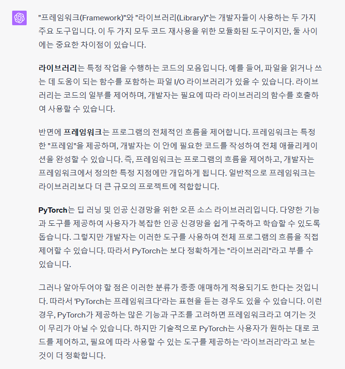

# [PyTorch] PyTorch 기초 1

## 텐서플로우TensorFlow, 케라스Keras
- 텐서플로우TensorFlow 공개 이유?   $$\rightarrow$$ 문서화를 잘 하기 위해서. 개발 내용을 다른 사람들이 정확히 파악하게 하기 위해서.
- 케라스Keras는 기본적으로 wrapper!
그 아래에는 텐서플로우, 파이토치 등으로 구현될 수 있게 됨.

## 파이토치PyTorch vs. 텐서플로우TensorFlow

|  | 텐서플로우 | 파이토치 |
|---|---|---|
|방식|Define by run|define and run|
|설명|동적 계산 그래프 Autograd 수행 시 실행 시점에서 그래프를 정의 실행 중 그래프를 생성 | 그래프를 먼저 정의 실행 시점에 데이터 feed|
|강점|- 프로덕션production   - 클라우드 컴퓨팅cloud computing   - 멀티 GPU | - 개발 과정에서 디버깅이 쉬움   $$\rightarrow$$ 구현 용이|

## Why PyTorch?

- Define by Run의 장점 .. 즉시 확인가능 $$\rightarrow$$ pythonic code
- GPU support, Good API, and community
- 사용 편한 장점
- TF는 production, scalability에 있어서 장점
- NumPy 구조를 가지는 tensor 객체로 array 표현
- 자동 미분 지원 $$\rightarrow$$ DL 연산 지원
- 다양한 형태의 DL을 지원하는 함수 & 모델 지원

## Q. 프레임워크framework vs. 라이브러리library?
- PyTorch가 프레임워크인지, 라이브러리인지에 관해 의문이 있었다. Quora 사이트의 [어떤 질문글](https://www.quora.com/Is-PyTorch-a-framework-or-a-library){:target="_blank"}에서는 library라이브러리라는 의견이 많다가도 Wikipedia의 [PyTorch](https://en.wikipedia.org/wiki/PyTorch){:target="_blank"} 문서를 보면 framework프레임워크라고 정의가 되어있어서 사전지식 없는 초심자로서는 혼동되기 쉽다고 생각했다. 또한, PyTorch의 [어떤 웹 페이지](https://pytorch.org/docs/stable/index.html){:target="_blank"}에는 library라고 표현되어 있는데, [또 다른 페이지](https://pytorch.org/get-started/pytorch-2.0/){:target="_blank"}에는 framework라는 취지로 설명이 되어있다보니 더욱 그랬던 듯하다.
- 사실 GeeksforGeeks 사이트의 [Software Framework vs Library](https://www.geeksforgeeks.org/software-framework-vs-library/){:target="_blank"} 글이나 출처의 정보 신뢰성을 담보하기 힘든 어떤 사이트의 [설명](https://www.c-sharpcorner.com/uploadfile/a85b23/framework-vs-library/){:target="_blank"}을 포함한 여러 사이트를 보면 framework가 library를 포함하는 개념이라는 듯한데.. 어찌됐든 결론은..
- PyTorch는 framework 혹은 library 두 표현 모두 가능하지 않을까 싶다.

### (2023. 06. 24. 수정) GPT-4 기반의 ChatGPT의 답변
블로그 글 곳곳에 보이는 오탈자를 수정하다가 라이브러리와 프레임워크에 대한 질문을 다시 GPT-4 기반의 ChatGPT에 물어보았다.
 생성형 AI는 사실을 담보하지 않는다 하더라도, GPT-4는 전문가를 고용하여 양질의 데이터로 학습하였고, 또 이 정도 류의 사람들이 자주 물어볼 법한 쉬운 질문은 꽤나 신뢰할 만하다는 사실에 비추어볼 때, 아래 내용 대로 알고 있어도 괜찮을 것 같다.

## 참고
- [부스트코스 - PyTorch 강의](https://www.boostcourse.org/ai213){:target="_blank"}